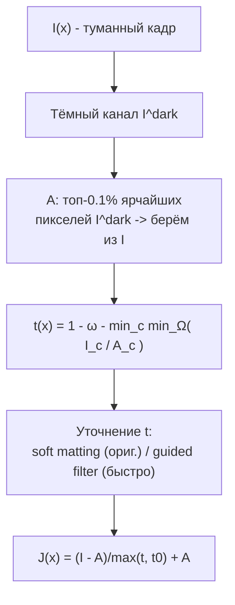
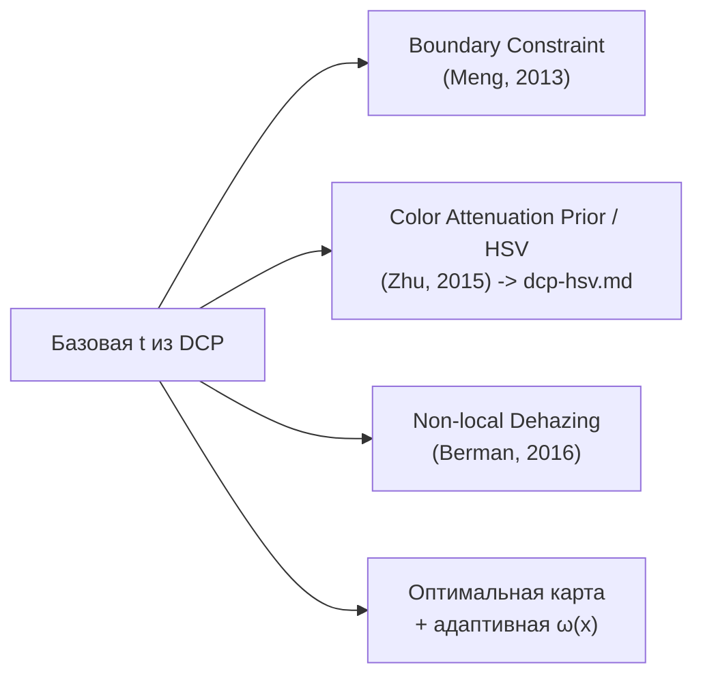

# Dark Channel Prior: теория и методы сверх реализованного

Здесь - общая теория DCP и **способы убирать дымку, которых нет в текущей реализации**
проекта (она описана в [../algorithm.md](../algorithm.md)). Отдельно вынесен HSV-подход:
[dcp-hsv.md](dcp-hsv.md).

---

## 1. Классический DCP (He, Sun, Tang, 2009)

Модель рассеяния:

$$I(x) = J(x)\,t(x) + A\,\bigl(1 - t(x)\bigr)$$

**Тёмный канал** произвольного изображения:

$$J^{dark}(x) = \min_{c\in\{r,g,b\}}\ \Bigl(\min_{y\in\Omega(x)} J_c(y)\Bigr)$$

**Prior:** для чистых уличных снимков (кроме неба) $J^{dark}\to 0$ - почти всегда есть
хотя бы один тёмный канал в окрестности. Из модели тогда выводится оценка трансмиссии.

### Классический конвейер

Ключевые формулы:

$$\tilde t(x) = 1 - \omega \min_{c}\Bigl(\min_{y\in\Omega(x)} \frac{I_c(y)}{A_c}\Bigr),
\qquad \omega \approx 0.95$$

$$J(x) = \frac{I(x)-A}{\max\bigl(t(x),\,t_0\bigr)} + A,\qquad t_0 \approx 0.1$$

$\omega$ оставляет немного дымки для естественности; $t_0$ - нижний порог.

### Что отличается в нашей реализации

| Этап | Классика (He) | В проекте ([../algorithm.md](../algorithm.md)) |
|---|---|---|
| Оценка $A$ | топ-0.1% по тёмному каналу **всего** кадра | quad-decomposition -> топ-`percen`% в **светлой области** |
| Оценка $t$ | линейная: $1-\omega\min_c\min_\Omega(I_c/A_c)$ | экспоненциальная по каналам: $1-e^{-\beta A_c/m_c}$ |
| Уточнение $t$ | soft matting (медленно) | **guided filter** (быстро) |
| Каналы $t$ | один общий $t$ | **отдельный $t_c$** на канал |

---

## 2. Методы сверх реализованного

### 2.1. Оценка атмосферного света $A$

- **Quad-tree subdivision** (Kim et al.) - рекурсивный спуск по квадранту с максимумом
  *(mean - std)*; устойчивее к ярким объектам. Близко к тому, что в проекте, но критерий
  'яркость - контраст', а не просто яркость.
- **Hierarchical search по тёмному каналу** - топ-N ярчайших пикселей $I^{dark}$, затем
  среди них максимум яркости $I$ (не среднее) - меньше засветки от белых объектов.
- **Non-local / по 'haze-line'** (Berman, 2016) - $A$ как точка схода цветовых линий.

### 2.2. Оценка трансмиссии $t$

- **Boundary Constraint + Contextual Regularization** (Meng) - $t$ как решение задачи с
  ограничениями сверху/снизу и L1-регуляризацией по градиентам; меньше ореолов, лучше края.
- **Адаптивная $\omega(x)$** - больше убирать дымку там, где её больше (по локальному
  контрасту/глубине), вместо константы.
- **Color Attenuation Prior (HSV)** - глубина из яркости и насыщенности; см. [dcp-hsv.md](dcp-hsv.md).
- **Non-local dehazing** - пиксели группируются в 'haze-lines' в RGB; $t$ из положения
  на линии. Хорошо там, где патч-DCP даёт ореолы.

### 2.3. Уточнение карты $t$

| Метод | Плюсы | Минусы |
|---|---|---|
| Soft matting (Laplacian) | максимальное качество краёв | очень медленно, O(N) с большой константой |
| **Guided filter** (в проекте) | $O(N)$, края по гайду | лёгкое 'протекание' на текстурах |
| Weighted Least Squares (WLS) | гладко + резкие края | дороже guided |
| Fast/large-kernel bilateral | простой | хуже на тонких краях |

### 2.4. Постобработка

- **Sky/atmospheric compensation** - детектировать небо (низкая насыщенность + высокая
  яркость) и ограничивать там усиление, чтобы не было шума и пересвета.
- **Гамма-коррекция / баланс белого** результата $J$ для естественности.
- **Сегментная/локальная $A$** для неоднородной дымки (несколько источников освещения).

---

## 3. Куда смотреть в коде

Эти улучшения встраиваются в существующие методы:

- $A$ -> [`ComputeAtmosphericLight`](../../DeHazeCPU.cs) / [`QuadDecomposition`](../../DeHazeCPU.cs)
- $t$ -> [`EstimateTransmission`](../../DeHazeCPU.cs)
- уточнение -> [`RefineTransmission`](../../DeHazeCPU.cs) / GPU [`Filter`](../../DeHazeGPU.cs)
- восстановление -> [`RecoverImage`](../../DeHazeCPU.cs)

Самый практичный следующий шаг с хорошим соотношением 'эффект/усилия' -
**HSV / Color Attenuation Prior**: [dcp-hsv.md](dcp-hsv.md).

Более тяжёлая/альтернативная математика уточнения $t$ и целых пайплайнов (Matting Laplacian,
Laplacian Pyramid Fusion, дробный лапласиан, Beltrami, MST-граф, color-cube, WLS / Domain
Transform / Bilateral Solver), а также железо и решатели - в разделе
[../methods/README.md](../methods/README.md).
