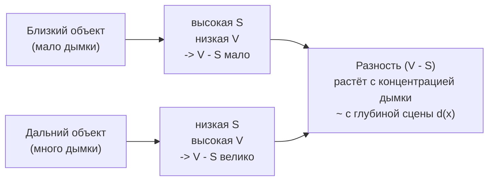
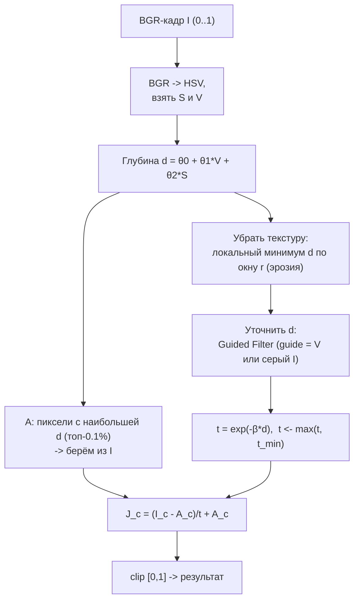

# DCP через HSV (Color Attenuation Prior)

Альтернатива тёмному каналу по BGR: оценивать дымку в пространстве **HSV** по яркости и
насыщенности. Метод известен как **Color Attenuation Prior (CAP)** - Zhu, Mao, Wang (2015).
Восстановление то же, что в проекте (формула $J=(I-A)/\max(t,t_{min})+A$), меняется только
способ оценки карты пропускания $t$.

---

## 1. Идея: почему HSV

Перевод в HSV даёт три канала: **H** (тон), **S** (насыщенность), **V** (яркость).
Наблюдение: **дымка одновременно повышает яркость и снижает насыщенность**.



Поэтому **разность $V-S$ монотонно связана с глубиной/концентрацией дымки** - это и есть
'prior'. В тёмном канале (BGR) глубина оценивается косвенно через минимум каналов; в HSV -
напрямую через два осмысленных канала.

---

## 2. Модель глубины и трансмиссии

**Линейная модель глубины** (коэффициенты из обучения Zhu et al.):

$$d(x) = \theta_0 + \theta_1 V(x) + \theta_2 S(x) + \varepsilon,\qquad
\theta_0=0.121779,\ \theta_1=0.959710,\ \theta_2=-0.780245$$

(то есть $d \approx \theta_1 V + \theta_2 S$ - 'яркость минус насыщенность' с весами).

**Трансмиссия** по закону Бугера-Ламберта:

$$t(x) = e^{-\beta\, d(x)},\qquad \beta\approx 1$$

$\beta$ - коэффициент рассеяния атмосферы (аналог `beta` в проекте).

---

## 3. Конвейер



## 4. Псевдокод

```text
function DeHazeHSV(I_bgr, β=1.0, r_min=7, r_guide=60, eps=1e-3, t_min=0.1):
    I   <- I_bgr / 255                       # [0,1]
    HSV <- BGR2HSV(I);   S <- HSV.S;  V <- HSV.V

    # 1. карта глубины по Color Attenuation Prior
    d   <- 0.121779 + 0.959710*V - 0.780245*S

    # 2. снять влияние текстуры (как 'минимум по патчу' в DCP)
    d   <- Erode(d, r_min)

    # 3. сгладить, сохранив края (гайд - яркость V или серый I)
    d   <- GuidedFilter(guide = V, src = d, r = r_guide, eps = eps)

    # 4. трансмиссия
    t   <- exp(-β - d);    t <- max(t, t_min)

    # 5. атмосферный свет: ярчайшие пиксели I среди самых 'глубоких' (макс. d)
    A   <- AtmosphericLight(I, d, topPercent = 0.001)

    # 6. восстановление (как в проекте)
    for c in {B,G,R}:  J_c <- (I_c - A_c) / t + A_c
    return clip(J, 0, 1)
```

---

## 5. Набросок на Emgu.CV

> Иллюстративный набросок в стиле проекта - адаптируй имена API под свою версию Emgu
> (часть сигнатур упрощена). Логика 1:1 соответствует псевдокоду выше.

```csharp
using Emgu.CV;
using Emgu.CV.CvEnum;
using Emgu.CV.Structure;
using Emgu.CV.Util;
using Emgu.CV.XImgproc;

// I - исходное BGR-изображение, нормализованное в [0,1]
static Mat DeHazeHsv(Image<Bgr, float> I, float beta = 1f, int rMin = 7,
                     int rGuide = 60, double eps = 1e-3, float tMin = 0.1f)
{
    // 1) BGR -> HSV, берём S и V
    using var hsv = new Mat();
    CvInvoke.CvtColor(I, hsv, ColorConversion.Bgr2Hsv);   // S,V в [0,1]
    var ch = hsv.Split();                                 // ch[0]=H, ch[1]=S, ch[2]=V
    Mat S = ch[1], V = ch[2];

    // 2) глубина d = θ0 + θ1*V + θ2*S   (Color Attenuation Prior)
    var d = new Mat();
    CvInvoke.AddWeighted(V, 0.959710, S, -0.780245, 0.121779, d);

    // 3) минимум по окну (снять текстуру) - эрозия радиуса rMin
    var k = CvInvoke.GetStructuringElement(ElementShape.Rectangle,
                new Size(2 * rMin + 1, 2 * rMin + 1), new Point(-1, -1));
    CvInvoke.Erode(d, d, k, new Point(-1, -1), 1, BorderType.Reflect101, default);

    // 4) уточнить карту глубины направляющим фильтром (гайд - яркость V)
    var dRef = new Mat();
    XImgprocInvoke.GuidedFilter(V, d, dRef, rGuide, eps);

    // 5) трансмиссия t = exp(-beta*d), t = max(t, tMin)
    using var t = dRef * (-beta);
    CvInvoke.Exp(t, t);
    using (var tm = new Mat(t.Size, DepthType.Cv32F, 1))
    {
        tm.SetTo(new MCvScalar(tMin));
        CvInvoke.Max(t, tm, t);
    }

    // 6) атмосферный свет: среднее BGR ярчайших пикселей по максимальной глубине dRef
    MCvScalar A = EstimateAtmosphericLightByDepth(I, dRef, topPercent: 0.001);

    // 7) восстановление: J_c = (I_c - A_c)/t + A_c
    var src = I.Mat.Split();
    using var outCh = new VectorOfMat();
    double[] a = { A.V0, A.V1, A.V2 };
    for (int c = 0; c < 3; c++)
    {
        var jc = new Mat();
        CvInvoke.Subtract(src[c], new ScalarArray(a[c]), jc);
        CvInvoke.Divide(jc, t, jc);
        CvInvoke.Add(jc, new ScalarArray(a[c]), jc);
        outCh.Push(jc);
    }
    var J = new Mat();
    CvInvoke.Merge(outCh, J);
    return DeHazeCPU.Clip(J);   // загнать в [0,1]
}
```

GPU-версию строят так же на `GpuMat`: `CudaInvoke.CvtColor(..., Bgr2Hsv)`, `Split`,
`CudaInvoke.AddWeighted`, `CudaMorphologyFilter(Erode)`, guided filter из
[`DeHazeGPU.Filter`](../../DeHazeGPU.cs), `CudaInvoke.Exp`, `Max`, и восстановление как в
[`DeHazeGPU.RecoverImage`](../../DeHazeGPU.cs).

---

## 6. HSV-CAP против реализованного BGR-DCP

| | BGR Dark Channel (в проекте) | HSV / Color Attenuation Prior |
|---|---|---|
| Признак дымки | $\min_c\min_\Omega I_c$ (тёмный канал) | $d=\theta_1 V+\theta_2 S$ (яркость - насыщенность) |
| Глубина | косвенно | напрямую, линейная модель |
| Параметры | $\omega/\beta$ | $\theta_{0,1,2}$ (обучены), $\beta$ |
| Небо | склонно к пересвету | мягче (низкая $S$ -> большая $d$ -> малое усиление) |
| Скорость | быстрая | быстрая (та же сложность $O(N)$) |
| Цвета | возможен сдвиг при плохом $A$ | устойчивее по тону (H не трогаем) |

**Когда выбирать HSV:** много неба/светлых поверхностей; важна стабильность цвета; дымка
плавно зависит от глубины. **Когда BGR-DCP:** сцены с глубокими тёмными участками и
выраженным тёмным каналом.

> Замечание про OpenCV: после `Bgr2Hsv` для `float`-изображения H в диапазоне $[0,360)$, а
> S и V - в $[0,1]$. Для `8U` H будет в $[0,180]$. В формуле CAP участвуют только S и V в
> $[0,1]$ - следи за нормировкой каналов.

---

## Источники

- K. He, J. Sun, X. Tang. *Single Image Haze Removal Using Dark Channel Prior*, 2009/2011.
- Q. Zhu, J. Mao, L. Wang. *A Fast Single Image Haze Removal Algorithm Using Color
  Attenuation Prior*, IEEE TIP, 2015.
- K. He, J. Sun, X. Tang. *Guided Image Filtering*, ECCV 2010.
