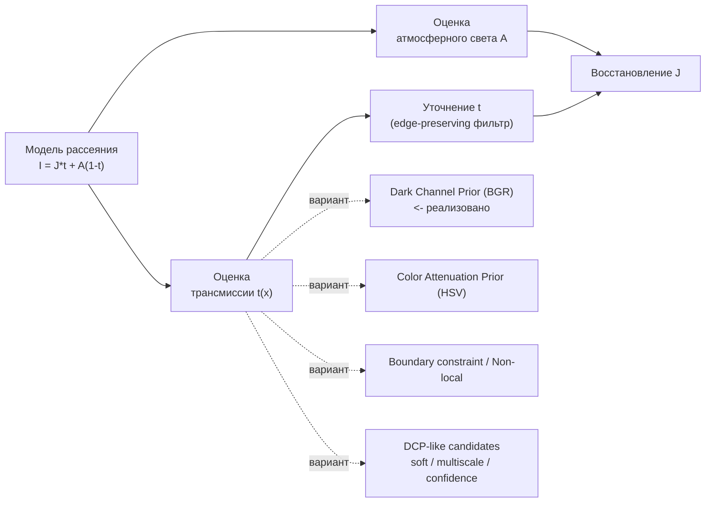

# Документация SimpleDeHaze

Описание алгоритма удаления дымки и его вариантов.

## Содержание

| Документ | О чём |
|---|---|
| [algorithm.md](algorithm.md) | **Алгоритм, реализованный в проекте** (`DeHazeCPU` / `DeHazeGPU`): полный конвейер, блок-схема, псевдокод, формулы, привязка к коду. |
| [DCP/README.md](DCP/README.md) | **Dark Channel Prior**: теория, классический метод He et al. и способы убирать дымку *сверх* того, что реализовано здесь. |
| [DCP/dcp-hsv.md](DCP/dcp-hsv.md) | **DCP через HSV** (Color Attenuation Prior): оценка дымки по яркости/насыщенности, псевдокод и пример на Emgu.CV. |
| [methods/README.md](methods/README.md) | **Альтернативная математика и DCP-like кандидаты**: Matting/Pyramid Laplacian, дробный лапласиан, Beltrami, MST-граф, color-cube, WLS/Domain Transform/Bilateral Solver, а также soft/multiscale DCP, local airlight, gradient-domain и fast DCP engine. |

## Модель дымки

В основе всех методов - атмосферная модель рассеяния света:

$$I(x) = J(x)\,t(x) + A\,\bigl(1 - t(x)\bigr)$$

| Символ | Смысл |
|---|---|
| $I(x)$ | наблюдаемое (туманное) изображение |
| $J(x)$ | восстановленное (чистое) изображение - то, что ищем |
| $A$ | атмосферный свет (цвет 'дымки на горизонте') |
| $t(x)\in[0,1]$ | карта пропускания: доля света, дошедшего от объекта без рассеяния |

Чем дальше объект и плотнее дымка - тем меньше $t$. Задача любого метода ниже -
оценить $A$ и $t(x)$, после чего чистое изображение выражается явно:

$$J(x) = \frac{I(x) - A}{\max\bigl(t(x),\, t_{min}\bigr)} + A$$

Нижний порог $t_{min}$ не даёт делению взорваться в самых плотных участках дымки.

## Семейство методов

- **Реализовано в проекте** - DCP по BGR-каналам, см. [algorithm.md](algorithm.md).
- **Сверх реализованного** - другие способы оценки $A$, $t$ и уточнения, см. [DCP/README.md](DCP/README.md).
- **HSV-вариант** - отдельно в [DCP/dcp-hsv.md](DCP/dcp-hsv.md).
- **Новые DCP-like идеи** - [methods/README.md](methods/README.md).
