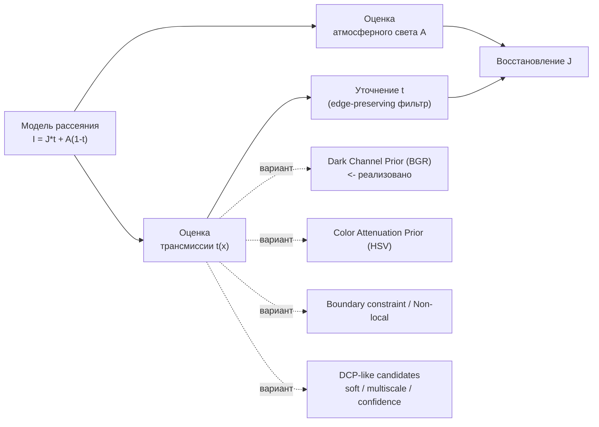

# Документация SimpleDeHaze

Описание алгоритма удаления дымки и его вариантов.

## Содержание

| Документ | О чём |
|---|---|
| [algorithm.md](algorithm.md) | **Алгоритм, реализованный в проекте** (`DeHazeCPU` / `DeHazeGPU`): полный конвейер, блок-схема, псевдокод, формулы, привязка к коду. |
| [DCP/README.md](DCP/README.md) | **Dark Channel Prior**: теория, классический метод He et al. и способы убирать дымку *сверх* того, что реализовано здесь. |
| [DCP/dcp-hsv.md](DCP/dcp-hsv.md) | **DCP через HSV** (Color Attenuation Prior): оценка дымки по яркости/насыщенности, псевдокод и пример на Emgu.CV. |
| [../../NOVELTY.md](../../NOVELTY.md) | **Матрица новизны**: что здесь новое, что известно из литературы, какие формулировки разрешены. Обязательна к сверке перед любой публикацией. |
| [../../REPRODUCIBILITY.md](../../REPRODUCIBILITY.md) | **Воспроизводимость**: окружение, данные, режимы прогона, какие метрики основные, что фиксировать при публикации чисел. |
| [research/audit-2026-07.md](research/audit-2026-07.md) | **Аудит**: новизна методов относительно литературы, проблемы методологии измерений, готовность к arXiv/Хабру, план работ. |
| [research/physics-linear-spectral.md](research/physics-linear-spectral.md) | **Физика пайплайна**: линеаризация sRGB и её влияние на оценку $t$, спектральная модель $\beta(\lambda)$, точность яркостно-хромного разложения, вывод $t_{floor}$ из шума. |
| [research/a2cr-data-protocol.md](research/a2cr-data-protocol.md) | **A²CR data protocol**: DIODE integrity/split, 22 500 streaming recipes, B0–B9/G0, LPIPS, метрики и real-paired результаты. |
| [methods/hcv-a2cr-utaw.md](methods/hcv-a2cr-utaw.md) | **Exact HCV-A²CR**: airlight-normalized алгебра, два gain, feasible polygon, validity fusion и HCV-UTAW. |
| [methods/transmission-aware-multiscale.md](methods/transmission-aware-multiscale.md) | **Transmission-aware Laplacian/Edge/UTAW**: CPU/GPU реализация, reliability, frozen test и noise trade-off. |
| [research/hcv-a2cr-utaw-study-2026-08.md](research/hcv-a2cr-utaw-study-2026-08.md) | **NEW3 audit**: HCV отрицательные результаты, UTAW validation/frozen test четырёх наборов, AutoTuner, GPU и решение по статьям. |
| [research/literature-review-2026-07.md](research/literature-review-2026-07.md) | Проверка ближайших работ и безопасная формулировка новизны A²CR/CAR. |
| [methods/car-dehaze.md](methods/car-dehaze.md) | CAR-Dehaze, формулы chromatic anchor, сцена №08 и аудит автоподбора. |
| [articles/habr-a2cr.md](articles/habr-a2cr.md) | Сфокусированная Habr-статья: A²CR, exact RGB feasibility, controlled/real-paired evaluation, CUDA scope и ограничения. |
| [methods/README.md](methods/README.md) | **Альтернативная математика и DCP-like кандидаты**: RFEP-DCP, BRACE-DCP, PF-SFGF, LAF-TV/WLS, GDR-SP, Matting/Pyramid Laplacian, дробный лапласиан, Beltrami, MST-граф, color-cube, WLS/Domain Transform/Bilateral Solver, local airlight, gradient-domain и fast DCP engine. |

## Модель дымки

В основе всех методов - атмосферная модель рассеяния света:

$$I(x) = J(x)\,t(x) + A\,\bigl(1 - t(x)\bigr)$$

| Символ | Смысл |
|---|---|
| $I(x)$ | наблюдаемое (туманное) изображение |
| $J(x)$ | восстановленное (чистое) изображение - то, что ищем |
| $A$ | атмосферный свет (цвет 'дымки на горизонте') |
| $t(x)\in[0,1]$ | карта пропускания: доля света, дошедшего от объекта без рассеяния |

Чем дальше объект и плотнее дымка - тем меньше $t$. Задача любого метода ниже -
оценить $A$ и $t(x)$, после чего чистое изображение выражается явно:

$$J(x) = \frac{I(x) - A}{\max\bigl(t(x),\, t_{min}\bigr)} + A$$

Нижний порог $t_{min}$ не даёт делению взорваться в самых плотных участках дымки.

## Семейство методов

```mermaid
flowchart LR
    M["Модель рассеяния<br/>I = J*t + A(1-t)"] --> A["Оценка<br/>атмосферного света A"]
    M --> T["Оценка<br/>трансмиссии t(x)"]
    T --> R["Уточнение t<br/>(edge-preserving фильтр)"]
    A --> REC["Восстановление J"]
    R --> REC

    T -.вариант.-> T1["Dark Channel Prior (BGR)<br/><- реализовано"]
    T -.вариант.-> T2["Color Attenuation Prior (HSV)"]
    T -.вариант.-> T3["Boundary constraint / Non-local"]
    T -.вариант.-> T4["DCP-like candidates<br/>soft / multiscale / confidence"]
```

- **Реализовано в проекте** - DCP по BGR-каналам, см. [algorithm.md](algorithm.md).
- **Сверх реализованного** - другие способы оценки $A$, $t$ и уточнения, см. [DCP/README.md](DCP/README.md).
- **HSV-вариант** - отдельно в [DCP/dcp-hsv.md](DCP/dcp-hsv.md).
- **Новые DCP-like идеи** - [methods/README.md](methods/README.md).
