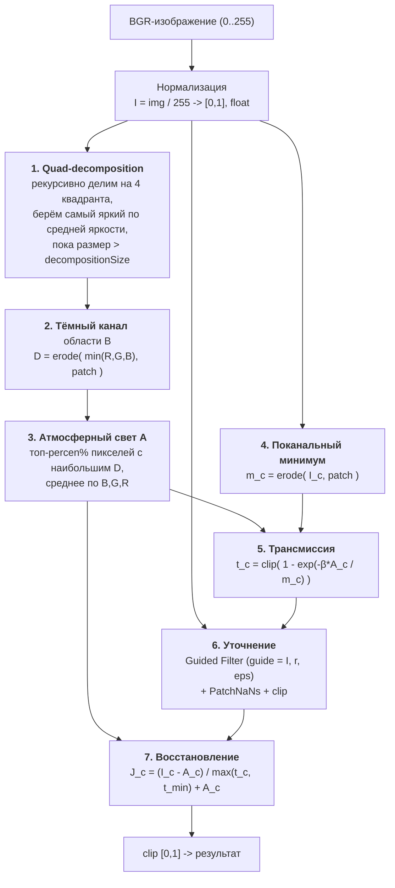

# Алгоритм, реализованный в проекте

Проект убирает дымку методом **Dark Channel Prior (DCP)** с оптимизированной оценкой
атмосферного света (через quad-decomposition) и уточнением карты пропускания
**направляющим фильтром (Guided Filter)**. Реализованы две идентичные по логике версии:

- [`DeHazeCPU`](../DeHazeCPU.cs) - на `Mat` / OpenCV (CPU);
- [`DeHazeGPU`](../DeHazeGPU.cs) - на `GpuMat` / CUDA (GPU), с собственной реализацией
  цветного guided filter (метод [`Filter`](../DeHazeGPU.cs)).

Точка входа - [`Program.cs`](../Program.cs), метод `RemoveHaze(...)` в обоих классах.

---

## Конвейер



---

## Псевдокод

```text
function RemoveHaze(img_bgr, β, patch, decompSize, t_min, percen, refineSize, eps):
    I <- img_bgr / 255                                  # float, [0,1]

    # 1. найти самую светлую область (кандидат на 'небо'/дымку)
    B <- QuadDecomposition(I, decompSize)

    # 2-3. атмосферный свет по тёмному каналу этой области
    D <- Erode( min_c(B_c), patch )                     # тёмный канал
    A <- AtmosphericLight(B, D, percen)                 # среднее BGR ярчайших пикселей D

    # 4. локальный минимум каждого канала всего кадра
    for c in {B,G,R}:  m_c <- Erode( I_c, patch )

    # 5. оценка трансмиссии (по каналам)
    for c in {B,G,R}:  t_c <- clip( 1 - exp(-β - A_c / m_c), 0, 1 )

    # 6. уточнение карты по структуре исходного кадра
    t <- GuidedFilter(guide = I, src = t, r = refineSize, eps = eps)
    t <- PatchNaNs(t, t_min);  t <- clip(t, 0, 1)

    # 7. восстановление чистого изображения
    for c in {B,G,R}:  J_c <- (I_c - A_c) / max(t_c, t_min) + A_c
    return clip(J, 0, 1)
```

### 1. Quad-decomposition - [`QuadDecomposition`](../DeHazeCPU.cs)

```text
function QuadDecomposition(I, windowSize):
    while width(I)/2 > windowSize and height(I)/2 > windowSize:
        split I into 4 quadrants q1..q4
        pick the quadrant with the highest mean grayscale intensity
        I <- that quadrant
    return I            # маленькая, самая яркая область кадра
```

Зачем: атмосферный свет $A$ оценивается по самым светлым пикселям. Наивный поиск 'топ
ярких пикселей по всему кадру' легко промахивается на локальных источниках света (фары,
блики). Иерархический спуск по самому яркому квадранту приводит в крупную светлую зону
(небо/дымка) и заодно резко уменьшает объём последующей сортировки. Серый строится как
$0.114B + 0.587G + 0.299R$ ([`GrayMat`](../DeHazeCPU.cs)).

### 2. Тёмный канал - [`ComputeDarkChannelPatch`](../DeHazeCPU.cs)

$$D(x) = \min_{c\in\{R,G,B\}}\ \min_{y\in\Omega(x)} I_c(y)$$

Сначала поканальный минимум $\min_c$, затем минимум по окну $\Omega$ радиуса `patch`
(морфологическая **эрозия**). **Prior** (наблюдение He et al.): на чистых уличных снимках
тёмный канал близок к нулю, а наличие дымки 'поднимает' его - это и есть индикатор дымки.

### 3. Атмосферный свет - [`ComputeAtmosphericLight`](../DeHazeCPU.cs)

```text
sort pixels of D by value (descending)
take top `percen` share -> these are the haziest pixels
A_c <- mean over those pixels of I_c,  c ∈ {B,G,R}
```

$A$ - это средний цвет наиболее 'задымлённых' (с самым высоким тёмным каналом) пикселей
внутри светлой области из шага 1.

### 4-5. Трансмиссия - [`ComputeColorsChannelPatch`](../DeHazeCPU.cs) + [`EstimateTransmission`](../DeHazeCPU.cs)

$$m_c(x) = \min_{y\in\Omega(x)} I_c(y), \qquad
  t_c(x) = \mathrm{clip}\!\left(1 - e^{-\beta\, A_c / m_c(x)},\ 0,\ 1\right)$$

Карта пропускания считается **по каждому каналу отдельно**. Параметр $\beta$ регулирует
силу удаления дымки. Это экспоненциальный вариант оценки (в отличие от классической
линейной $t = 1 - \omega\,\frac{\min_c m_c}{A}$, см. [DCP/README.md](DCP/README.md)).

### 6. Уточнение - Guided Filter - [`RefineTransmission`](../DeHazeCPU.cs)

Грубая $t$ блочная (из-за эрозии) и даёт ореолы на краях. **Guided Filter** сглаживает её,
сохраняя края **по структуре исходного изображения** $I$ как направляющего:

$$q_i = a_k I_i + b_k,\quad
a_k=\frac{\frac{1}{|\omega|}\sum_{i\in\omega_k} I_i t_i - \mu_k \bar t_k}{\sigma_k^2+\varepsilon},\quad
b_k=\bar t_k - a_k\mu_k$$

- CPU: готовый [`XImgprocInvoke.GuidedFilter`](../DeHazeCPU.cs).
- GPU: ручная реализация цветного guided filter с инверсией ковариационной матрицы 3x3
  ([`Filter`](../DeHazeGPU.cs)) - портирование MATLAB-кода Kaiming He.

`eps` $=\varepsilon$ - регуляризация (больше -> сильнее сглаживание), `refineSize` - радиус окна.

### 7. Восстановление - [`RecoverImage`](../DeHazeCPU.cs)

$$J_c(x) = \frac{I_c(x) - A_c}{\max\bigl(t_c(x),\, t_{min}\bigr)} + A_c$$

$t_{min}$ (`min`, по умолчанию $2/255$) ограничивает усиление в самых плотных участках.
Финальный `Clip` загоняет результат в $[0,1]$ ([`Clip`](../DeHazeCPU.cs) - двойной trunc-порог).

> **Защита от перенасыщения (семейство 'DCP *', [`DehazeCore.Recover`](../Methods/DehazeCore.cs)).**
> В формуле выше каждый канал делится на один и тот же $t$, поэтому при малом $t$ (большая $\omega$,
> плотная дымка) вместе с яркостью усиливается и **разброс между каналами** - цвет 'выжигается'.
> Лечим раскладкой $(I-A)$ на ахроматическую часть $\bar d=\operatorname{mean}_c(I_c-A_c)$ и хрому
> $\delta_c=(I_c-A_c)-\bar d$ с **разными порогами**:
> $$J_c = A_c + \frac{\bar d}{\max(t,\,t_{min})} + \frac{\delta_c}{\max(t,\,t_{chroma})},\qquad t_{chroma}\ge t_{min}.$$
> Яркость (вуаль) убирается полностью, а хрома усиливается слабее. По умолчанию $t_{chroma}=0.4$:
> при мягкой $\omega=0.5$ ($t\ge0.5$) защита **неактивна** (результат идентичен классике), а при большой
> $\omega$ (малое $t$) - гасит перенасыщение. То же на GPU - [`GpuCore.Recover`](../Methods/GpuCore.cs).

---

## Параметры (вызов из [`Program.cs`](../Program.cs))

`patch` вычисляется от размера кадра: `patch = (H>W ? W*0.01 : H*0.001) + 1`.

| Параметр | Значение в `Program.cs` | Смысл |
|---|---|---|
| `beta` $\beta$ | `0.5` | сила удаления дымки в оценке $t$ |
| `patchDarkChannel` | `patch*0.5` | радиус окна тёмного канала / минимума |
| `decompositionSize` | `patch*0.5` | порог остановки quad-decomposition |
| `min` $t_{min}$ | `2/255` | нижний порог трансмиссии |
| `percen` | `0.5` | доля ярчайших пикселей тёмного канала для $A$ |
| `refineSize` | `patch*2` | радиус guided filter |
| `eps` $\varepsilon$ | `0.001/patch` | регуляризация guided filter |

---

## Сложность и свойства

- **Сложность:** ~$O(N)$ по числу пикселей $N$ (эрозия и box-фильтры линейны; сортировка -
  только по маленькой области из шага 1). Quad-decomposition суммарно линеен (область
  уменьшается вдвое на каждом уровне).
- **GPU:** все стадии на `GpuMat`/CUDA, кроме сортировки для $A$ (она на CPU над выгруженным
  тёмным каналом маленькой области). В статье [`habr.md`](../habr.md) отмечено, что для
  `GpuMat` важно аккуратно освобождать память (см. также замечания об утечках в обзоре кода).

**Сильные стороны:** без обучающих данных и нейросетей; детерминирован и интерпретируем;
быстрый; нет 'фантомных' артефактов закрытых моделей.

**Слабые стороны / на что смотреть:**
- небо и крупные светлые поверхности склонны к пересвету/цветовому сдвигу (типичная
  проблема DCP - там prior нарушается);
- ореолы на резких границах глубины - сглаживаются guided filter, но не всегда полностью;
- качество чувствительно к оценке $A$ (поэтому и нужен умный поиск через quad-decomposition);
- модель предполагает однородную дымку и единый $A$ на кадр.

Способы обойти эти ограничения (другие оценки $t$, $A$ и уточнения, в т.ч. через HSV) -
в [DCP/README.md](DCP/README.md) и [DCP/dcp-hsv.md](DCP/dcp-hsv.md).
