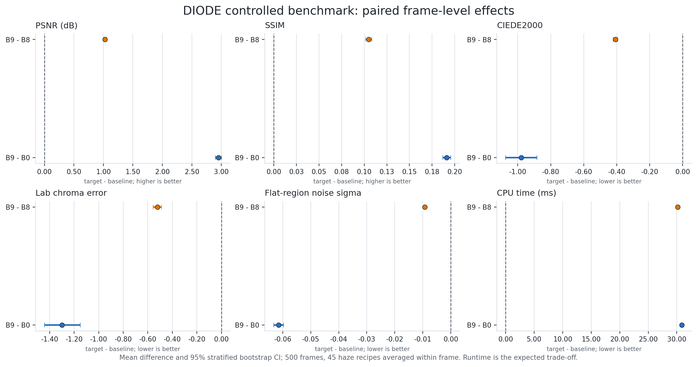
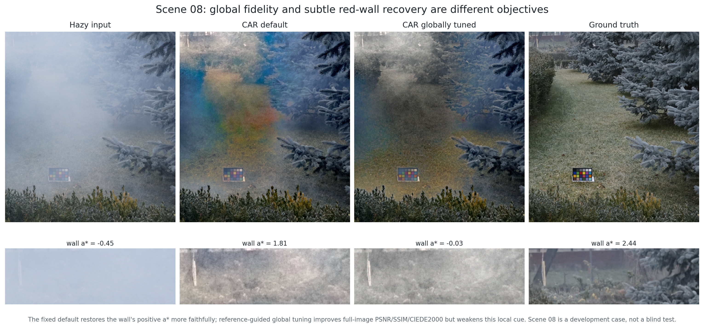

# Как я перестал делить RGB на одну карту тумана: HSV, CAR и A²CR без нейросетей

> Черновик готов к редакторской публикации на Habr. Перед публикацией нужно загрузить два рисунка
> в хранилище Habr и заменить относительные ссылки. Код: https://github.com/yellow444/SimpleDehaze

Теги: `.NET`, `C#`, `OpenCV`, `Computer Vision`, `Image Processing`, `алгоритмы`.

## Что изменилось после первой статьи

В первой версии проекта я решал удаление дымки классически: оценивал атмосферный свет, строил
карту трансмиссии и применял

$$J(x)=A+\frac{I(x)-A}{\max(t(x),t_{min})}.$$

Формула выглядит убедительно, пока не попадается плотная дымка. Если `t=0,1`, любой шум и любая
ошибка в `A` умножаются примерно на десять. После этого обычный `clamp(0,1)` скрывает нарушение
модели, но не исправляет цвет. Именно так исчезают слабые оттенки, возникают кислотные пятна и
ореолы.

Ещё одна ошибка была менее заметна: физическую формулу нельзя честно применять прямо к 8-битному
sRGB. Значения файла уже прошли нелинейное гамма-кодирование. Теперь все физические операции
выполняются после точного sRGB-to-linear преобразования, а обратно в sRGB изображение кодируется
только в конце. HSV при этом не запрещён: его можно использовать как пространство **признаков**,
но не как замену linear-radiance физике.

За несколько итераций проект превратился из одной DCP-реализации в испытательный стенд: единый
интерфейс методов, headless benchmark, raw и диагностические метрики, controlled RGB-D синтез,
LPIPS, тесты формул и воспроизводимый подбор параметров.

## Где полезен HSV

В HSV яркость `V` и насыщенность `S` отделены достаточно удобно для простых статистических prior.
Color Attenuation Prior (CAP) использует наблюдение: с ростом дымки сцена обычно становится светлее
и менее насыщенной. Глубину можно приблизить линейной моделью

$$d(x)=\theta_0+\theta_1V(x)+\theta_2S(x),$$

а трансмиссию получить как

$$t(x)=\exp[-\beta d(x)].$$

В проекте коэффициенты CAP оставлены в исходном feature space, затем depth проходит min-фильтр и
guided refinement. Но восстановление уже идёт в linear RGB. Такой гибрид важен: HSV отвечает на
вопрос «где, вероятно, плотнее дымка», а физическая модель - «как складывался свет».

Я добавил и эксперимент `FractalHsvMethod`: насыщенность и яркость анализируются на нескольких
масштабах, чтобы отличать широкую дымку от локальной текстуры. Это полезный enhancer, но не новая
физическая модель. Если назвать любой multiscale contrast «фрактальным восстановлением», получится
красивое название и слабая наука. Поэтому в интерфейсе он прямо помечен как эксперимент.

## Почему одной трансмиссии недостаточно

Пусть после оценки `t` и `A` осталось восстановить пиксель. Скалярный множитель `1/t` одинаково
усиливает:

- изменение яркости вдоль оттенка атмосферного света;
- цветовое отклонение поперёк этого направления;
- ошибку `t`;
- ошибку `A`;
- шум камеры и JPEG.

Но надёжность этих компонент разная. При синеватом airlight слабая краснота стены находится почти
поперёк направления `A`; её легко принять за цветной шум или, наоборот, раздуть до пятна.

Так появился A²CR - Airlight-Aligned Componentwise Constrained Recovery.

## A²CR: два gain вместо одного

Нормируем вектор атмосферного света:

$$u=\frac{A}{\|A\|_2}, \qquad d=I-A.$$

Разложим residual на параллельную и перпендикулярную компоненты:

$$p=uu^Td, \qquad q=(I-uu^T)d.$$

Вместо одного `1/t` используем два коэффициента:

$$J=A+g_{\parallel}p+g_{\perp}q.$$

Для каждой компоненты минимизируется явный квадратичный риск

$$R(g)=S[(g\bar t-1)^2+g^2\sigma_t^2]+Ng^2+U(1-g)^2.$$

Здесь `S` - энергия сигнала, `sigma_t^2` - неопределённость трансмиссии, `N` - эффективный шум,
`U` - мягкое притяжение к безопасному identity. Минимум получается без итерационного black box:

$$g^*=\frac{S\bar t+U}{S(\bar t^2+\sigma_t^2)+N+U}.$$

Если шум и uncertainty равны нулю, формула точно переходит в `1/t`. Это проверяется unit-тестом,
а не фразой «при разумных условиях».

Откуда берётся uncertainty? Я собираю несколько оценок `A` и `t`: bootstrap по patch/top-percent,
DCP, CAP и упрощённая haze-line карта. Медиана и MAD считаются не в `t`, а в оптической глубине
`D=-ln(t)`, где мультипликативная структура модели становится аддитивной.

## Почему clamp - не ограничение

Сначала я ограничивал уже восстановленный RGB. Это спасает файл от отрицательных значений, но
создаёт плоские каналы: много разных radiance превращаются в один и тот же 0 или 1.

Для каждого канала A²CR требует

$$0\le A_c+g_{\parallel}p_c+g_{\perp}q_c\le1.$$

Шесть неравенств плюс границы двух gain образуют выпуклый многоугольник на плоскости
`(g_parallel,g_perp)`. Точка `(1,1)` всегда допустима, потому что возвращает входной пиксель.
Поэтому можно найти точную евклидову проекцию proposed gain на этот многоугольник, а не исправлять
цвет после разрушения.

Проектор проверен на 20 000 случайных пикселях. Кэшированная polygon-реализация ещё на 5 000
случаях совпала с прямой. Ни одного выхода из RGB-куба после проекции тесты не нашли.

## Совместный TV, а не два независимых blur

Gain-карты должны быть гладкими внутри объектов и не перетекать через границы. Финальная версия
решает одну выпуклую задачу:

$$\sum_x R_{\parallel,x}+R_{\perp,x}+\mu(g_{\parallel}-g_{\perp})^2+
\lambda w_x(\|\nabla g_{\parallel}\|_2+\|\nabla g_{\perp}\|_2),$$

причём пара gain каждого пикселя обязана оставаться в его RGB-feasible polygon. Используется
primal-dual схема Condat-Vu: quadratic risk идёт явным gradient step, TV - dual projection,
ограничение - точной 2D-проекцией. Возвращается лучшая допустимая итерация по исходной objective.

Это заметно дороже простого проектора, и результат честно отражён в таблице ниже.

## Controlled benchmark: где метод действительно помогает

Для controlled-теста я взял 500 RGB-D кадров DIODE: 250 indoor и 250 outdoor. Целые физические
scene groups распределены между development/validation/internal test без утечки. Для каждого
кадра потоково создаются 45 условий: пять уровней transmission, три airlight и три noise recipe.
Итого 22 500 условий и 112 500 строк для пяти вариантов. Generated изображения не сохраняются,
но каждый sample воспроизводится из SHA-256-derived seed.

| Вариант | PSNR ↑ | SSIM ↑ | CIEDE ↓ | Chroma ↓ | invalid after ↓ | ms ↓ |
|---|---:|---:|---:|---:|---:|---:|
| B0: scalar `1/t` | 18,797 | 0,515 | 12,521 | 12,672 | 0,259 | 0,30 |
| B3: RGB boundary | 19,965 | 0,611 | 13,758 | 16,556 | 0 | 0,35 |
| B7: dual gain + uncertainty | 19,257 | 0,514 | **11,303** | **8,968** | 0,227 | 0,73 |
| B8: exact feasibility | 20,723 | 0,602 | 11,951 | 11,894 | 0 | **1,01** |
| B9: joint TV | **21,748** | **0,707** | 11,543 | 11,372 | 0 | 31,18 |

B9 лучше B0 по PSNR в 22 201 из 22 500 условий и по SSIM во всех. Но B7 имеет лучший средний
CIEDE и chroma error. Значит, правильный вывод звучит так: joint A²CR хорошо стабилизирует
структуру, шум и допустимость, но не является безусловно лучшим восстановителем цвета.



На графике сначала усреднены 45 рецептов внутри каждого кадра, затем выполнены 10 000
indoor/outdoor-stratified bootstrap повторов. Для B9 относительно B0 получено:

- PSNR `+2,951 dB`, 95% CI `[2,900; 3,001]`;
- SSIM `+0,191`, `[0,187; 0,196]`;
- CIEDE2000 `-0,978`, `[-1,074; -0,883]`;
- chroma error `-1,299`, `[-1,443; -1,151]`;
- runtime примерно `+30,88 ms` на кадр `maxdim=96`.

LPIPS не подменён MSE: отдельный CUDA-streaming evaluator с `lpips==0.1.4`, AlexNet v0.1 дал
4 500 из 4 500 конечных значений на pilot.

## Реальные paired datasets: отрицательные результаты тоже результат

Локально собраны I-HAZE, O-HAZE, Dense-Haze, NH-HAZE и DIODE validation. Для каждого источника
есть URL, фактическое число файлов, manifest и SHA-256. Никакого «датасет примерно тот же».

Но есть важное ограничение: эти real-paired наборы уже просматривались во время разработки.
Называть их blind test нельзя.

Фиксированный A²CR оказался лучшим из четырёх проверенных методов по всем четырём метрикам только
на Dense-Haze. На I-HAZE RFEP лучше по PSNR, CIEDE и LPIPS; на O-HAZE A²CR улучшает SSIM/CIEDE,
но проигрывает LPIPS; на NH-Haze результат зависит от метрики и baseline. В научной статье это
написано прямо, потому что таблица с одним удобным dataset доказывает только умение выбрать dataset.

## CAR и красноватая стена на изображении №08

Отдельная проблема появилась на O-HAZE №08. В левом верхнем участке находится большая слабая
красноватая стена. Локальное поле `A(x)` может считать её оттенок частью airlight и нейтрализовать.

CAR - Chromatic Airlight Residual - делает иначе:

1. CAP в HSV оценивает depth, но inverse выполняется в linear RGB.
2. Яркость восстанавливает устойчивый DCP/RFEP backbone.
3. Centered RGB chroma привязывается к глобальному `A_g`, а не полностью к локальному `A(x)`.
4. В плотной дымке chroma усредняется на крупном масштабе.
5. В Lab переносятся только низкочастотные `a*`,`b*`; вес уменьшается при сильной gamut projection.



В GT-defined ROI вход имеет средний `a*=-0,445`, GT - `2,440`. CAR defaults дают `1,808`, то есть
возвращают правильный знак и большую часть красного смещения. Но на полном кадре видны ложные
цветовые пятна. Reference-autotuning улучшает глобальные PSNR/SSIM/CIEDE, однако стена снова
становится почти нейтральной (`a*=-0,031`).

Это не провал автоподбора. Это конфликт целей. Один scalar score по всему изображению почти не
видит небольшую стену. Если добавить wall ROI в objective после просмотра GT, получится хороший
development demo и плохой blind experiment. Поэтому CAR оставлен отдельной проверяемой гипотезой,
а не спрятан внутрь A²CR.

## Как проверялся автоподбор параметров

У методов много параметров, и coordinate descent легко «залипает»: берёт стартовое значение,
делает пару соседних шагов и объявляет победу. Я добавил явный audit contract.

Для 27 tunable параметров CAR и budget 320 поиск обязан:

- независимо проверить default, минимум и максимум каждого измерения;
- использовать Halton-последовательность с уникальными простыми основаниями;
- исследовать обе стороны при локальном refinement;
- кэшировать только действительно одинаковые квантизованные комбинации;
- считать failed evaluation, а не превращать ошибку в хороший score;
- повторно сравнить start/coarse/fine на полном разрешении;
- применить hard safety guard по clipping и артефактам.

Фактический аудит: 320 уникальных evaluation, 114 cache hits, 0 ошибок, coverage всех параметров
100%, минимум 14 разных значений на параметр, 17 из 27 параметров изменены, три full-resolution
verification. Reference objective вырос с 42,49 до 52,64. В режиме без GT опасный fine-кандидат
с `clip=5,00%` получил лучший preview score, но был отвергнут safety guard; выбран coarse.

То есть подбор не гарантирует мировой optimum в 27-мерном пространстве, но теперь доказуемо не
выдаёт отсутствие движения за поиск и не доверяет одному уменьшенному preview.

## Какие ещё методы остались в проекте

Не все эксперименты стали центральным вкладом, но они полезны как baselines и строительные блоки:

- canonical DCP и старые CPU/GPU ветви;
- RFEP-DCP и BRACE-DCP с boundary/chroma safety;
- PF-SFGF и multiscale DCP fusion;
- local airlight field и LAF-TV/WLS;
- guided/WGIF/domain-transform/FGS refiners;
- transmission-aware Laplacian, gradient-domain и contour operators;
- Haze-Lines baseline;
- HSV/CAP и multiscale roughness enhancement;
- A²CR recovery и CAR color case study.

Для каждого метода документация теперь отделяет: что взято из литературы, что является
реализационной комбинацией, что только экспериментальная идея и какой у неё failure mode.

## Воспроизводимость

Сборка и тесты:

```powershell
dotnet build SimpleDeHaze.sln -c Release
dotnet run --project SimpleDeHaze.Tests/SimpleDeHaze.Tests.csproj -c Release
```

Controlled A²CR:

```powershell
dotnet run --project SimpleDeHaze/SimpleDeHaze.csproj -c Release -- `
  --a2cr-stress --out=benchmark_results/a2cr-stress-full-joint-tv.csv
```

Точные команды DIODE, LPIPS, real-paired evaluation, источники и hash находятся в
`REPRODUCIBILITY.md`. arXiv source лежит в `paper/a2cr-dehaze`, готовый локально проверенный PDF -
в `output/pdf/a2cr-recovery-preprint.pdf`.

## Что дальше

Сейчас корректно утверждать следующее: A²CR - интерпретируемый training-free recovery framework,
который в контролируемой модели заметно улучшает структуру, шум и RGB feasibility. Нельзя
утверждать, что это SOTA или первый в мире метод. Для следующего шага нужен заранее зафиксированный
blind external dataset/evaluator, полный внешний BCCR baseline и GPU-реализация joint solver.

Мне этот результат нравится именно отсутствием магии. Если цвет стал неверным, можно открыть
`t`, `sigma_t`, два gain, polygon projection alpha и увидеть, на каком предположении алгоритм
сломался. Для исследовательского инструмента такая честность иногда полезнее ещё одной красивой
картинки.

## Ссылки

- K. He, J. Sun, X. Tang, [Dark Channel Prior](https://people.csail.mit.edu/kaiming/cvpr09/index.html).
- G. Meng et al., [Boundary Constraint and Contextual Regularization](https://openaccess.thecvf.com/content_iccv_2013/html/Meng_Efficient_Image_Dehazing_2013_ICCV_paper.html).
- Q. Zhu et al., [Color Attenuation Prior](https://ueaeprints.uea.ac.uk/id/eprint/62621/).
- D. Berman et al., [Non-Local Image Dehazing](https://openaccess.thecvf.com/content_cvpr_2016/html/Berman_Non-Local_Image_Dehazing_CVPR_2016_paper.html).
- L. Condat, [Primal-dual splitting](https://lcondat.github.io/publis/Condat-optim-JOTA-2013.pdf).
- [DIODE dataset](https://diode-dataset.org/).
- Полный обзор ближайших работ: `docs/research/literature-review-2026-07.md`.
