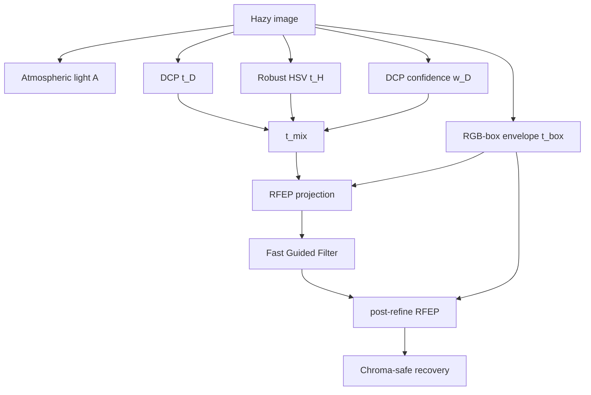

# Математический dehazing без нейросетей: физическая проверка перед делением на t

> Черновик статьи для Хабра. Статья deliberately math-only: без нейросетей, без обучения,
> без скрытых весов. Все результаты должны быть пересчитаны командой `--benchmark` перед публикацией.
>
> **ВАЖНО перед публикацией.** Граница `t_box`, вокруг которой построен текст, - это известный
> boundary constraint из Meng et al., ICCV 2013, а не находка автора. Подавать её как новую идею
> нельзя. Рабочий вариант сюжета - «я переоткрыл статью 2013 года, вот как это выяснилось и что
> в итоге осталось новым»: см. [`habr-2-physics.md`](habr-2-physics.md), часть 4.
> Актуальные формулировки - [`NOVELTY.md`](../../../NOVELTY.md).

## Тезис

Классический Dark Channel Prior часто ломается не потому, что “математика устарела”, а потому
что мы слишком доверяем карте трансмиссии `t`, а потом делим на неё:

$$
J_c=\frac{I_c-A_c}{t}+A_c.
$$

Если `t` ошиблась рядом с небом, белой стеной или бликом, результат вылетает из RGB-диапазона,
а `clip(0,1)` превращает ошибку в пересвет, цветной ореол или грязную насыщенность.

Идея RFEP-DCP: перед восстановлением проверять, **физически допустима ли такая `t`**.

## Что было в проекте

В `SimpleDeHaze` теперь две линии:

- legacy `DeHazeCPU/DeHazeGPU`: quad-decomposition, old DCP, guided filter;
- current `Methods/`: DCP variants, CAP-HSV, RFEP-DCP, BRACE-DCP, PF-SFGF,
  LAF-TV/WLS, GDR-SP, CLAHE/Retinex baselines и benchmark harness.

## Почему DCP ломается

DCP оценивает:

$$
t_D=1-\omega\,dark(I/A).
$$

На обычных текстурных объектах это работает. На bright regions dark channel высок даже без
дымки, поэтому DCP считает, что объект далеко в тумане. Дальше происходит жёсткое деление
на слишком маленькую `t`.

## RFEP: radiance-feasible projection

Берём физическую формулу восстановления:

$$
J_c=\frac{I_c-A_c}{t}+A_c.
$$

Требуем:

$$
0\le J_c\le 1.
$$

Отсюда получаем нижнюю границу для `t`:

$$
t_{box,c}=
\begin{cases}
\frac{I_c-A_c}{1-A_c+\varepsilon}, & I_c>A_c,\\
\frac{A_c-I_c}{A_c+\varepsilon}, & I_c<A_c,\\
0, & I_c=A_c.
\end{cases}
$$

Берём максимум по каналам:

$$
t_{box}=\max_c t_{box,c}.
$$

И мягко поднимаем prior-fused карту:

$$
t_{proj}=t_{mix}+\rho\max(t_{box}-t_{mix},0).
$$

Это не “улучшайзер картинки”, а проверка физической допустимости будущего восстановления.

## Откуда берётся `t_mix`

RFEP-DCP смешивает две карты:

1. DCP:

$$
t_D=1-\omega\,dark(I/A).
$$

2. Robust HSV bright-region prior:

$$
q=V-S,\qquad
z=\frac{q-\operatorname{median}(q)}{\operatorname{IQR}(q)/1.349+\varepsilon},
$$

$$
t_H=\exp(-\alpha\,clip(z,0,3.5)).
$$

Доверие к DCP падает в sky/bright-low-sat областях:

$$
w_D=(1-Sky)\exp(-3\alpha(V-\tau_v)_+)\exp(-3\alpha(\tau_s-S)_+).
$$

Итог:

$$
t_{mix}=t_H+w_D(t_D-t_H).
$$

## Конвейер



## Как воспроизвести

```powershell
pwsh build.ps1
dotnet run --project .\SimpleDeHaze\SimpleDeHaze.csproj -c Release -- --benchmark --limit=3 --maxdim=800 --out=bench.csv
```

Для быстрой smoke-проверки:

```powershell
dotnet run --project .\SimpleDeHaze\SimpleDeHaze.csproj -- --selftest
```

## Что показать в статье

Минимальная таблица ниже - **smoke-прогон** на `01_outdoor_hazy.jpg`, а не финальный
benchmark для публикации. Для статьи эти числа нужно пересчитать на полном наборе paired
изображений и отдельно показать визуальные failure cases.

| Метод | PSNR aligned (диагн.) | SSIM aligned (диагн.) | CIEDE2000 aligned (диагн.) | score | ms/MP |
|---|---:|---:|---:|---:|---:|
| DCP CPU | 16.97 | 0.752 | 14.19 | 72.3 | 796 |
| BRACE-DCP | 16.60 | 0.602 | 14.66 | 60.4 | 617 |
| RFEP-DCP | 16.62 | 0.611 | 14.65 | 58.2 | 489 |
| PF-SFGF | 16.96 | 0.751 | 14.18 | 61.4 | 476 |
| LAF-TV/WLS | 17.59 | 0.838 | 13.34 | 59.2 | 253 |
| GDR-SP | 16.93 | 0.740 | 14.27 | 54.3 | 1346 |

Картинки:

- небо/белая стена: DCP vs BRACE vs RFEP;
- городской смог;
- лесной горизонт;
- failure case, где RFEP слишком мягкий из-за высокого `t_box`.

## Честные ограничения

- RFEP зависит от оценки атмосферного света `A`; если `A` плохой, bound тоже плохой.
- `t_box` предотвращает физически невозможное восстановление, но может сделать результат мягче.
- Для arXiv нужны внешние baselines: BCCR, PF-DCP, non-local haze-lines, RSVT, Tarel.

## Почему это всё ещё интересно в эпоху нейросетей

Потому что здесь нет обучения, доменного сдвига, скрытых весов и галлюцинаций. Любой артефакт
можно проследить до формулы: prior, confidence, projection, refinement или recovery.
