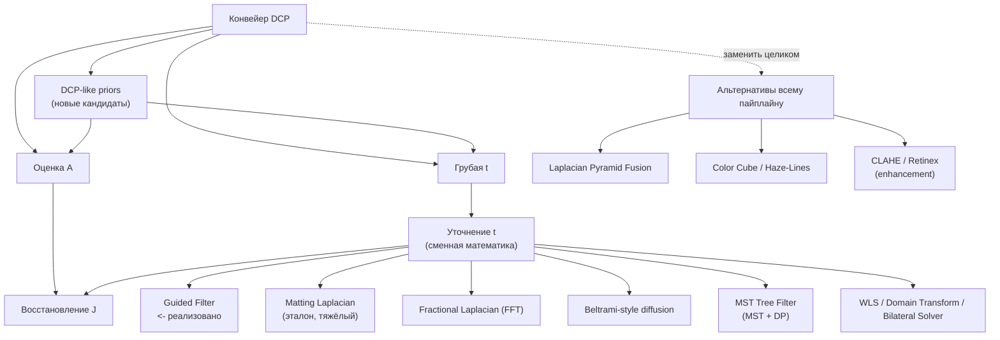
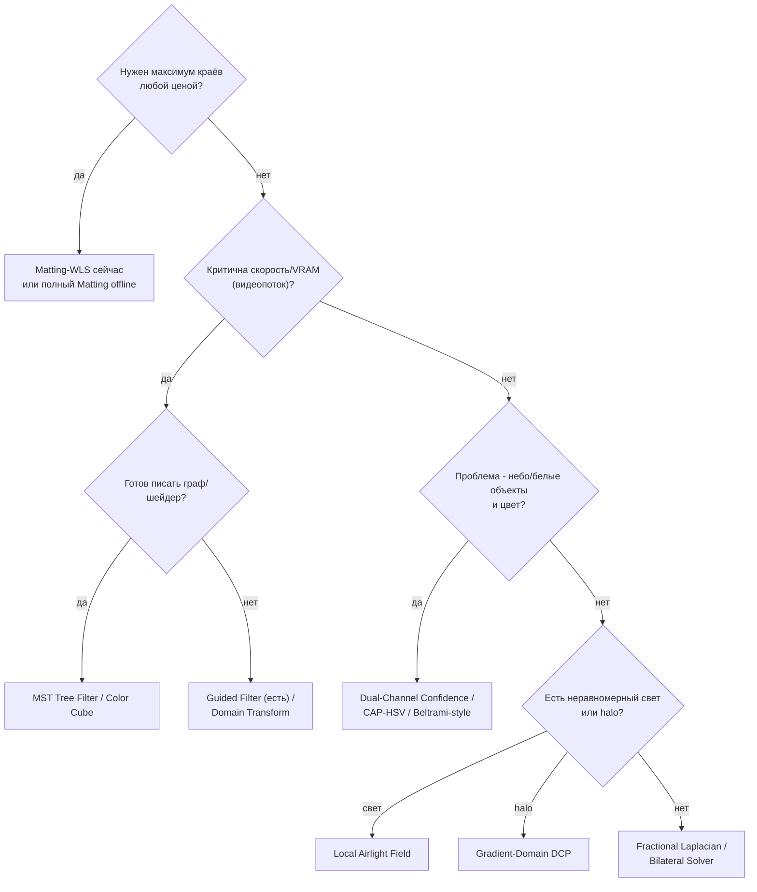

# Альтернативная математика дехейзинга

Методы оценки/уточнения карты пропускания $t(x)$ и альтернативных пайплайнов. Идея - уйти
от тяжёлых матриц $N\times N$ (полный Matting Laplacian) к быстрым и экономным по памяти
приближениям, которые проще поддерживать в Emgu.CV и переносить на GPU.

> В проекте реализована основная часть методов из таблицы: DCP CPU/GPU, CAP-HSV, Fractional,
> Beltrami-style, MST, Matting-WLS CPU/GPU, Haze-Lines, Pyramid Fusion, CLAHE и Retinex.
> Часть страниц ниже - это кандидаты на будущую реализацию; у них явно стоит статус
> 'не реализовано'.

## Реализация и качество (важно)

DCP-варианты с одной картой $t$ собраны над общим ядром
[`Methods/DehazeCore.cs`](../../Methods/DehazeCore.cs): нормализация -> тёмный канал ->
атмосферный свет (top-k по гистограмме, $O(N)$) -> грубая
$\tilde t = 1-\omega\cdot\mathrm{dark}(I/A)$ -> **уточнитель** -> восстановление. Эти методы
отличаются уточнителем из [`Methods/Refiners.cs`](../../Methods/Refiners.cs).

Pyramid Fusion, Haze-Lines/Color Cube и enhancement-методы не являются просто заменой
`RefineTransmission`: они меняют весь пайплайн или вообще не используют физическую модель
дымки.

**Ключевой вывод локального selftest:** дефолт силы $\omega$ критичен. Агрессивный
$\omega=0.95$ часто даёт тёмный/пересатурированный результат, а мягкий **$\omega=0.5$**
обычно выглядит естественнее на текущем наборе `dataset/hazefree`. PSNR здесь полезен как
быстрая регрессия, но не как универсальная метрика визуального качества дехейзинга.

**Что важно знать про реализацию:**
- **Matting Laplacian** реализован как **WLS** (взвешенный Якоби, matrix-free, полное разрешение) -
  практичная альтернатива разреженной системе $N\times N$ из теории ниже.
- **Beltrami Flow** в коде - Beltrami/Perona-Malik-style анизотропная диффузия карты $t$,
  а не полный оператор Лапласа-Бельтрами по RGB-метрике.
- **Fractional Laplacian** - изотропное частотное сглаживание $t$ через DFT; edge-aware
  дробный оператор пока не реализован.
- **Color Cube** - упрощённый Haze-Lines: биннинг направлений $(I-A)/\lVert I-A\rVert$ в
  $K^3$ корзин, ослабление через $\omega$ и Guided Filter.
- **DCP-like кандидаты** - новые идеи рядом с DCP: soft/percentile dark channel,
  multi-scale DCP, dual-channel confidence, local airlight field, gradient-domain recover,
  energy-based DCP и fast DCP engine. Они пока описаны как документы, не как код.
- **GPU-варианты** Matting и Beltrami ([`GpuCore.cs`](../../Methods/GpuCore.cs) + [`GpuRefiners.cs`](../../Methods/GpuRefiners.cs))
  держат весь конвейер на CUDA. Замер на 9.5 Мп: **Matting x4.8** (7180->1501 мс), **Beltrami x1.9**.
- Добавлены **enhancement-методы** (не физическая модель дымки): **CLAHE** и **Multi-Scale
  Retinex** - [enhancement-methods.md](enhancement-methods.md).
- Известные методы, ещё **не** реализованные (Tarel, нейросети, boundary-constraint и др.) -
  [other-methods.md](other-methods.md).

> Теория ниже описывает математику методов; реализации могут использовать практичные
> варианты (как WLS вместо полного matting-Laplacian).

## Таксономия

## Сводная матрица

Память/скорость - ориентиры для кадра порядка 1 Мп. В реальном проекте итог зависит от
размера патча, числа итераций, доступности CUDA и стоимости копирования CPU<->GPU.

| Метод | Статус | Мат. основа | Что заменяет | Память | Стоимость | Сильная сторона |
|---|---|---|---|---|---|---|
| [Guided Filter](../algorithm.md) | реализовано | локальная лин. регрессия | уточнение $t$ | ~несколько кадров | низкая | простой быстрый baseline |
| [Matting WLS](laplacian-matting.md) | реализовано CPU/GPU | взвешенная 5-точечная система | уточнение $t$ | $O(N)$ | средняя, итеративно | края без полной матрицы |
| Полный Matting Laplacian | не реализовано | разреж. система $N\times N$ | уточнение $t$ | сотни МБ -> ГБ | высокая | эталонная регуляризация |
| [Laplacian Pyramid Fusion](laplacian-pyramid-fusion.md) | реализовано | многомасштаб. слияние | весь пайплайн | $O(N)$ | низкая-средняя | градиенты, небо, без $t$ |
| [Fractional Laplacian](fractional-laplacian.md) | реализовано | дробн. фильтр + DFT | уточнение $t$ | $O(N)$ | средняя | гладкая нелокальная $t$ |
| [Beltrami-style diffusion](beltrami-flow.md) | реализовано CPU/GPU | edge-aware PDE | уточнение $t$ | $O(N)$ | зависит от `iters` | мягкие края без матриц |
| [MST Tree Filter](mst-graph-filter.md) | реализовано CPU | граф + MST + DP | уточнение $t$ | $O(N)$, много массивов | build $O(N\log N)$ + агрегация $O(N)$ | резкие границы |
| [Color Cube / Haze-Lines](color-cube-projection.md) | реализовано упрощённо | вектор. геометрия цвета | весь пайплайн | $O(N+K^3)$ | низкая-средняя | цветовые линии, мало параметров |
| [CLAHE / Retinex](enhancement-methods.md) | реализовано | enhancement | весь кадр | $O(N)$ | низкая-средняя | быстрый визуальный baseline |
| [Domain Transform / Bilateral Solver / TV](more-ideas.md) | не реализовано | edge-preserving сглаживание | уточнение $t$ | низкая-$O(N)$ | низкая-средняя | кандидаты для real-time |
| [Adaptive Soft DCP](adaptive-soft-dark-channel.md) | не реализовано | soft/percentile dark channel | грубая $\tilde t$ | $O(N)$-$O(kN)$ | низкая-средняя | меньше шума и блочности |
| [Multi-Scale DCP Fusion](multiscale-dcp-fusion.md) | не реализовано | несколько `patch` + confidence | грубая $\tilde t$ | $O(kN)$ | средняя | меньше зависимость от patch |
| [Dual-Channel Confidence Prior](dual-channel-confidence-prior.md) | не реализовано | dark + bright/saturation priors | $\tilde t$ и sky handling | $O(N)$ | низкая | небо/белые объекты |
| [Local Airlight Field](local-airlight-field.md) | не реализовано | spatially-varying $A(x)$ | оценка $A$ и $\tilde t$ | $O(N)$ + solve/filter | высокая | неравномерная засветка |
| [Gradient-Domain DCP](gradient-domain-dcp.md) | не реализовано | screened Poisson | восстановление $J$ | $O(N)$-$O(N\log N)$ | высокая | меньше halo |
| [Energy-Based DCP](energy-based-dcp.md) | не реализовано | единая оптимизация $t$ | оценка/уточнение $t$ | $O(N)$ | высокая, итеративно | качество и ограничения |
| [Fast DCP Engine](fast-dcp-engine.md) | не реализовано | fast min-filter/downsample | ускорение DCP | низкая | низкая | preview/video |

Примечание: MST/tree-filter - зрелый приём в стереозрении (cost aggregation); для дехейзинга
это перенос идеи на карту пропускания.

## Как выбирать

Практический совет: если хочется уйти от тяжёлых матриц и сохранить края, сначала смотреть
в сторону **Matting-WLS**, **[MST Tree Filter](mst-graph-filter.md)** и будущих
**Domain Transform / Fast Bilateral Solver**. **[Fractional Laplacian](fractional-laplacian.md)**
полезен как быстрый способ получить очень гладкую $t$, но сам по себе не знает про края.
Железо и решатели (direct vs iterative, RAM/VRAM) разобраны в
**[performance-and-solvers.md](performance-and-solvers.md)**.

## DCP-like кандидаты (идеи/проекты, ещё не реализованы)

Расширения именно DCP-семейства - каждый отдельным доком с математикой и псевдокодом
(- уже реализован как метод в GUI):

- [multiscale-dcp-fusion.md](multiscale-dcp-fusion.md) - несколько радиусов тёмного канала (`DCP - Multi-Scale Fusion`).
- [dual-channel-confidence-prior.md](dual-channel-confidence-prior.md) - DCP + bright/saturation priors, лучше небо/белое (`DCP - Dual-Channel`).
- [adaptive-soft-dark-channel.md](adaptive-soft-dark-channel.md) - soft-min тёмный канал (`DCP - Adaptive Soft Dark Channel`).
- [local-airlight-field.md](local-airlight-field.md) - пространственно-переменный $A(x)$ (`DCP - Local Airlight Field`).
- [energy-based-dcp.md](energy-based-dcp.md) - смесь $t_{DCP}+t_{CAP}$ по довериям + WLS (`DCP - Energy-Based`).
- [gradient-domain-dcp.md](gradient-domain-dcp.md) - восстановление $J$ через screened-Poisson, меньше halo (`DCP - Gradient Domain`).
- [guided-filter-variants.md](guided-filter-variants.md) - WGIF реализован (`DCP - Weighted Guided Filter`); GDGIF/Fast GF - кандидаты.
- [fast-dcp-engine.md](fast-dcp-engine.md) - план ускорения; частично закрыт `GpuCore` + Domain Transform.

Также реализованы как уточнители $t$: **Total Variation**, **Domain Transform**, **Fast Global Smoother**
(см. [more-ideas.md](more-ideas.md)), а из 'нереализованных' - **Tarel** и **MSRCR** (см. [other-methods.md](other-methods.md)).

## Связанное

- Базовый реализованный алгоритм - [../algorithm.md](../algorithm.md).
- Классический DCP и варианты оценки $A$/$t$ - [../DCP/README.md](../DCP/README.md).
- DCP через HSV (Color Attenuation Prior) - [../DCP/dcp-hsv.md](../DCP/dcp-hsv.md).
- Новые DCP-like кандидаты: [Adaptive Soft DCP](adaptive-soft-dark-channel.md),
  [Multi-Scale DCP Fusion](multiscale-dcp-fusion.md),
  [Dual-Channel Confidence Prior](dual-channel-confidence-prior.md),
  [Local Airlight Field](local-airlight-field.md),
  [Gradient-Domain DCP](gradient-domain-dcp.md),
  [Energy-Based DCP](energy-based-dcp.md),
  [Fast DCP Engine](fast-dcp-engine.md).
- Enhancement-методы (CLAHE, Retinex) - [enhancement-methods.md](enhancement-methods.md).
- Известные методы, ещё не реализованные - [other-methods.md](other-methods.md).
- **Оценка атмосферного света $A$** - [atmospheric-light.md](atmospheric-light.md).
- **Метрики и оценка качества** (PSNR/SSIM/FADE, привязка к `--selftest` и AutoTuner) - [metrics-and-evaluation.md](metrics-and-evaluation.md).
- Ещё кандидаты для уточнения $t$ - [more-ideas.md](more-ideas.md).
- Железо и решатели (RAM/VRAM, direct vs iterative) - [performance-and-solvers.md](performance-and-solvers.md).
