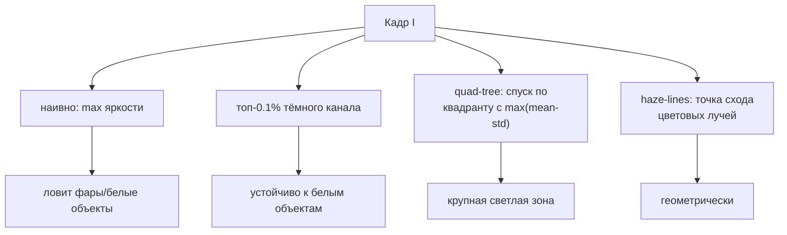

# Оценка атмосферного света A

$A$ - цвет 'дымки на бесконечности' в модели $I = J\,t + A\,(1-t)$. Это **вторая по важности
величина после $\omega$/силы**: ошибка в $A$ протекает во всё восстановление
$J=(I-A)/\max(t,t_{min})+A$ - даёт цветовой сдвиг и тёмность/пересвет. Отдельного дока на
$A$ не было - собираю методы здесь.

> В проекте $A$ считается двумя способами:
> - общий конвейер вариантов - [`DehazeCore.Atmospheric`](../../Methods/DehazeCore.cs):
>   top-k по тёмному каналу через гистограмму, $O(N)$;
> - исходные `DeHazeCPU`/`DeHazeGPU` - quad-decomposition (иерархический спуск по яркому квадранту).

## Почему это тонко

Наивный 'самый яркий пиксель' легко промахивается: фары, блик на капоте, белая стена дают
максимум яркости, но это **не** дымка. Поэтому хорошие оценки $A$ ищут яркость именно там,
где *prior дымки* выполняется (высокий тёмный канал, низкая насыщенность, плоская область).

## Методы

### 1. Самый яркий пиксель (baseline)
$A = I(\arg\max_x \sum_c I_c)$. Просто, но ненадёжно (любой яркий объект ломает). Годится лишь
как референс/отладка.

### 2. Топ-доля тёмного канала (He, 2009)
Берём пиксели с наибольшим **тёмным каналом** $D(x)=\min_c\min_\Omega I_c$ (это 'самые
задымлённые'), среди них - максимум/среднее яркости $I$:
$$A_c = \operatorname*{mean}_{x\,\in\,\text{top-}p\%\ D}\ I_c(x),\quad p\approx 0.1\%$$
Устойчиво к белым объектам (у них $D$ мал). **Так делает `DehazeCore.Atmospheric`**, только
top-k находится гистограммой за $O(N)$ (без полной сортировки).

### 3. Quad-tree / иерархический поиск (Kim, 2013)
Рекурсивно делим кадр на 4, считаем для каждого квадранта $\text{score}=\text{mean}-\text{std}$
(яркая **и** однородная зона), спускаемся в лучший, пока область не станет мелкой; $A$ -
её средний цвет. Не ловит точечные источники света. **Так делает `DeHazeCPU.QuadDecomposition`.**

### 4. Плоская/планарная область (Sulami, 2014)
Ищем участок, где сцена почти постоянна, чтобы наблюдаемые вариации были вызваны дымкой -
из них раздельно оценивают **направление** и **величину** $A$. Точнее на сложных сценах,
дороже по вычислениям.

### 5. Точка схода haze-lines (Berman, 2016)
$A$ - точка, из которой выходят все цветовые лучи (haze-lines): перебором/оптимизацией ищут
$A$, максимизирующий 'лучевую' структуру облака RGB. Согласуется с
[color-cube-projection.md](color-cube-projection.md).

## Сравнение

| Метод | Идея | Устойчивость к белым объектам | Стоимость | В проекте |
|---|---|---|---|---|
| Brightest pixel | max яркости | | $O(N)$ | - |
| Top-% dark channel | ярчайшие по $D$ | | $O(N)$ (гистограмма) | `DehazeCore` |
| Quad-tree (Kim) | спуск по mean-std | | $O(N)$ | `DeHazeCPU` |
| Flat-region (Sulami) | дымка на плоскости | | дороже | - |
| Haze-lines (Berman) | точка схода лучей | | дороже | - |

## Грабли

- **Небо/пересвет.** Если в кадре яркое небо, top-% берёт его - обычно это и есть $A$, но при
  неоднородном небе $A$ 'средний' может быть неточным (тогда - сегментная/локальная $A$,
  см. sky-aware в [other-methods.md](other-methods.md)).
- **Несколько источников освещения** (ночь, разноцветная подсветка) -> единый $A$ некорректен;
  нужна региональная оценка.
- **Перенасыщение каналов** в ярких зонах искажает оценку - иногда исключают клиппованные пиксели.

## Источники

- He, Sun, Tang. *Single Image Haze Removal Using Dark Channel Prior*, CVPR 2009 / TPAMI 2011.
- J.-H. Kim et al. *Optimized contrast enhancement for real-time image and video dehazing*, JVCIR 2013 (quad-tree $A$).
- M. Sulami et al. *Automatic Recovery of the Atmospheric Light in Hazy Images*, ICCP 2014.
- D. Berman, T. Treibitz, S. Avidan. *Non-Local Image Dehazing*, CVPR 2016.
