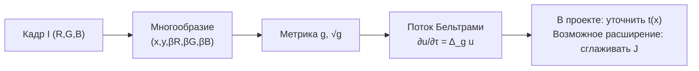

# Beltrami Flow - геометрическая и edge-aware диффузия

DCP оценивает карту пропускания через минимум по каналам и локальное окно. Beltrami-подход
в полной форме смотрит на изображение как на **2D-многообразие, погружённое в 5D-пространство**
$(x,y,R,G,B)$, и работает с его геометрией. Для дехейзинга это полезно как edge-aware
регуляризация: сглаживать карту $t$ внутри областей, но тормозить сглаживание на границах
объектов.

> Зрелость: Beltrami framework - классика обработки изображений (Sochen, Kimmel, Malladi,
> 1998). Применение к дехейзингу - research-приём.
>
> **Реализация в проекте:** метод `DCP - Beltrami Flow` - не полный оператор
> Лапласа-Бельтрами по RGB-метрике. В [`Refiners.Beltrami`](../../Methods/Refiners.cs)
> и [`GpuRefiners.BeltramiCore`](../../Methods/GpuRefiners.cs) реализована практичная
> Beltrami/Perona-Malik-style диффузия:
> $$\partial_\tau t = c(\lVert\nabla Y\rVert)\,\Delta t,\quad
> c=\exp(-\lVert\nabla Y\rVert^2/\kappa^2),$$
> где $Y$ - яркость направляющего кадра. Это дешевле и устойчивее, но не использует полную
> 5D-метрику.

## Полная идея Beltrami

Поверхность-изображение задаём отображением $(x,y)\mapsto (x,\,y,\,\beta R,\,\beta G,\,\beta B)$.
У неё есть **индуцированная метрика** $g$ (первая фундаментальная форма):

$$g = \begin{pmatrix} 1+\beta^2\sum_c (R^c_x)^2 & \beta^2\sum_c R^c_x R^c_y \\[2pt] \beta^2\sum_c R^c_x R^c_y & 1+\beta^2\sum_c (R^c_y)^2 \end{pmatrix},\qquad \sqrt{g}=\sqrt{\det g}$$

$\beta$ задаёт 'вес' цвета относительно пространственных координат. **Поток Бельтрами** -
градиентный спуск по площади многообразия - это оператор Лапласа-Бельтрами по метрике $g$:

$$\frac{\partial u}{\partial \tau} = \Delta_g u = \frac{1}{\sqrt{g}}\,\partial_i\!\Bigl(\sqrt{g}\,g^{ij}\,\partial_j u\Bigr)$$

Это **анизотропная диффузия, согласованная с геометрией цвета**: вдоль однородных областей
она сглаживает сильнее, поперёк цветовых границ - слабее. В дехейзинге такую диффузию
логично применять не вместо физической модели, а как регуляризатор грубой карты $t$ или
как аккуратную пост-обработку восстановленного изображения.

## Зачем это для тумана

Главный минус DCP - ошибки на небе, светлых стенах, снегу и белых объектах: dark-channel
prior там часто нарушается. Edge-aware диффузия не исправляет саму оценку $A$ или $\tilde t$,
но уменьшает блочность и ореолы, потому что переносит значения $t$ преимущественно внутри
похожих областей кадра.

Полная RGB-метрика Beltrami теоретически лучше связывает каналы и может аккуратнее вести
себя на цветных/белых областях. Текущая реализация проекта использует более простой
яркостный гайд, поэтому обещать 'идеальное небо' или безусловное сохранение белого объекта
некорректно.



## Псевдокод полной схемы

```python
def beltrami_refine(u, I, beta=0.05, dt=0.1, iters=20):
    """
    u: уточняемая величина (карта t или канал J)
    I: направляющий кадр (H, W, 3) в [0,1]
    """
    for _ in range(iters):
        Ix, Iy = grad(I)                          # по каналам
        a = 1 + beta**2 * sum_c(Ix[c]**2)         # g11
        d = 1 + beta**2 * sum_c(Iy[c]**2)         # g22
        b = beta**2 * sum_c(Ix[c]*Iy[c])          # g12
        detg = a*d - b*b
        sg   = sqrt(detg)
        # g^{-1} = (1/detg) [[d,-b],[-b,a]]
        ux, uy = grad(u)
        vx = (d*ux - b*uy) / detg
        vy = (a*uy - b*ux) / detg
        lap_g = ( div(sg*vx, sg*vy) ) / sg        # Δ_g u
        u = u + dt * lap_g
    return clip(u, 0, 1)
```

## Псевдокод реализации в проекте

```python
def beltrami_style_refine(t, I, kappa=0.1, dt=0.2, iters=20):
    Y = gray(I)
    gx, gy = sobel(Y)
    c = exp(-(gx*gx + gy*gy) / (kappa*kappa))

    cur = t.copy()
    for _ in range(iters):
        cur = cur + dt * c * laplacian(cur)
    return clip(cur, 0, 1)
```

Память $O(N)$: несколько float-карт размера кадра. Стоимость - $O(N\cdot\text{iters})$;
на GPU хорошо параллелится, на CPU зависит от числа итераций и размера кадра.

## Плюсы / минусы

| Плюсы | Минусы |
|---|---|
| Мягкое edge-aware сглаживание $t$ без матриц | Итеративно; нужны `iters`, $\kappa$, устойчивый шаг |
| Хорошо убирает блочность DCP | Не исправляет плохую оценку $A$ или грубую $\tilde t$ |
| GPU-версия простая и memory-friendly | Текущий код не использует полную RGB-метрику Beltrami |

## Связь с проектом

В проекте это уточнитель $t$ над общим DCP-ядром:
[`BeltramiMethod.cs`](../../Methods/BeltramiMethod.cs) ->
[`Refiners.Beltrami`](../../Methods/Refiners.cs), а GPU-вариант -
[`BeltramiGpuMethod.cs`](../../Methods/BeltramiGpuMethod.cs) ->
[`GpuRefiners.BeltramiCore`](../../Methods/GpuRefiners.cs).

Если делать полный Beltrami-оператор, нужно хранить/считать компоненты метрики $g$ по RGB
градиентам и обновлять дивергенцию $\sqrt g\,g^{-1}\nabla u$; текущий код этого сознательно
не делает.

## Источники

- N. Sochen, R. Kimmel, R. Malladi. *A General Framework for Low Level Vision*, IEEE TIP 1998.
- R. Kimmel et al. работы по Beltrami flow / geometric image processing.
