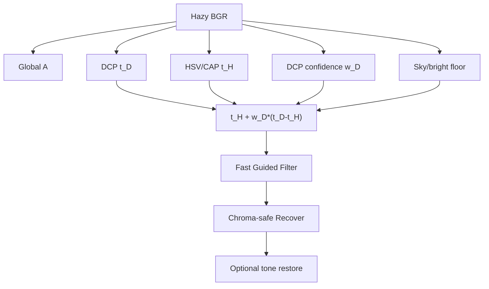

# BRACE-DCP - Bright-Region Adaptive Confidence Enhanced DCP

> Статус: **реализовано** - `BRACE-DCP (bright-region aware)`
> ([`BraceDcpMethod.cs`](../../Methods/BraceDcpMethod.cs)).

BRACE-DCP - гибридный prior-based метод без обучения. Он оставляет физическую основу DCP,
но снижает доверие к dark channel там, где он чаще всего ломается: небо, снег, белые стены,
пересветы и гладкие bright regions.

## Идея

Считаем две оценки трансмиссии:

$$
t_D(x)=1-\omega\,\operatorname{dark}(I/A)
$$

и robust HSV-оценку без обученных коэффициентов:

$$
q(x)=V(x)-S(x),
\qquad
z(x)=\frac{q(x)-\operatorname{median}(q)}
{\operatorname{IQR}(q)/1.349+\varepsilon},
$$

$$
t_H(x)=\exp\bigl(-\alpha\,\operatorname{clip}(z(x),0,3.5)\bigr).
$$

В bright/sky-зонах `t_H` получает мягкий floor `t_sky`, чтобы алгоритм не пытался
агрессивно "восстанавливать" небо или белые объекты, где данных о настоящем цвете сцены мало.

Доверие к DCP:

$$
w_D(x)=
(1-\operatorname{Sky}(x))
\cdot\exp(-3\alpha(V(x)-\tau_v)_+)
\cdot\exp(-3\alpha(\tau_s-S(x))_+).
$$

В коде это произведение трёх факторов. Оно почти 1 на обычных объектах и падает на ярких
малонасыщенных областях, где DCP чаще всего принимает белый объект или небо за плотную дымку.

Финальная грубая карта:

$$
\tilde t(x)=t_H(x)+w_D(x)\,(t_D(x)-t_H(x)).
$$

После этого применяется fast guided refinement, затем `DehazeCore.Recover` с раздельным
порогом для яркости и хромы:

$$
J_c=A_c+\frac{\bar d}{\max(t,t_{min})}
    +\frac{\delta_c}{\max(t,chromaFloor)}.
$$

## Конвейер

## Параметры по умолчанию

| Параметр | Значение | Смысл |
|---|---:|---|
| `omega` | `0.95` | сила DCP-очистки |
| `patch` | `5` | радиус dark channel |
| `alpha` | `1.1` | сила robust HSV prior и bright/low-sat штрафа |
| `tauV` | `0.62` | порог яркости для снижения доверия к DCP |
| `tauS` | `0.22` | порог насыщенности для снижения доверия к DCP |
| `tsky` | `0.68` | мягкая трансмиссия для неба/белого |
| `min` | `0.08` | нижний порог яркостной трансмиссии |
| `chroma` | `0.35` | нижний порог хромы |
| `refine` | `48` | радиус guided refinement |
| `fast` | `4` | downsample-фактор fast guided filter |
| `color` | `1.25` | потолок усиления цветности относительно входа |

## Когда использовать

BRACE-DCP стоит сравнивать прежде всего с:

- `Dark Channel Prior (CPU/GPU)` - базовый legacy DCP;
- `Color Attenuation Prior (HSV)` - чистый HSV/CAP prior;
- `DCP - Dual-Channel (sky-aware)` - более простая bright-region эвристика;
- `DCP - Energy-Based (DCP+CAP)` - родственная confidence-смесь с WLS.

Типовая абляция для статьи: DCP-only -> DCP + sky floor -> DCP + HSV/CAP -> BRACE confidence
fusion -> BRACE + chroma-safe recovery.
