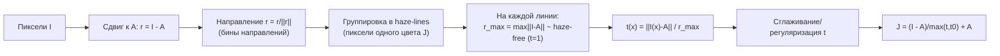

# Color Cube Projection / Haze-Lines - векторная геометрия цвета

Дехейзинг как **радиальное растяжение цветовых векторов** относительно точки атмосферного
света $A$. Основа - идея haze-lines из *Non-Local Image Dehazing* (Berman, Treibitz,
Avidan, CVPR 2016): пиксели одного чистого цвета лежат на одном луче из $A$, а туман
сжимает их к $A$.

> **Реализация в проекте:** [`ColorCubeMethod.cs`](../../Methods/ColorCubeMethod.cs) -
> упрощённый Haze-Lines. Направление $(I-A)/\lVert I-A\rVert$ квантуется в регулярную
> $K^3$-сетку, на каждой корзине берётся `r_max`, затем $t$ ослабляется через $\omega$ и
> уточняется Guided Filter. Полный Berman 2016 с kd-tree/сферическими направлениями и
> глобальной регуляризацией описан в [other-methods.md](other-methods.md).

## Геометрия

Модель тумана $I(x) = t(x)\,J(x) + (1-t(x))\,A$ перепишем относительно $A$:

$$I(x) - A = t(x)\,\bigl(J(x) - A\bigr)$$

Значит вектор $I(x)-A$ **сонаправлен** с $J(x)-A$, а его длина в $t(x)$ раз короче. Все
пиксели сцены с одним 'чистым' цветом $J$ ложатся на **луч из $A$** - это и есть **haze-line**.
Туман 'сжимает' облако RGB-векторов к точке $A$ (куб стягивается); восстановление - обратная
растяжка к границе исходной выпуклой оболочки.



## Формулы

1. Сдвиг и направление: $r(x) = I(x)-A$, $\hat r(x) = r(x)/\lVert r(x)\rVert$.
2. Группировка по направлению $\hat r$ (в проекте - $K^3$ бинов по координатам нормированного
   вектора; в полной статье - направления на сфере) -> haze-lines.
3. На каждой линии самый дальний от $A$ пиксель почти без тумана:
   $$r_{\max}(x) = \max_{y\in\text{line}(x)} \lVert I(y)-A\rVert$$
4. Оценка пропускания:
   $$\tilde t(x) = \frac{\lVert I(x)-A\rVert}{r_{\max}(x)}$$
5. Лёгкая регуляризация $t$ (гладкость с сохранением краёв) и стандартное восстановление.

## Псевдокод

```python
def dehaze_haze_lines(I, A, n_bins=1000, t_min=0.1):
    r = I - A                                  # (H,W,3)
    radius = norm(r, axis=2)                   # ||I-A||
    rhat   = r / (radius[...,None] + 1e-6)

    line_id = assign_to_sphere_bins(rhat, n_bins)   # предрассчитанные направления
    r_max   = groupwise_max(radius, line_id)        # макс. радиус в каждой линии

    t = radius / np.maximum(r_max, 1e-6)
    t = regularize(t, I)                        # необяз. сглаживание по гайду I
    t = np.clip(t, t_min, 1.0)

    J = (I - A) / t[...,None] + A
    return np.clip(J, 0, 1)
```

Основные операции - простая векторная геометрия на пиксель плюс групповая операция `max`
по корзинам. Память - $O(N+K^3)$. В текущем CPU-коде после оценки $t$ ещё вызывается Guided
Filter, поэтому это не 'чисто попиксельный' алгоритм. Шейдерный/CUDA-вариант возможен, но
потребует отдельной реализации группировки и регуляризации.

## Тонкости

- $A$ нужно оценить заранее (напр. как в проекте - [`DehazeCore.Atmospheric`](../../Methods/DehazeCore.cs),
  или по самым ярким haze-line). Качество результата чувствительно к $A$.
- Без регуляризации $t$ возможен шум на слабоконтрастных областях - поэтому шаг 5.

## Плюсы / минусы

| Плюсы | Минусы |
|---|---|
| Простая RGB-геометрия, мало параметров | Нужна точная оценка $A$ и достаточно заполненные бины |
| Основная оценка без матриц/PDE, хорошо подходит для GPU/шейдеров | Регуляризация $t$ всё же желательна |
| Хорошо сохраняет цвет (работаем в RGB-геометрии) | Деградация при малом числе цветов в сцене |

## Связь с проектом

Это **замена всего пайплайна** DCP после оценки $A$: метод сам оценивает $t$ через haze-lines
и затем вызывает общее восстановление `Recover`. Текущая версия CPU; GPU-версия потребует
кастомной группировки по корзинам или другого способа аппроксимации `groupwise_max`.

## Источники

- D. Berman, T. Treibitz, S. Avidan. *Non-Local Image Dehazing*, CVPR 2016.
- Геометрия выпуклой оболочки цвета / quasi-invariants - родственные работы по color-line priors.
