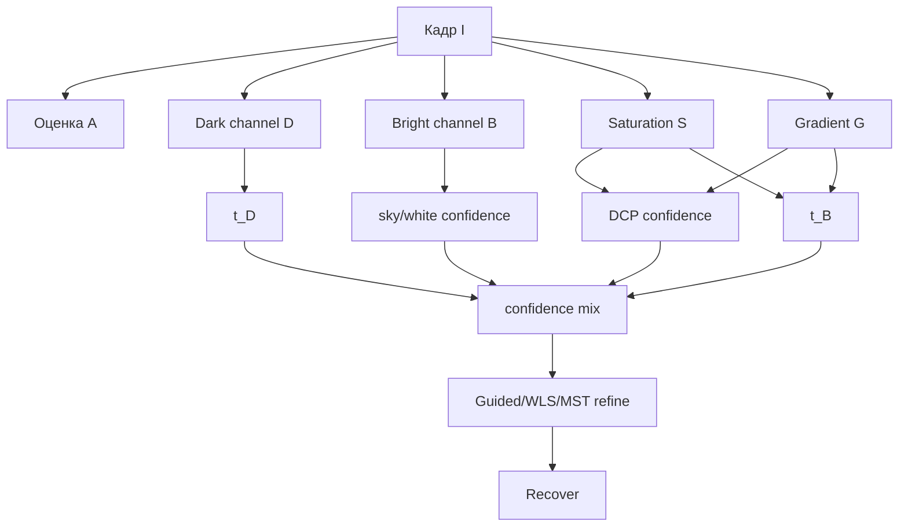

# Dual-Channel Confidence Prior - DCP + bright/saturation priors

Главная проблема DCP - светлые области без тёмных пикселей: небо, снег, белые стены,
белые машины. Dark channel там принимает дымку за объект и завышает толщину тумана.

Идея Dual-Channel Confidence Prior: считать несколько простых DCP-like карт и смешивать их
по довериям:

- dark prior - хорош на текстурных/цветных объектах;
- bright/sky prior - помогает на небе и пересветах;
- saturation prior - дымка обычно снижает насыщенность;
- gradient confidence - края глубины не должны расплываться.

> Статус: **реализовано** - `DCP - Dual-Channel (sky-aware)`
> ([`DualChannelMethod.cs`](../../Methods/DualChannelMethod.cs)): DCP + bright/saturation/gradient
> confidence, мягкая оценка $t$ на небе/белом.

## Карты признаков

Для нормализованного кадра $I\in[0,1]$:

$$D(x)=\min_{y\in\Omega(x)}\min_c I_c(y)$$

$$B(x)=\max_{y\in\Omega(x)}\max_c I_c(y)$$

$$S(x)=\operatorname{saturation}_{HSV}(I(x)),\qquad
G(x)=\lVert\nabla Y(x)\rVert.$$

Интуиция:

- большой $D$ в DCP означает плотную дымку, но на белых объектах это ложный сигнал;
- большой $B$ и малая насыщенность часто указывают на небо/airlight;
- высокий градиент обычно означает границу объекта или глубины, там смешивание должно быть
  осторожным.

## Доверие к DCP

$$w_D(x)=
\sigma(a_1 S(x)+a_2 G(x)-a_3 B(x)-b).$$

Высокое доверие к DCP: насыщенность/текстура есть, область не похожа на белое небо.

Доверие к sky/bright prior:

$$w_B(x)=1-w_D(x).$$

## Две оценки трансмиссии

DCP-оценка:

$$t_D(x)=1-\omega_D D_A(x),\qquad D_A=\operatorname{dark}(I/A).$$

Sky/bright-оценка должна быть мягче, чтобы не затемнять небо:

$$t_B(x)=\operatorname{clip}\left(t_{sky} + k_S S(x) + k_G G(x),\ t_{\min},\ 1\right).$$

Затем смешиваем:

$$\tilde t(x)=
\frac{w_D(x)t_D(x)+w_B(x)t_B(x)}
{w_D(x)+w_B(x)+\epsilon}.$$

Финальный шаг - edge-aware уточнение `GuidedFilter`, WLS или MST.

## Конвейер



## Псевдокод

```python
def dual_channel_confidence(I, A, omega=0.5):
    IA = I / A
    D = dark_channel(IA, radius=7)
    B = bright_channel(I, radius=15)
    S = hsv_saturation(I)
    G = abs_sobel(gray(I))

    wD = sigmoid(3.0*S + 2.0*G - 2.5*B - 0.3)
    wB = 1.0 - wD

    tD = 1.0 - omega * D
    tB = 0.55 + 0.25*S + 0.15*G

    t = (wD*tD + wB*tB) / (wD + wB + 1e-6)
    t = guided_filter(I, clip(t, 0.08, 1.0))
    return recover(I, t, A)
```

## Плюсы / минусы

| Плюсы | Минусы |
|---|---|
| Лучше ведёт себя на небе, снегу и белых объектах | Нужна настройка confidence-функций |
| Быстрый: min/max/HSV/градиенты + один refine | Может недоочищать плотный туман в небе |
| Хорошо совместим с текущим DCP ядром | Эвристики могут ошибаться на белых зданиях |

## Связь с проектом

Это отдельный `IDeHazeMethod`, но большую часть можно переиспользовать:
[`DehazeCore.Atmospheric`](../../Methods/DehazeCore.cs),
[`DehazeCore.Recover`](../../Methods/DehazeCore.cs), Guided Filter из текущих DCP-методов.
Если хочется быстро проверить идею, сначала можно реализовать только confidence-смешивание
поверх существующего `RawTransmission`.
