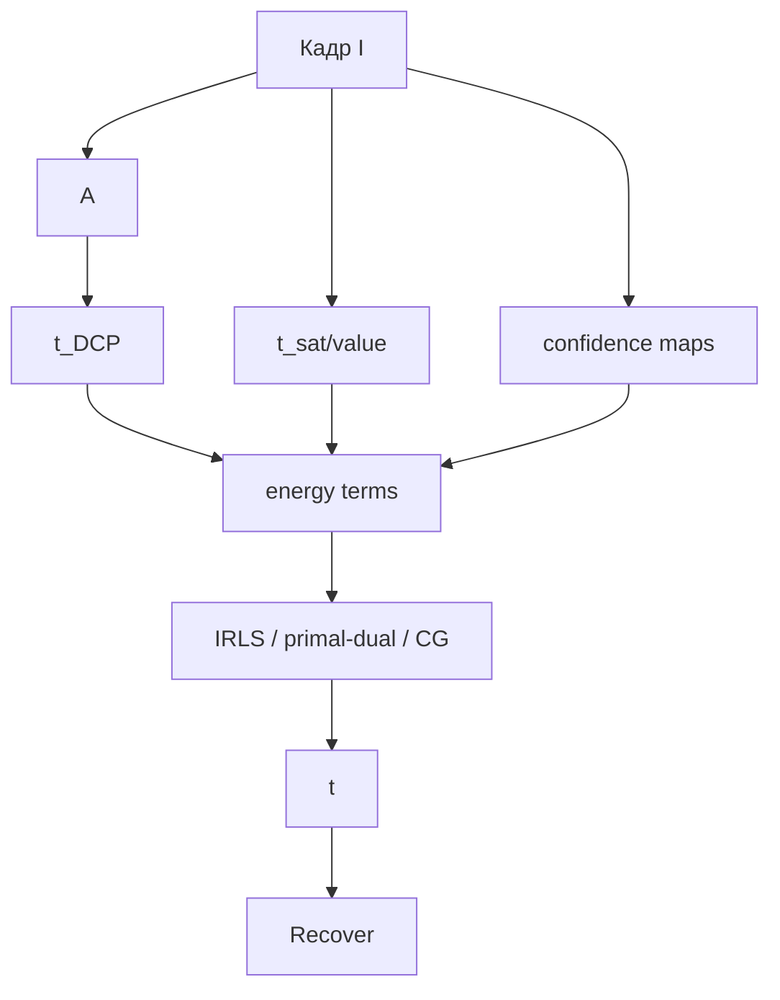

# Energy-Based DCP - DCP как задача оптимизации

Классический DCP делает два шага раздельно:

1. эвристически оценивает грубую $\tilde t$;
2. сглаживает её guided filter / WLS / matting.

Energy-Based DCP объединяет всё в одну энергию: карта $t$ должна быть близка к DCP-оценке,
согласована с локальным контрастом/насыщенностью и иметь edge-aware гладкость.

> Статус: **реализовано** (упрощённо) - `DCP - Energy-Based (DCP+CAP)`
> ([`EnergyBasedDcpMethod.cs`](../../Methods/EnergyBasedDcpMethod.cs)): доверительная смесь
> $t_{DCP}$ и $t_{CAP}$ + WLS, без явного clipping-терма (минимальный прототип из конца дока).

## Энергия

$$
\min_t
\sum_x \lambda_D(x)(t_x-\tilde t_D(x))^2
+
\lambda_S(x)(t_x-\tilde t_S(x))^2
+
\lambda_C(x)\,\Phi_C(t_x)
+
\gamma\sum_{(x,y)}w_{xy}(t_x-t_y)^2.
$$

Где:

- $\tilde t_D$ - обычная DCP-трансмиссия;
- $\tilde t_S$ - оценка по насыщенности/яркости, похожая на CAP-HSV;
- $\Phi_C$ - ограничение контраста: восстановленный $J(t)$ не должен уходить в клиппинг;
- $w_{xy}=\exp(-\lVert I_x-I_y\rVert/\sigma)$ - edge-aware гладкость.

## Confidence к DCP

DCP-терм должен быть сильным только там, где prior надёжен:

$$\lambda_D(x)=
\lambda_0\,
\sigma(aS(x)+bTEX(x)-cB(x)).
$$

Меньшее доверие:

- небо;
- белые объекты;
- пересветы;
- области без текстуры.

## Contrast / clipping constraint

Плохая $t$ часто проявляется тем, что восстановление выходит за диапазон:

$$J(t)=\frac{I-A}{\max(t,t_{\min})}+A.$$

Добавим мягкий штраф:

$$\Phi_C(t)=
\sum_c \left[
\max(0, J_c(t)-1)^2+\max(0, -J_c(t))^2
\right].
$$

Он не даёт алгоритму выбирать слишком маленькую $t$, если это приводит к клиппингу и
неестественным цветам.

## Конвейер



## Псевдокод

```python
def energy_based_dcp(I, A, omega=0.5, gamma=40, iters=50):
    tD = raw_dcp_transmission(I, A, omega)
    tS = hsv_cap_like_transmission(I)

    S = hsv_saturation(I)
    B = bright_channel(I)
    TEX = local_variance(gray(I))

    lamD = sigmoid(3*S + 4*TEX - 2*B)
    lamS = 1.0 - lamD
    w = edge_weights(I)

    t = tD.copy()
    for _ in range(iters):
        # linearized clipping penalty around current t
        clip_grad, clip_weight = linearize_clipping_penalty(I, A, t)

        t = solve_wls_step(
            data_terms=[
                (lamD, tD),
                (lamS, tS),
                (clip_weight, t - clip_grad),
            ],
            smooth_weights=w,
            gamma=gamma,
        )
        t = clip(t, 0.05, 1.0)

    return recover(I, t, A)
```

## Решатели

Варианты по сложности:

- **Weighted Jacobi / Gauss-Seidel** - проще всего встроить, похоже на текущий
  [`Refiners.Wls`](../../Methods/Refiners.cs).
- **CG/PCG** - лучше для качества, но нужен оператор и предобуславливатель.
- **Primal-dual** - если заменить $\ell_2$-гладкость на TV.
- **IRLS** - если clipping/robust-термы сделать нелинейными.

## Плюсы / минусы

| Плюсы | Минусы |
|---|---|
| Все эвристики DCP собраны в одну управляемую задачу | Больше параметров и сложнее отладка |
| Можно явно подавлять клиппинг/пересатурацию | Итеративно, медленнее обычного DCP |
| Хорошо расширяется новыми приорами | Нужны confidence-карты |

## Связь с проектом

Это можно реализовать как новый `IDeHazeMethod`, переиспользовав:

- `DehazeCore.RawTransmission` как $\tilde t_D$;
- `HsvCapMethod`-подобную оценку как $\tilde t_S$;
- `Refiners.Wls` как основу решателя.

Минимальный прототип: убрать clipping-терм и решить только confidence-weighted смесь
`tD/tS + WLS`. Потом добавить нелинейные ограничения.
