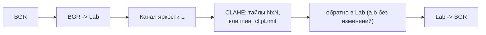
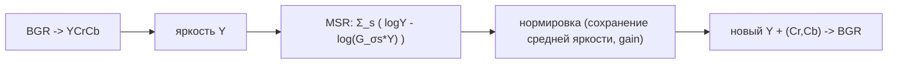

# Enhancement-методы: CLAHE и Multi-Scale Retinex

Эти методы **не моделируют дымку физически** (нет $A$ и $t$), а повышают видимость через
локальный контраст / нормализацию освещённости. Часто дают приятный результат на дымке
дёшево и устойчиво. Оба реализованы в проекте.

---

## 1. CLAHE - Contrast Limited Adaptive Histogram Equalization

Реализация: [`Methods/ClaheMethod.cs`](../../Methods/ClaheMethod.cs).

Локальная эквализация гистограммы по тайлам с ограничением усиления (клиппинг гистограммы -
чтобы не раздувать шум в однородных областях).

- Работаем только с **яркостью** (Lab/L), тон $a,b$ не трогаем -> цвет сохраняется.
- `clipLimit` - сила (ограничение наклона CDF в тайле); `tiles` - размер сетки.
- **Плюсы:** очень быстро, надёжно, вытягивает детали в дымке; в локальном `--selftest`
  часто служит сильным baseline, хотя PSNR не всегда совпадает с визуальным качеством.
- **Минусы:** не убирает 'вуаль' физически (это контраст, а не модель дымки); крупный clip -> 'перешарп'.
- Ref: Zuiderveld, *Contrast Limited Adaptive Histogram Equalization*, Graphics Gems IV, 1994.

---

## 2. Multi-Scale Retinex (MSR)

Реализация: [`Methods/RetinexMethod.cs`](../../Methods/RetinexMethod.cs).

Модель Retinex: наблюдение = освещённость x отражение. Логарифм-разность с размытыми
версиями убирает плавную освещённость (~ дымку/перепад света), оставляя 'отражение':

$$R(x) = \sum_{s} \Bigl[\log I(x) - \log\bigl(G_{\sigma_s} * I\bigr)(x)\Bigr]$$

по нескольким масштабам $\sigma_s$ (малый/средний/большой).

- Применяется к **яркости** (Y), цвет (Cr,Cb) сохраняется -> нет 'серого' эффекта классического MSR.
- Нормировка: центрируем по среднему MSR и возвращаем **к исходной средней яркости** сцены
  (иначе результат уходит в пересвет - проверено), `gain` управляет растяжением контраста.
- **Плюсы:** выравнивает неравномерную дымку/освещённость, усиливает локальные детали.
- **Минусы:** большие $\sigma$ -> дорогое гауссово размытие; возможны ореолы у резких границ.
- Ref: Jobson, Rahman, Woodell, *A Multiscale Retinex for Bridging the Gap Between Color
  Images and the Human Observation of Scenes*, IEEE TIP 1997.

---

## Когда брать

| Ситуация | Метод |
|---|---|
| Нужен быстрый надёжный 'вытягиватель' деталей | **CLAHE** |
| Неравномерная дымка/освещённость по кадру | **Multi-Scale Retinex** |
| Нужна физическая модель (карта глубины/$t$) | DCP / CAP-HSV / варианты из [README.md](README.md) |

Полноценная цветовосстанавливающая версия Retinex - **MSRCR** (с членом цветовой
реставрации) - пока не реализована, см. [other-methods.md](other-methods.md).
