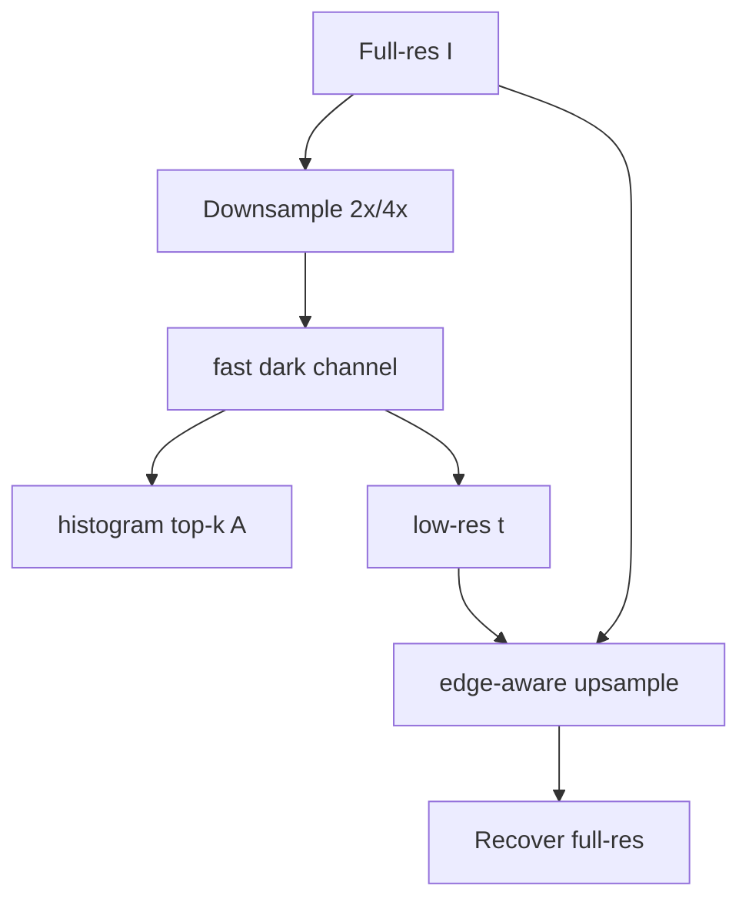

# Fast DCP Engine - быстрый DCP без смены физической модели

Иногда лучший новый метод - не менять DCP, а заменить медленные блоки быстрыми эквивалентами.
Fast DCP Engine сохраняет ту же модель:

$$I=tJ+(1-t)A,\qquad \tilde t=1-\omega\,\operatorname{dark}(I/A),$$

но ускоряет `dark channel`, оценку $A$, refine и восстановление.

> Статус: **не реализовано как отдельный метод**. Это план оптимизации для CPU/GPU и база
> для real-time DCP-like вариантов.

## 1. Быстрый min-filter

Dark channel - это min-filter по окну. Наивная стоимость:

$$O(Nr^2).$$

Для прямоугольного окна можно использовать separable min-filter:

1. горизонтальный минимум по строкам;
2. вертикальный минимум по столбцам.

С алгоритмом van Herk/Gil-Werman стоимость становится $O(N)$ и почти не зависит от радиуса.

```text
RGB -> min_channel -> horizontal_min(radius r) -> vertical_min(radius r)
```

В OpenCV обычная `Erode` уже хорошо оптимизирована, но собственный tiled GPU/min-filter
может быть быстрее и предсказуемее для больших окон.

## 2. Downsampled transmission

Карта $t$ обычно гладкая. Можно считать DCP на уменьшенной копии:

1. уменьшить `I` в 2-4 раза;
2. оценить $A$ и грубую $\tilde t_{low}$;
3. поднять $\tilde t$ на полный размер;
4. уточнить Guided Filter по полному `I`.

$$\tilde t=\operatorname{upsample}(\tilde t_{low}),\qquad
t=\operatorname{GuidedFilter}(I,\tilde t).$$

Это часто даёт почти тот же вид, но резко уменьшает стоимость dark channel.

## 3. Гистограммный top-k для A

Текущий [`DehazeCore.Atmospheric`](../../Methods/DehazeCore.cs) уже использует гистограммный
порог вместо полной сортировки. Для GPU-варианта можно сделать то же без полной выгрузки:

- локальные гистограммы по блокам;
- reduction в 256 bins;
- порог top-percent;
- reduction среднего BGR среди пикселей выше порога.

## 4. Однопроходный approximate refine

Guided Filter качественный, но для видео можно заменить его быстрым приближением:

- joint bilateral grid;
- domain transform;
- fast global smoother;
- один-два прохода edge-aware box filter.

Для real-time режима лучше иметь переключатель:

| Режим | Refine | Качество | Скорость |
|---|---|---|---|
| Preview | upsample + joint bilateral/domain transform | среднее | высокая |
| Photo | Guided/WLS/MST | выше | ниже |

## Конвейер real-time



## Псевдокод

```python
def fast_dcp(I, scale=0.5, patch=7, omega=0.5):
    low = resize(I, scale)
    dark = fast_dark_channel(low, patch)
    A = histogram_airlight(low, dark, top_percent=0.001)

    IA = low / A
    D = fast_dark_channel(IA, patch)
    t_low = 1.0 - omega * D

    t = joint_upsample(t_low, guide=I)
    t = fast_edge_refine(t, I)
    return recover(I, t, A)
```

## Плюсы / минусы

| Плюсы | Минусы |
|---|---|
| Максимально близко к текущему DCP | Это ускорение, а не новая оценка качества |
| Хорошо подходит для GUI preview и видео | Downsample может потерять тонкие границы |
| Можно внедрять по частям | Нужна аккуратная GPU-инженерия |

## Связь с проектом

Этот документ полезен как план оптимизации:

- заменить/добавить быстрый `DarkChannel`;
- добавить режим downsampled transmission;
- сделать GPU top-k для `A`;
- добавить быстрый preview-refine.

Кодовые точки входа: [`DehazeCore.DarkChannel`](../../Methods/DehazeCore.cs),
[`GpuCore`](../../Methods/GpuCore.cs), GUI-параметры методов.
