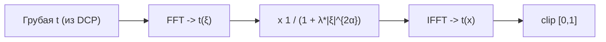

# Fractional Laplacian - дробный лапласиан через БПФ

Замена целочисленного оператора второй производной $\Delta$ на **дробный лапласиан**
$(-\Delta)^{\alpha}$ с нецелым порядком $\alpha$ (напр. $0.5$ или $1.2$). Это нелокальный
оператор с 'эффектом памяти', который учитывает текстурный контекст всего кадра, а не
окно $3\times3$. В изотропном варианте он быстро считается в частотной области через БПФ/DFT.

> Зрелость: дробное исчисление в обработке изображений (текстуры, шумоподавление,
> fractional-TV) - реальное направление; применение именно к уточнению трансмиссии - это
> research-приём. Ниже - честная изотропная спектральная версия и заметка про edge-aware.

## Математика

Дробный лапласиан проще всего определить через преобразование Фурье - у него скалярный
символ $|\xi|^{2\alpha}$:

$$\widehat{(-\Delta)^{\alpha} t}(\xi) = |\xi|^{2\alpha}\,\hat t(\xi)$$

Уточнение $t$ ставим как регуляризацию дробного порядка: карта остаётся близкой к грубой
$\tilde t$, но получает нелокальную гладкость:

$$E(t) = \lVert t-\tilde t\rVert^2 + \lambda\,\bigl\langle t,\ (-\Delta)^{\alpha} t\bigr\rangle$$

В Фурье-области задача **диагональна**, минимум - закрытая формула (фильтр):

$$\boxed{\ \hat t(\xi) = \dfrac{\hat{\tilde t}(\xi)}{1 + \lambda\,|\xi|^{2\alpha}}\ }$$

То есть это частотный low-pass с дробной степенью: $\alpha$ управляет 'жёсткостью' спада, а
значит - нелокальностью и гладкостью результата. Это не edge-aware фильтр: границы он знает
только как высокие частоты.

## Конвейер



## Псевдокод

```python
import numpy as np

def refine_t_fractional(t_raw, alpha=0.8, lam=2.0):
    h, w = t_raw.shape
    # сетка частот |ξ|^2 (нормированная)
    fy = np.fft.fftfreq(h)[:, None]
    fx = np.fft.fftfreq(w)[None, :]
    xi2 = (2*np.pi*fx)**2 + (2*np.pi*fy)**2          # |ξ|^2

    T  = np.fft.fft2(t_raw)
    H  = 1.0 / (1.0 + lam * np.power(xi2, alpha))     # |ξ|^{2α} = (|ξ|^2)^α
    t  = np.real(np.fft.ifft2(T * H))
    return np.clip(t, 0.0, 1.0)
```

Сложность $O(N\log N)$ (DFT + inverse DFT), память $O(N)$ - несколько float-карт/комплексных
буферов. В проекте используется [`CvInvoke.Dft`](../../Methods/Refiners.cs) с padding до
оптимального размера DFT и отражённой границей; частоты нормированы, поэтому масштаб
$2\pi$ фактически поглощается параметром $\lambda$. На GPU это естественно переносится на
`cuFFT`, но конкретная скорость зависит от размера кадра и стоимости копирования данных.

## Edge-aware расширение (честно)

Формула выше **изотропна** - она не знает про края и может размывать границы глубины.
Чтобы сделать дробную регуляризацию edge-aware, нужен **пространственно-зависимый** или
**взвешенный по градиентам** дробный оператор (fractional-order anisotropic diffusion /
weighted fractional-TV). Тогда диагонализации в Фурье уже нет - решают итеративно
(например, primal-dual/Chambolle-Pock) или гибридом 'DFT + направляющие веса'. Это отдельный
research-вариант, в проекте он пока не реализован.

## Плюсы / минусы

| Плюсы | Минусы |
|---|---|
| Быстро для глобального сглаживания ($O(N\log N)$), мало памяти | Изотропная версия не edge-aware |
| Нелокальный 'эффект памяти', гладкая $t$ | Edge-aware вариант сложнее (итерации) |
| Тривиально на GPU (cuFFT) | Подбор $\alpha,\lambda$ эмпирический |

## Связь с проектом

В проекте это DCP-уточнитель:
[`FractionalMethod.cs`](../../Methods/FractionalMethod.cs) вызывает
[`Refiners.Fractional`](../../Methods/Refiners.cs). Он заменяет блок `RefineTransmission`
и возвращает одну сглаженную карту $t$.

## Источники

- Y. Pu et al. *Fractional Differential Mask: A Fractional Differential-Based Approach for
  Multiscale Texture Enhancement*, IEEE TIP 2010.
- Обзоры fractional-order TV / diffusion в обработке изображений (fractional calculus in imaging).
