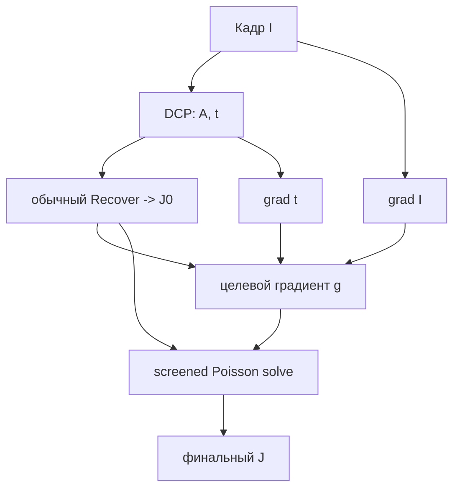

# Gradient-Domain DCP - восстановление через градиенты

Обычный DCP восстанавливает пиксель напрямую:

$$J(x)=\frac{I(x)-A}{\max(t(x),t_{\min})}+A.$$

Если $t$ чуть ошиблась около границы глубины, формула усиливает ошибку и даёт halo,
перешарп или тёмный контур. Gradient-Domain DCP оставляет DCP для оценки $A$ и $t$, но
восстанавливает итоговое изображение через согласованные градиенты и решает Poisson/screened
Poisson задачу.

> Статус: **реализовано** - `DCP - Gradient Domain`
> ([`GradientDomainMethod.cs`](../../Methods/GradientDomainMethod.cs)): screened-Poisson
> поканально итерациями Якоби (быстрый вариант из раздела ниже).

## Идея

Из модели:

$$I=tJ+(1-t)A.$$

Если $A$ глобальный, то градиент:

$$\nabla I = t\nabla J + (J-A)\nabla t.$$

Отсюда:

$$\nabla J \approx \frac{\nabla I - (J_0-A)\nabla t}{\max(t,t_{\min})},
$$

где $J_0$ - обычное пиксельное восстановление DCP. Затем вместо прямого `J0` ищем изображение
$J$, близкое к $J_0$, но с более согласованным градиентным полем:

$$
\min_J
\sum_x \mu(x)\lVert J(x)-J_0(x)\rVert^2
+
\lambda\sum_x \lVert\nabla J(x)-g(x)\rVert^2.
$$

Это screened Poisson задача. $\mu(x)$ можно уменьшать около ненадёжных границ $t$, чтобы
там больше доверять градиентам.

## Конвейер



## Псевдокод

```python
def gradient_domain_dcp(I, A, t, lam=0.2):
    J0 = recover(I, t, A)

    gxI, gyI = grad(I)
    gxt, gyt = grad(t)

    # target gradients, channel-wise
    gx = (gxI - (J0 - A) * gxt[...,None]) / maximum(t[...,None], 0.08)
    gy = (gyI - (J0 - A) * gyt[...,None]) / maximum(t[...,None], 0.08)

    # confidence: меньше доверяем пиксельной формуле там, где t резко меняется
    mu = 1.0 / (1.0 + 20.0 * (gxt*gxt + gyt*gyt))

    J = screened_poisson(J0, gx, gy, mu=mu, lam=lam)
    return clip(J, 0, 1)
```

## Решение screened Poisson

Для каждого канала решаем:

$$
(\mu - \lambda\Delta)J = \mu J_0 - \lambda\,\operatorname{div}(g).
$$

Варианты:

- FFT/DCT solver при постоянной $\mu$ - быстро, $O(N\log N)$;
- CG/PCG при переменной $\mu(x)$ - медленнее, но качественнее;
- multigrid - лучший вариант для больших кадров.

## Плюсы / минусы

| Плюсы | Минусы |
|---|---|
| Меньше halo от локальных ошибок $t$ | Нужен Poisson/CG solver |
| Хорошо восстанавливает локальный контраст | Может давать лёгкий tone-mapping эффект |
| Можно использовать поверх любого DCP-like метода | Сложнее контролировать цвет и клиппинг |

## Быстрый вариант

Можно не решать полноценный Poisson:

1. Считать обычный `J0`.
2. Усилить/подавить градиенты `J0` по confidence карте.
3. Собрать результат через несколько итераций Jacobi:

$$J^{k+1}=\frac{\mu J_0+\lambda\,\text{neighbor/gradient terms}}{\mu+4\lambda}.$$

Это уже похоже на WLS и хорошо ложится на существующие итеративные CPU/GPU уточнители.

## Связь с проектом

Это не замена [`DehazeCore.RawTransmission`](../../Methods/DehazeCore.cs), а замена финального
[`DehazeCore.Recover`](../../Methods/DehazeCore.cs). Его можно добавить как отдельный метод:

1. получить $A,t$ любым текущим DCP-вариантом;
2. выполнить обычный `Recover`;
3. применить gradient-domain refinement к `J`.
