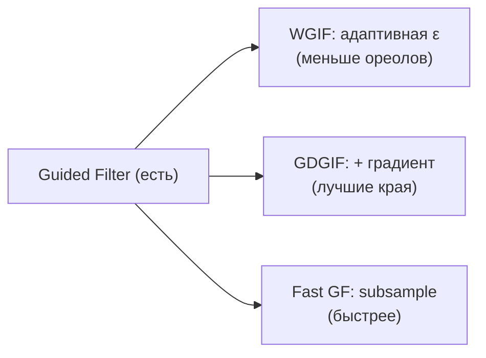

# Варианты Guided Filter - улучшения дефолтного уточнителя

Guided Filter (He, 2010) - **основной уточнитель $t$ в проекте** (его зовут DCP CPU/GPU, HSV,
Color Cube). Это быстрый edge-aware фильтр, но у него есть известная слабость - **ореолы у
сильных границ** - и есть готовые улучшения. Здесь собраны его варианты как кандидаты на
замену `XImgprocInvoke.GuidedFilter` / GPU-[`Filter`](../../DeHazeGPU.cs).

> Статус: базовый GF и **WGIF** - **реализованы** (`DCP - Weighted Guided Filter`,
> [`Refiners.Wgif`](../../Methods/Refiners.cs)); GDGIF и Fast GF - кандидаты.

## База: Guided Filter (He, 2010)

В окне $\omega_k$ ищем линейную модель $q_i = a_k I_i + b_k$, минимизируя
$\sum_{i\in\omega_k}\bigl((a_k I_i + b_k - p_i)^2 + \varepsilon a_k^2\bigr)$:

$$a_k=\frac{\frac{1}{|\omega|}\sum_{i\in\omega_k} I_i p_i-\mu_k\bar p_k}{\sigma_k^2+\varepsilon},
\qquad b_k=\bar p_k-a_k\mu_k.$$

$\varepsilon$ - **глобальная** регуляризация: чем больше, тем сильнее сглаживание. Проблема:
один $\varepsilon$ одинаково сглаживает и гладкие зоны, и важные края -> у резких границ
глубины появляются ореолы (halo).

## 1. Weighted Guided Image Filter (WGIF, Li, 2015)

Делает $\varepsilon$ **пространственно-адаптивным** через edge-aware вес $\Gamma(x)$
(на базе локальной дисперсии гайда):

$$a_k=\frac{\sigma_k^2}{\sigma_k^2+\dfrac{\varepsilon}{\Gamma_k}}\cdot(\dots),\qquad
\Gamma(x)=\frac{1}{M}\sum_y \frac{\sigma_{1,x}^2+\eta}{\sigma_{1,y}^2+\eta}.$$

У краёв $\Gamma$ велик -> эффективная регуляризация мала -> край сохраняется; в плоских зонах
наоборот. **Итог:** меньше ореолов почти без потери скорости. Ref: Li, Zheng, Jia, Wu,
*Weighted Guided Image Filtering*, IEEE TIP 2015.

## 2. Gradient Domain Guided Image Filter (GDGIF, Kou, 2015)

Добавляет в модель **многомасштабный edge-aware штраф** и явный градиентный член, ещё
точнее сохраняя края и контраст у тонких структур (провода, ветки). Чуть дороже WGIF,
качество границ - выше. Ref: Kou, Chen, Hou, Hu, *Gradient Domain Guided Image Filtering*,
IEEE TIP 2015.

## 3. Fast Guided Filter (He & Sun, 2015)

Чистое **ускорение** без смены качества по сути: коэффициенты $a,b$ считаются на
**прореженной** версии (subsample в $s$ раз), затем $a,b$ апсемплятся и применяются на полном
разрешении. Стоимость падает с $O(N)$ до $\approx O(N/s^2)$ - удобно для preview/видео и
больших $r$. Ref: He, Sun, *Fast Guided Filter*, arXiv 2015.

## Сравнение

| Фильтр | Идея | Ореолы | Скорость | В проекте |
|---|---|---|---|---|
| Guided Filter | глоб. $\varepsilon$ | бывают у краёв | быстро | **есть** (дефолт) |
| WGIF | адаптивный $\varepsilon/\Gamma$ | заметно меньше | ~ как GF | кандидат |
| GDGIF | + градиентный член | минимум | чуть медленнее | кандидат |
| Fast GF | subsample $a,b$ | как у базового | $\times s^2$ быстрее | кандидат (preview/видео) |

## Связь с проектом

Точки замены:
- CPU: `XImgprocInvoke.GuidedFilter(...)` в [`DeHazeCPU`](../../DeHazeCPU.cs) и
  [`ColorCubeMethod`](../../Methods/ColorCubeMethod.cs);
- GPU: ручной цветной guided filter [`DeHazeGPU.Filter`](../../DeHazeGPU.cs).

Практичный план: WGIF - наименьшая правка с заметным выигрышем по ореолам; Fast GF - для
preview-режима из [fast-dcp-engine.md](fast-dcp-engine.md); GDGIF - если нужны идеальные
тонкие границы. Все совместимы с текущим $\tilde t$ из [`DehazeCore.RawTransmission`](../../Methods/DehazeCore.cs).

## Источники

- K. He, J. Sun, X. Tang. *Guided Image Filtering*, ECCV 2010 / TPAMI 2013.
- K. He, J. Sun. *Fast Guided Filter*, arXiv:1505.00996, 2015.
- Z. Li, J. Zheng, Z. Zhu, W. Yao, S. Wu. *Weighted Guided Image Filtering*, IEEE TIP 2015.
- F. Kou, W. Chen, C. Wen, Z. Li. *Gradient Domain Guided Image Filtering*, IEEE TIP 2015.
