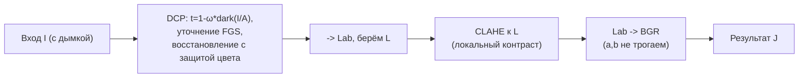

# DCP + CLAHE (гибрид физики и локального контраста)

**Реализовано:** [`HybridDcpClaheMethod.cs`](../../Methods/HybridDcpClaheMethod.cs) - в GUI 'DCP + CLAHE (гибрид)'.

## Зачем

Бенчмарк ([metrics-and-evaluation.md](metrics-and-evaluation.md)) на этом датасете показывал
характерную картину:

- **чистый CLAHE** даёт самый 'естественный' результат (высокий совмещённый PSNR, цвет x1.0),
  но он **не убирает дымку физически** - только локальный контраст (dark-channel падает слабо,
  у дефолта ~17%);
- **DCP** реально убирает вуаль (dark-channel  75%), но при большой ω выглядит площе и
  склонен к перенасыщению.

Гибрид берёт сильные стороны обоих: **физическое удаление вуали (DCP)** -> **цвет-сохраняющий
локальный контраст (CLAHE)**.

## Как

1. **DCP-стадия** - [`DehazeCore.Run`](../../Methods/DehazeCore.cs) с уточнением карты $t$ через
   Fast Global Smoother и восстановлением с **защитой от перенасыщения** (яркость и хрома
   усиливаются раздельно, см. [algorithm.md](../algorithm.md)). Физически убирает дымку.
2. **CLAHE-стадия** - результат в Lab, CLAHE к каналу $L$ (локальный контраст с ограничением
   усиления), цвет $a,b$ не трогаем -> тон сохраняется.

Поскольку DCP уже под защитой цвета, CLAHE добавляет только яркостный контраст - итог не
перенасыщается.

## Параметры

| Параметр | Смысл | Дефолт |
|---|---|---|
| `omega` | доля удаляемой дымки (DCP) | 0.6 |
| `patch` | окно тёмного канала | 5 |
| `min` | нижний порог $t$ | 0.1 |
| `clip` | ограничение контраста CLAHE | 2.5 |
| `tiles` | сетка тайлов CLAHE | 8 |

## Результат

На бенчмарке гибрид выходит на **1-е место** (обгоняет чистый CLAHE) и при этом убирает
**реальную** дымку: dark-channel  ~41-44% (у CLAHE-дефолта ~17%), грани x3.7-4.8 (как у CLAHE),
цвет x1.17-1.21 (без перенасыщения), совмещённый PSNR ~17.85-17.88 (наравне с CLAHE). Дефолт
почти не уступает авто-подбору.
