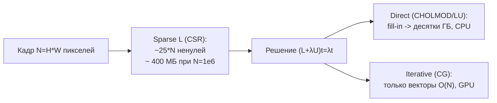

# Matting Laplacian - эталонное уточнение трансмиссии

Оригинальный способ уточнения карты пропускания из статьи о DCP (He, Sun, Tang) на базе
матового лапласиана Левина (Levin, Lischinski, Weiss). Даёт очень качественную edge-aware
регуляризацию ценой решения большой разреженной системы.

> **Реализация в проекте.** Полный matting-Laplacian (разреж. система $N\times N$) на 9.5 Мп
> непрактичен интерактивно. Поэтому метод 'DCP - Matting Laplacian (WLS)'
> ([`Methods/Refiners.cs`](../../Methods/Refiners.cs), `Wls`) реализован как **WLS** - взвешенный
> Якоби того же семейства (matrix-free, память $O(N)$, полное разрешение), есть и GPU-версия
> ([`GpuRefiners.cs`](../../Methods/GpuRefiners.cs), x4.8 на 9.5 Мп). Теория ниже - про
> оригинальный (тяжёлый) вариант.

## Идея

Ищем гладкую карту $t$, близкую к грубой оценке $\tilde t$ из DCP, но с краями,
согласованными со структурой кадра $I$. Это глобальная оптимизация:

$$E(t) = t^{\mathsf T} L\, t + \lambda\,(t-\tilde t)^{\mathsf T}(t-\tilde t)$$

- $\tilde t$ - грубая (блочная) карта из DCP;
- $\lambda$ - регуляризация (обычно $10^{-4}$);
- $L$ - **матовый лапласиан** размера $N\times N$ ($N$ - число пикселей).

Минимум даёт линейную систему:

$$\bigl(L + \lambda\, U\bigr)\,t = \lambda\,\tilde t$$

($U$ - единичная матрица). Это и есть 'решение огромной матрицы'.

## Матовый лапласиан Левина

Для пикселей $i,j$ в локальных окнах $w_k$ ($3\times3$):

$$L_{i,j} = \sum_{k\,\mid\,(i,j)\in w_k}\!\left( \delta_{i,j} - \frac{1}{|w_k|}\Bigl( 1 + (I_i-\mu_k)^{\mathsf T}\bigl(\Sigma_k + \tfrac{\varepsilon}{|w_k|}U\bigr)^{-1}(I_j-\mu_k) \Bigr) \right)$$

- $\mu_k,\ \Sigma_k$ - среднее и ковариация цветов в окне $w_k$;
- $\varepsilon$ - параметр гладкости; $\delta_{i,j}$ - символ Кронекера.

$L$ разрежена: у каждого пикселя ~9-25 ненулевых соседей.

## Куда уходит память



- Сама $L$ для $N=10^6$ (кадр $1000\times1000$): сотни МБ в CSR/CSC, в зависимости от
  `float32/float64`, `int32/int64` и фактического числа ненулевых соседей.
- **Прямой решатель** (CHOLMOD/LU): факторизация даёт *fill-in* - пик легко уходит в ГБ,
  а рост с разрешением обычно хуже линейного. Практическая граница сильно зависит от
  библиотеки, порядка факторизации и доступной RAM.
- **Итерационный** (сопряжённые градиенты, CG): хранит лишь несколько векторов длины $N$,
  память почти не растёт -> помещается в VRAM RTX 3080.

Детали по железу и выбору решателя - [performance-and-solvers.md](performance-and-solvers.md).

## Псевдокод (Python / SciPy)

```python
import numpy as np
import scipy.sparse as sp
import scipy.sparse.linalg as splinalg

def dehaze_matting_laplacian(image, raw_t, lam=1e-4):
    """
    image: затуманенный кадр (H, W, 3), значения [0,1]
    raw_t: грубая карта трансмиссии из DCP (H, W)
    """
    h, w, _ = image.shape
    n = h * w

    # 1) сборка разреженного матового лапласиана (оптимизированный обход окон 3x3)
    L = compute_matting_laplacian(image)        # scipy.sparse.csr (n, n)

    # 2) линейная система (L + lam*I) t = lam * t
    A = L + lam * sp.eye(n, format='csr')
    b = lam * raw_t.flatten()

    # 3) решение: CG (память O(N)) или прямой решатель (точнее, но ГБ RAM)
    t, _ = splinalg.cg(A, b, rtol=1e-5, maxiter=2000)

    refined_t = t.reshape(h, w)
    return recover(image, refined_t)            # J=(I-A)/max(t,t0)+A
```

> Важно: тип индексов матрицы выбирают по числу ненулевых элементов. `int32` обычно хватает
> для обычных фото/4K, но при очень больших кадрах, больших окнах или сборке с большим
> числом дубликатов можно приблизиться к лимиту $2^{31}-1$ ненулевых записей. Тогда нужны
> `int64`-индексы и библиотека, которая их поддерживает.

GPU-вариант: собрать $L$ в `cupyx.scipy.sparse`, решить `cupyx.scipy.sparse.linalg.cg`
(или cuSPARSE в C++). Это отдельная реализация; текущий проект вместо полного $L$ использует
matrix-free WLS.

## Что это даёт

- Тонкие объекты (провода, ветки на фоне тумана) обычно получают более чистые края и меньше
  дымчатых ореолов.
- Естественные градиенты тумана (нет 'картонного' заднего плана).
- Небо и гладкие градиенты ведут себя стабильнее, если грубая карта $t$ и $A$ оценены
  адекватно.

## Плюсы / минусы

| Плюсы | Минусы |
|---|---|
| Очень сильная edge-aware регуляризация | Сотни МБ/ГБ памяти в полном варианте |
| Глобально-согласованная карта | Медленно (особенно direct) |
| Хорошо изучен, воспроизводим | Не для видеопотока на больших кадрах |

Более лёгкие альтернативы для краёв - реализованные **Matting-WLS** и
[MST Tree Filter](mst-graph-filter.md), а также будущий [Bilateral Solver](more-ideas.md).
[Fractional Laplacian](fractional-laplacian.md) полезен для гладкости, но не является
полноценной заменой edge-aware matting.

## Источники

- K. He, J. Sun, X. Tang. *Single Image Haze Removal Using Dark Channel Prior*, CVPR 2009 / TPAMI 2011.
- A. Levin, D. Lischinski, Y. Weiss. *A Closed-Form Solution to Natural Image Matting*, TPAMI 2008.
