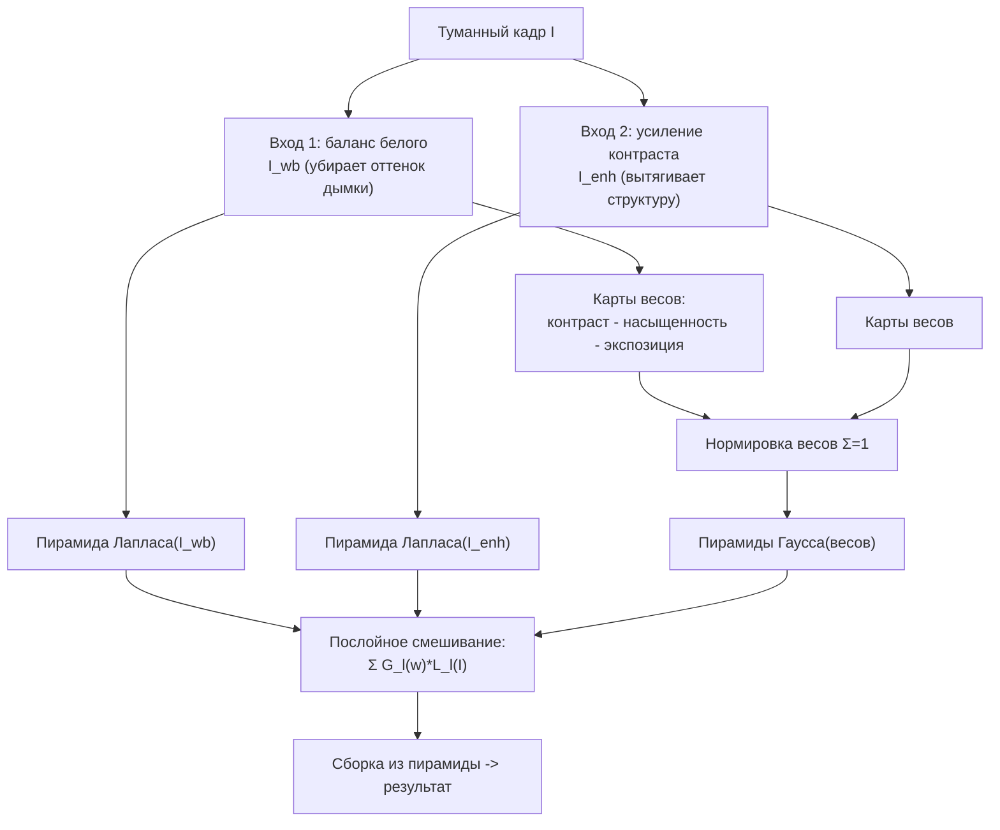

# Laplacian Pyramid Fusion - многомасштабное слияние

Альтернатива решению матриц: дехейзинг как **слияние нескольких улучшенных версий кадра**
на разных частотных масштабах. Никаких систем $N\times N$ - только свёртки и пирамиды.
Классика: Ancuti & Ancuti, *Single Image Dehazing by Multi-Scale Fusion* (IEEE TIP 2013).

> **Реализация в проекте:** [`PyramidFusionMethod.cs`](../../Methods/PyramidFusionMethod.cs)
> реализует упрощённый вариант: два входа (`WhiteBalance` и `ContrastBoost`) и вес по
> локальному контрасту (модуль лапласиана + минимум). Полная статья Ancuti также использует
> карты насыщенности и экспозиции; они описаны ниже как теоретический/расширяемый вариант,
> но сейчас в коде не считаются.

## Идея

Из одного туманного кадра $I$ делают **несколько 'входов'** (derived inputs), каждый
вытаскивает дымку по-своему, и сливают их так, чтобы из каждого взять лучшее - резкость
из одного, цвет из другого - без видимых швов за счёт многомасштабного (пирамидного)
смешивания.



## Математика

В полном варианте для каждого входа $k$ строят весовые карты (нормированные так, что
$\sum_k \hat W_k = 1$):

$$\hat W_k = \frac{W^{contrast}_k \cdot W^{sat}_k \cdot W^{exp}_k}{\sum_j (\dots)_j}$$

Слияние делают **по уровням пирамиды**, чтобы избежать ореолов на границах весов:

$$F_l = \sum_k G_l\{\hat W_k\}\ \odot\ L_l\{I_k\}$$

- $L_l\{\cdot\}$ - $l$-й уровень пирамиды **Лапласа** входного кадра;
- $G_l\{\cdot\}$ - $l$-й уровень пирамиды **Гаусса** весовой карты;
- итог собирается обратной реконструкцией пирамиды Лапласа из $\{F_l\}$.

## Псевдокод

```python
def dehaze_multiscale_fusion(I, levels=5):
    # 1) производные входы
    I_wb  = white_balance(I)            # убрать цветной оттенок дымки
    I_enh = enhance_contrast(I)         # завысить контраст/детали

    inputs = [I_wb, I_enh]
    # 2) весовые карты (контраст + насыщенность + 'экспозиция')
    W = [contrast(x) * saturation(x) * exposedness(x) for x in inputs]
    W = normalize_sum_to_one(W)         # поэлементно Σ_k W_k = 1

    # 3) пирамиды: Лапласа для входов, Гаусса для весов
    LP = [laplacian_pyramid(x, levels) for x in inputs]
    GW = [gaussian_pyramid(w, levels)  for w in W]

    # 4) послойное смешивание
    F = []
    for l in range(levels):
        F.append(sum(GW[k][l] * LP[k][l] for k in range(len(inputs))))

    # 5) сборка результата из пирамиды Лапласа
    return collapse_laplacian_pyramid(F)
```

## Память и скорость

Память - только сами пирамиды (входы, веса), $\approx 100$-$150$ МБ для 1 Мп
(сумма уровней одной пирамиды $\approx \frac{4}{3}\times$ кадра). Сложность $O(N)$, но
пиковая память зависит от того, сколько пирамид одновременно хранит реализация. Всё -
свёртки и down/up-сэмплинг, хорошо параллелится на GPU.

| Критерий | Pyramid Fusion | Matting Laplacian |
|---|---|---|
| Память (1 Мп) | десятки/сотни МБ | сотни МБ -> ГБ |
| Сложность по памяти | $O(N)$ | $O(N)$-$O(N^{1.5})$ |
| OOM на 2000x2000 | обычно маловероятен | возможен из-за fill-in |
| Решение систем | нет | да |

## Плюсы / минусы

- **+** очень экономно по памяти, линейно, GPU-friendly; ровные градиенты и чистое небо.
- **+** не нужна явная карта трансмиссии - работает как fusion.
- **-** результат зависит от качества 'входов' (баланс белого, усиление); может слегка
  'приукрашивать' (tone-mapping-эффект), а не строго следовать физ. модели.

## Связь с проектом

Это **замена всего пайплайна**, а не блока $t$. В проекте уже реализовано на Emgu.CV через
`PyrDown`/`PyrUp`, пирамиду Лапласа и нормированные карты весов. Полный Ancuti-вариант можно
достроить, добавив saturation/exposedness-веса в `Weight`.

## Источники

- C. O. Ancuti, C. Ancuti. *Single Image Dehazing by Multi-Scale Fusion*, IEEE TIP 2013.
- Реализация-пример: github.com/zhengchaobing/Multi-scale-Single-Image-Dehazing-Using-Laplacian-and-Gaussian-Pyramids
