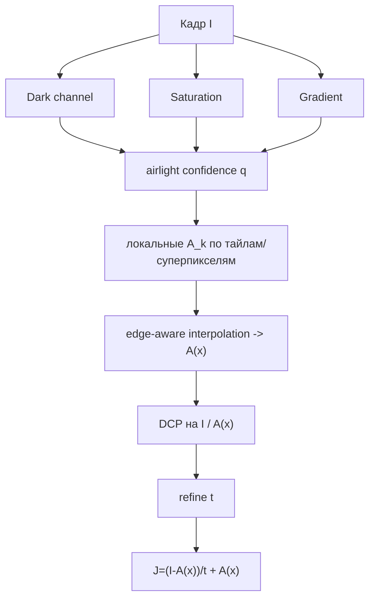

# Local Airlight Field - DCP со spatially-varying атмосферным светом

Классическая модель DCP предполагает один глобальный атмосферный свет $A$:

$$I(x)=t(x)J(x)+(1-t(x))A.$$

На реальных фото это часто неверно: небо имеет градиент, солнце сбоку, городская дымка
подсвечена локально, часть кадра в тени. Тогда одна константа $A$ ломает восстановление:
одна область получается серой, другая - пересатурированной.

Local Airlight Field заменяет $A$ на гладкое поле $A(x)$:

$$I(x)=t(x)J(x)+(1-t(x))A(x).$$

> Статус: **реализовано** - `DCP - Local Airlight Field`
> ([`LocalAirlightMethod.cs`](../../Methods/LocalAirlightMethod.cs)): поле $A_c(x)=\mathrm{blur}(q\cdot I_c)/\mathrm{blur}(q)$,
> затем DCP по $I/A(x)$ и восстановление с $A(x)$.

## Идея

1. Найти кандидаты airlight-точек: яркие пиксели с высоким dark channel, низкой насыщенностью
   и малой текстурой.
2. Разбить изображение на суперпиксели или крупные тайлы.
3. Для каждого тайла оценить локальный $A_k$.
4. Построить гладкое поле $A(x)$ через edge-aware интерполяцию.
5. Считать DCP-трансмиссию уже как $I(x)/A(x)$.

## Локальная оценка airlight

Для тайла/суперпикселя $R_k$:

$$A_k=\operatorname{weighted\ mean}_{x\in R_k} I(x),$$

где веса:

$$q(x)=D(x)^\alpha\,(1-S(x))^\beta\,\exp(-\gamma\lVert\nabla Y(x)\rVert).$$

То есть airlight-кандидаты должны быть:

- светлыми в dark channel;
- малонасыщенными;
- гладкими, без текстуры объекта.

## Гладкое поле $A(x)$

Поле $A(x)$ не должно прыгать по объектам. Его можно получить WLS-задачей:

$$
\min_A
\sum_k \eta_k\lVert A(p_k)-A_k\rVert^2
+
\lambda\sum_{(x,y)} w_{xy}\lVert A(x)-A(y)\rVert^2,
$$

где $w_{xy}=\exp(-\lVert I_x-I_y\rVert/\sigma)$ сохраняет границы, а $\eta_k$ - доверие к
локальной оценке.

Упрощённая версия: размыть sparse-карту $A_k$ Fast Global Smoother / Guided Filter по кадру.

## Конвейер



## Псевдокод

```python
def local_airlight_dcp(I, tile=64, omega=0.5):
    D = dark_channel(I, radius=7)
    S = hsv_saturation(I)
    G = abs_sobel(gray(I))
    q = (D**2.0) * ((1.0 - S)**1.5) * exp(-3.0*G)

    A_sparse = zeros_like(I)
    conf = zeros(H, W)

    for R in tiles(I, tile):
        if sum(q[R]) < eps:
            continue
        A_k = weighted_mean(I[R], q[R])
        p = argmax(q[R])
        A_sparse[p] = A_k
        conf[p] = sum(q[R])

    A_field = edge_aware_interpolate(A_sparse, conf, guide=I)

    IA = I / maximum(A_field, 1e-3)
    D_A = dark_channel(IA, radius=7)
    t = 1.0 - omega * D_A
    t = edge_aware_refine(t, I)

    J = (I - A_field) / maximum(t, 0.08) + A_field
    return clip(J, 0, 1)
```

## Качество и риски

| Плюсы | Минусы |
|---|---|
| Лучше для неравномерного неба и боковой засветки | Сложнее глобального $A$ |
| Меньше цветовых перекосов на больших сценах | Ошибка в $A(x)$ сильно портит результат |
| Можно строить поверх текущего DCP | Нужна хорошая интерполяция и confidence |

## Быстрый вариант

Для первой реализации не нужны суперпиксели:

1. Делать тайлы 64-128 px.
2. В каждом тайле искать airlight-кандидата.
3. Интерполировать $A(x)$ `GuidedFilter`/FGS.
4. Ограничить поле: $A(x)$ не ниже локального 90-го процентиля яркости.

Это даст большую часть пользы без сложной оптимизации.

## Связь с проектом

Потребуются новые функции:

- `EstimateAirlightField(I)` вместо [`DehazeCore.Atmospheric`](../../Methods/DehazeCore.cs);
- `RawTransmission(I, AField, omega, patch)`;
- `Recover(I, t, AField, tmin)`.

Остальные уточнители карты $t$ можно переиспользовать без изменений.
