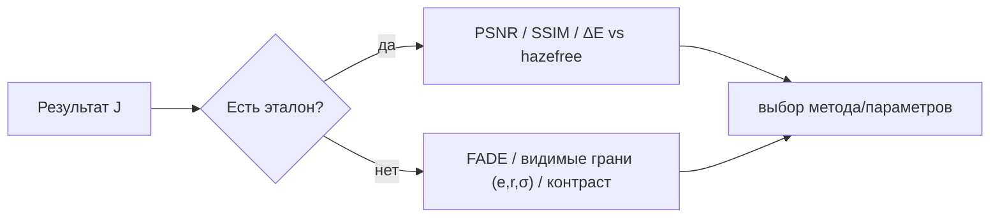

# Метрики и оценка качества дехейзинга

Как объективно сравнивать методы и подбирать параметры. Делится на два класса: **с эталоном**
(есть чистый кадр) и **без эталона** (есть только туманный вход). Оба используются в проекте.

## С эталоном (full-reference)

Нужен 'правильный' кадр - у нас это пары `dataset/*_hazy` <-> `hazefree/*_GT`.

| Метрика | Что меряет | Замечание |
|---|---|---|
| **PSNR** | поэлементную ошибку (через MSE) | прост, но 'любит' совпадение по яркости/тону |
| **PSNR/SSIM 'совмещённые'** | то же, но **после выравнивания экспозиции/ББ** под эталон | снимает главное смещение (см. ниже) - **реализовано** |
| **SSIM** | структурное сходство (яркость*контраст*структура) | ближе к восприятию, чем PSNR |
| **CIEDE2000 / ΔE** | различие **цвета** в Lab | ловит цветовой сдвиг, который PSNR недооценивает |
| MSE / MAE | сырое отклонение | базовые |

> **В проекте:** все метрики собраны в [`Metrics`](../../Methods/Metrics.cs). GUI после 'Вычислить'
> показывает PSNR, **совмещённый** PSNR, SSIM и без-эталонные метрики; `--selftest` печатает их
> для каждого метода **и два рейтинга** - по совмещённому PSNR и по без-эталонной оценке.

**Важная оговорка (проверено на этом датасете).** Эталон `hazefree/` - это *отдельный
ясный снимок*, а не 'вход минус дымка': у него другая экспозиция/освещённость/баланс белого.
Поэтому **сырой** PSNR-vs-GT награждает **мягкое** удаление дымки (близко по тону к ясному дню)
и штрафует агрессивное. Пример с этого датасета: у MSRCR сырой PSNR **15.09**, у DCP-CPU -
**14.07**, то есть сырой PSNR ставит перенасыщенный MSRCR *выше* - что противоречит глазам.

**Чем лечим - 'совмещённый' PSNR/SSIM.** Перед сравнением подгоняем результат к эталону
**поканальным аффинным преобразованием** $J'_c = a_c J_c + b_c$ (МНК-оценка $a_c,b_c$ на канал).
Это убирает глобальную разницу экспозиции/ББ, и метрика начинает мерить **структуру и
относительный цвет**, а не тон. Реализация - `Metrics.AlignExposure`. Оговорка: аффинное
совмещение может частично 'простить' *глобальное* перенасыщение, поэтому для ловли
перенасыщения/клиппинга надёжнее без-эталонные метрики ниже.

## Без эталона (no-reference)

Когда чистого кадра нет (реальные пользовательские фото). Оценивают 'насколько хорошо убрана
дымка', не зная истины.

| Метрика | Идея |
|---|---|
| **FADE** (Choi, 2015) | предсказывает 'плотность тумана' по natural-scene-statistics; меньше = чище |
| **e / r / σ** (Hautière, 2008) | доля **новых видимых граней** после обработки, средний прирост градиента, доля 'пересветов' |
| Контраст / энтропия / σ яркости | грубые прокси 'детальности' |
| BRISQUE / NIQE | общие blind-метрики качества (не специфичны дымке) |

> **В проекте (реализовано в [`Metrics`](../../Methods/Metrics.cs)):**
> - **'дымка убрана'** - снижение среднего dark-channel результата относительно входа
>   (DCP-прайор как детектор остаточной дымки): $1 - \overline{D_{\text{res}}}/\overline{D_{\text{in}}}$;
> - **контраст** $\sigma_{\text{res}}/\sigma_{\text{in}}$ и **грани** $\overline{|\nabla|}_{\text{res}}/\overline{|\nabla|}_{\text{in}}$;
> - **пересвет/завал** - доля пикселей с каналом $\le 1$ или $\ge 254$;
> - **насыщенность** - колоритность Хаслера-Зюсструнка результата относительно входа (ловит перенасыщение).

## Что используется в авто-подборе и в сводной оценке

Сводная **без-эталонная оценка** (0..100), `Metrics.NoRefScore` - она же objective для
[`AutoTuner`](../../Methods/AutoTuner.cs) (кнопка 'Авто-параметры') и показывается в GUI:

$$\text{score}=\Bigl[\underbrace{0.45\sqrt{h} + 0.35\,d + 0.20\,c}_{\text{польза}}-\underbrace{(0.45\,\text{clip}^{*}+0.45\,\text{over}^{*}+0.20\,\text{under}^{*})}_{\text{штрафы}}\Bigr]\cdot(1-0.85\,\text{severe})$$

где $h$ - доля убранной дымки (dark-channel, **под корнем** - сверх ~50% толку мало), $d$ -
прирост граней, $c$ - прирост контраста; $\text{clip}^{*}$ - доля пересвета (5% -> полный штраф),
$\text{over}^{*}$/$\text{under}^{*}$ - пере-/недо-насыщение ($>\times1.25$ / $<\times0.92$),
$\text{severe}$ - множитель за сильный пересвет ($>5\%$ всё сильнее гасит оценку).

**Зачем именно так (выяснено по бенчмарку).** Прежняя линейная формула награждала *максимум*
дымки: авто-подбор выкручивал $\omega$ до перенасыщения (цвет x1.52), при этом
совмещённый PSNR **не рос** (16.81 ~ как у мягкого). Новая формула (корень по дымке + строгий
симметричный штраф за цвет) даёт авто-подбору **сладкую точку**: на том же методе авто стал
давать дымку ~43% / цвет x1.26 / совмещённый PSNR **17.04** - то есть авто теперь *улучшает*
верность, а не портит. CLAHE (совмещённый PSNR 17.9, цвет x1.0) поднялся на 1-е место, а
перенасыщенный MSRCR и 'выжигатели' с пересветом - вниз.

### Идея на будущее: FADE вместо эвристики

Ещё более правильный no-reference сигнал для дымки - **FADE** (Choi, 2015): обучен на
статистике туманных/чистых сцен и коррелирует с восприятием плотности тумана. Замена
dark-channel-члена на FADE сделала бы оценку ещё устойчивее. Минус - FADE тяжелее
(набор признаков на патчах).

## Практический рецепт

1. **Есть эталон** (бенчмарк, как `hazefree/`) -> смотрите **совмещённый** PSNR/SSIM (не сырой!)
   плюс без-эталонную оценку; сырой PSNR держите как справочный, он смещён к мягким результатам.
2. **Нет эталона** (реальные фото) -> без-эталонная оценка (`Metrics.NoRefScore`) + визуальный
   контроль пересветов и цветовых сдвигов; на будущее - FADE.
3. **Подбор параметров** -> `AutoTuner` (та же no-ref оценка) как старт, затем ручная докрутка
   ползунками.

## Источники

- L. K. Choi, J. You, A. C. Bovik. *Referenceless Prediction of Perceptual Fog Density and
  Perceptual Image Defogging* (FADE), IEEE TIP 2015.
- N. Hautière, J.-P. Tarel, D. Aubert, É. Dumont. *Blind Contrast Enhancement Assessment by
  Gradient Ratioing at Visible Edges*, Image Analysis & Stereology 2008.
- Z. Wang et al. *Image Quality Assessment: From Error Visibility to Structural Similarity*
  (SSIM), IEEE TIP 2004.
