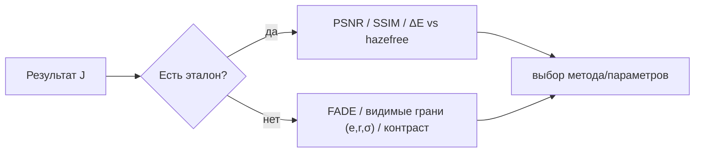

# Метрики и оценка качества дехейзинга

> **Изменения после аудита (27.07.2026).** Основные метрики для публикации - **без подгонки**:
> `psnr`, `ssim`, `ciede2000`, `mse`, `clip_pct`, `flat_noise_x`, `ms`, `ms_per_mp`.
> «Совмещённые» версии переименованы в CSV в `*_aligned_diag` и являются **диагностическими**:
> они используют эталон для правки результата, поэтому не могут быть главным результатом статьи.
> Прокси-метрики переименованы: `NiqeProxy` → `NaturalnessDev`, `BrisqueProxy` → `ArtifactDev`
> (в CSV `natur_dev_own`, `artifact_dev_own`) - **это собственные эвристики, а не NIQE и BRISQUE**.
> Добавлена метрика `flat_noise_x` - усиление шума на плоских участках (result/input).
> Протокол прогона: [`REPRODUCIBILITY.md`](../../../REPRODUCIBILITY.md).

Как объективно сравнивать методы и подбирать параметры. Делится на два класса: **с эталоном**
(есть чистый кадр) и **без эталона** (есть только туманный вход). Оба используются в проекте.

## С эталоном (full-reference)

Нужен 'правильный' кадр - у нас это пары `dataset/*_hazy` <-> `hazefree/*_GT`.

| Метрика | Что меряет | Замечание |
|---|---|---|
| **PSNR** | поэлементную ошибку (через MSE) | прост, но 'любит' совпадение по яркости/тону |
| **PSNR/SSIM 'совмещённые'** | то же, но **после выравнивания экспозиции/ББ** под эталон | снимает главное смещение (см. ниже) - **реализовано** |
| **SSIM** | структурное сходство (яркость*контраст*структура) | ближе к восприятию, чем PSNR |
| **CIEDE2000 / ΔE** | различие **цвета** в Lab | **реализовано**; ловит цветовой сдвиг, который PSNR недооценивает |
| MSE / MAE | сырое отклонение | базовые |

> **В проекте:** все метрики собраны в [`Metrics`](../../Methods/Metrics.cs). GUI после 'Вычислить'
> показывает основной PSNR, отдельный **совмещённый диагностический** PSNR, основной SSIM/CIEDE2000,
> runtime, мс/Мп и без-эталонные
> метрики; `--selftest` печатает их для каждого метода **и два рейтинга** - по совмещённому
> PSNR и по без-эталонной оценке.

Для воспроизводимых таблиц есть CLI:

```powershell
dotnet run --project .\SimpleDeHaze\SimpleDeHaze.csproj -c Release -- --benchmark --manifest=datasets/manifests/o-haze-in-repo.json --split=test --profile=core --evalfull --repeat=3 --out=benchmark_results/bench.csv
```

`--benchmark` читает явный manifest (либо `input-dir/gt-dir` для discovery), не сохраняет картинки и
пишет CSV, а рядом - `*.meta.json` с окружением, параметрами и состоянием Git. Ключи протокола:

| Ключ | Зачем |
|---|---|
| `--profile=core` | **обязателен для сравнения приоров**: запускает только методы с явным core-профилем; `--nopost` — совместимый alias |
| `--linear` | физика в линейном радиансе там, где метод поддерживает параметр `linear` |
| `--evalfull` | метрики на полном разрешении (по умолчанию оценка идёт на копии со стороной ≤ 1024) |
| `--native` / `--maxdim=N` | нативная обработка (default) либо явно помеченный downscale-прогон |
| `--warmup=N` / `--repeat=N` | прогрев и повторения с median/min/p95 |

Эталонный baseline - метод **`DCP канонический (He 2009, baseline)`** (без косметики).
Методы с пометкой *Legacy* - историческая ветка, это не канонический DCP.

**Важная оговорка (проверено на этом датасете).** Эталон `hazefree/` - это *отдельный
ясный снимок*, а не 'вход минус дымка': у него другая экспозиция/освещённость/баланс белого.
Поэтому **сырой** PSNR-vs-GT награждает **мягкое** удаление дымки (близко по тону к ясному дню)
и штрафует агрессивное. Пример с этого датасета: у MSRCR сырой PSNR **15.09**, у DCP-CPU -
**14.07**, то есть сырой PSNR ставит перенасыщенный MSRCR *выше* - что противоречит глазам.

**Диагностика причины - 'совмещённый' PSNR/SSIM.** Перед сравнением подгоняем результат к эталону
**поканальным аффинным преобразованием** $J'_c = a_c J_c + b_c$ (МНК-оценка $a_c,b_c$ на канал).
Это убирает глобальную разницу экспозиции/ББ, и метрика начинает мерить **структуру и
относительный цвет**, а не тон. Реализация - `Metrics.AlignExposure`. Оговорка: аффинное
совмещение использует GT для изменения результата, поэтому его нельзя использовать для ranking
или как основной результат. Основные метрики остаются raw PSNR/SSIM/CIEDE2000; aligned помогает
лишь понять вклад глобальной экспозиции/ББ.

## Без эталона (no-reference)

Когда чистого кадра нет (реальные пользовательские фото). Оценивают 'насколько хорошо убрана
дымка', не зная истины.

| Метрика | Идея |
|---|---|
| **FADE** (Choi, 2015) | предсказывает 'плотность тумана' по natural-scene-statistics; меньше = чище |
| **e / r / σ** (Hautière, 2008) | доля **новых видимых граней** после обработки, средний прирост градиента, доля 'пересветов' |
| Контраст / энтропия / σ яркости | грубые прокси 'детальности' |
| BRISQUE / NIQE | общие blind-метрики качества; официальных реализаций/моделей в проекте пока нет |


```mermaid
flowchart LR
    OUT["Результат J"] --> FR{"Есть эталон?"}
    FR -- да --> A["PSNR / SSIM / ΔE vs hazefree"]
    FR -- нет --> B["FADE / видимые грани (e,r,σ) / контраст"]
    A --> PICK["выбор метода/параметров"]
    B --> PICK
```

> **В проекте (реализовано в [`Metrics`](../../Methods/Metrics.cs)):**
> - **'дымка убрана'** - снижение среднего dark-channel результата относительно входа
>   (DCP-прайор как детектор остаточной дымки): $1 - \overline{D_{\text{res}}}/\overline{D_{\text{in}}}$;
> - **контраст** $\sigma_{\text{res}}/\sigma_{\text{in}}$ и **грани** $\overline{|\nabla|}_{\text{res}}/\overline{|\nabla|}_{\text{in}}$;
> - **пересвет/завал** - доля пикселей с каналом $\le 1$ или $\ge 254$;
> - **насыщенность** - колоритность Хаслера-Зюсструнка результата относительно входа (ловит перенасыщение);
> - **NaturalnessDev / ArtifactDev** - собственные model-free эвристики, меньше = лучше.

Важно: `NaturalnessDev` и `ArtifactDev` **не являются NIQE/BRISQUE**. Настоящие
версии требуют внешних статистических/регрессионных моделей; текущие proxy нужны как
вспомогательные колонки benchmark CSV, чтобы быстро ловить клиппинг, блочность, странный
контраст и неестественную цветность.

## Что используется в авто-подборе и в сводной оценке

Сводная **без-эталонная оценка** (0..100), `Metrics.NoRefScore`, показывается в GUI и служит
общим индикатором. У [`AutoTuner`](../../Methods/AutoTuner.cs) есть более строгие целевые функции:
`ObjectVisibility` отдельно оценивает слабую треть локальных тайлов и штрафует шум/жёсткость,
а `Vivid` ищет контролируемую сочность. Поэтому число в панели и внутренняя objective подбора
не обязаны совпадать, хотя используют один набор базовых измерений.

$$\text{score}=\Bigl[\underbrace{0.45\sqrt{h} + 0.35\,d + 0.20\,c}_{\text{польза}}-\underbrace{(0.45\,\text{clip}^{*}+0.45\,\text{over}^{*}+0.20\,\text{under}^{*})}_{\text{штрафы}}\Bigr]\cdot(1-0.85\,\text{severe})$$

где $h$ - доля убранной дымки (dark-channel, **под корнем** - сверх ~50% толку мало), $d$ -
прирост граней, $c$ - прирост контраста; $\text{clip}^{*}$ - доля пересвета (5% -> полный штраф),
$\text{over}^{*}$/$\text{under}^{*}$ - пере-/недо-насыщение ($>\times1.25$ / $<\times0.92$),
$\text{severe}$ - множитель за сильный пересвет ($>5\%$ всё сильнее гасит оценку).

**Зачем именно так (выяснено по бенчмарку).** Прежняя линейная формула награждала *максимум*
дымки: авто-подбор выкручивал $\omega$ до перенасыщения (цвет x1.52), при этом
совмещённый PSNR **не рос** (16.81 ~ как у мягкого). Новая формула (корень по дымке + строгий
симметричный штраф за цвет) даёт авто-подбору **сладкую точку**: на том же методе авто стал
давать дымку ~43% / цвет x1.26 / совмещённый PSNR **17.04** - то есть авто теперь *улучшает*
верность, а не портит. CLAHE (совмещённый PSNR 17.9, цвет x1.0) поднялся на 1-е место, а
перенасыщенный MSRCR и 'выжигатели' с пересветом - вниз.

### Идея на будущее: FADE вместо эвристики

Ещё более правильный no-reference сигнал для дымки - **FADE** (Choi, 2015): обучен на
статистике туманных/чистых сцен и коррелирует с восприятием плотности тумана. Замена
dark-channel-члена на FADE сделала бы оценку ещё устойчивее. Минус - FADE тяжелее
(набор признаков на патчах).

## Практический рецепт

1. **Есть эталон** (бенчмарк, как `hazefree/`) -> ранжируйте по raw PSNR/SSIM/CIEDE2000.
   Совмещённые значения показывайте только отдельной диагностикой; также контролируйте clip/noise.
2. **Нет эталона** (реальные фото) -> без-эталонная оценка (`Metrics.NoRefScore`) + визуальный
   контроль пересветов и цветовых сдвигов; на будущее - FADE.
3. **Подбор параметров** -> `AutoTuner` с целью `ObjectVisibility` или `Vivid` как старт, затем
   визуальная проверка и при необходимости ручная докрутка ползунками.

### Как автоподбор защищён от «залипания» параметров

1. Значения сначала приводятся к одной допустимой сетке `ParamDef` (`log`, целые числа и `step`).
   Например, окно 3..51 с шагом 2 всегда остаётся нечётным и в GUI, и в оптимизаторе.
2. До любых совместных стартов выполняются независимые пробы `min` и `max` **каждого** активного
   параметра при фиксированных остальных. Если заданный `maxEvals` слишком мал даже для этого,
   он автоматически поднимается до `1 + 2N`.
3. Одинаковые фактические точки после округления кэшируются и второй раз бюджет не расходуют.
4. Затем идут default/all-min/all-max, точки Холтона с отдельной простой базой для каждой координаты,
   двусторонний pattern search и совместные рестарты. Порядок координат циклически сдвигается.
5. В thorough-режиме основные параметры сначала ищутся на превью не меньше 480 px, затем все
   числовые параметры уточняются на 340 px. Это разделяет устойчивый крупномасштабный поиск и полный
   многомерный поиск, не исключая ни одной координаты.
6. После поиска `start`, quick/coarse и fine повторно обрабатываются на полном кадре. Возвращается
   лучший реально измеренный полноразмерный кандидат; эти 2-3 проверки не вычитаются из поискового
   бюджета. Обычный quick также сравнивает `start ↔ quick` на полном кадре.
7. Для целей без GT полноразмерный арбитраж отклоняет Goodhart-экстремумы, если относительно старта
   резко ухудшены клиппинг, удаление дымки, цветовой диапазон, собственные оценки артефактов или
   пространственной естественности. Отдельный Lab-заслон ловит локальные радужные пятна, которые
   скрывает средняя насыщенность кадра. Safety rejection учитывается отдельно от ошибки обработки.
8. Если все обработки упали или дали NaN, подбор сообщает ошибку, а не молча выдаёт исходные значения.

Конечный бюджет не может математически гарантировать глобальный максимум произвольной многомерной
негладкой функции. Здесь «лучший» означает максимум среди проверенных канонических кандидатов при
гарантированном покрытии каждой координаты, а не обещание полного перебора всего пространства.

При наличии GT objective строится по **raw PSNR (35%), SSIM (40%) и CIEDE2000 (25%)** с отдельной
проверкой Lab-вектора `(a*, b*)` на верхнем дециле цветности GT. MSE не добавляется второй раз: при
фиксированном диапазоне это та же пиксельная ошибка, что PSNR, в монотонно преобразованной шкале.
Метрики после аффинного совмещения с GT не участвуют в подборе, потому что такое совмещение использует
эталон для правки результата и годится лишь как диагностика.

## Источники

- L. K. Choi, J. You, A. C. Bovik. *Referenceless Prediction of Perceptual Fog Density and
  Perceptual Image Defogging* (FADE), IEEE TIP 2015.
- N. Hautière, J.-P. Tarel, D. Aubert, É. Dumont. *Blind Contrast Enhancement Assessment by
  Gradient Ratioing at Visible Edges*, Image Analysis & Stereology 2008.
- Z. Wang et al. *Image Quality Assessment: From Error Visibility to Structural Similarity*
  (SSIM), IEEE TIP 2004.
