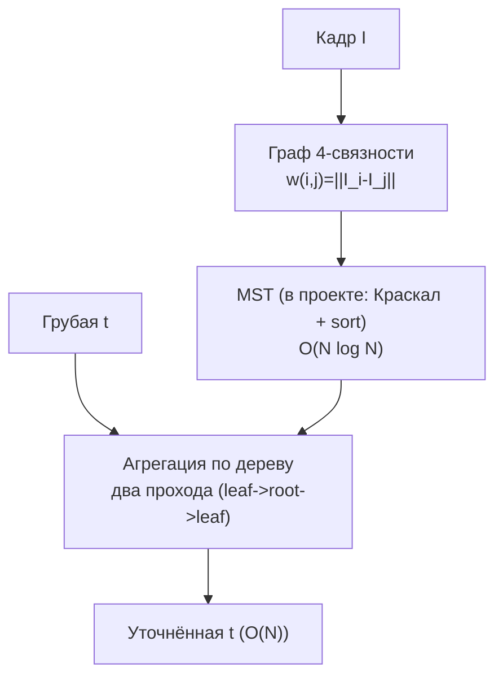

# MST Tree Filter - уточнение трансмиссии на минимальном остовном дереве

Вместо решения системы $N\times N$ изображение представляют **связным графом** (пиксель -
вершина, ребро - разница цвета соседей), строят **минимальное остовное дерево (MST)** и
'протекают' карту $t$ по его ветвям. Сама агрегация по готовому дереву - два линейных
прохода $O(N)$; построение MST в текущем коде через сортировку рёбер стоит $O(N\log N)$.

> Зрелость: tree-/MST-фильтрация - зрелый приём в стереозрении (cost aggregation:
> Yang 2012; Bao et al. 2014). Для дехейзинга это перенос идеи на карту трансмиссии.

## Идея

Граф 4-связности, вес ребра - близость цвета: $w(i,j)=\lVert I_i-I_j\rVert$. MST старается
оставлять самые 'дешёвые' связи (внутри однородных областей) и реже проходит через резкую
границу объекта (там вес ребра велик). Похожесть двух пикселей - по расстоянию вдоль
**единственного** пути в дереве:

$$S(i,j) = \exp\!\Bigl(-\frac{D(i,j)}{\sigma}\Bigr),\qquad D(i,j)=\sum_{e\in \text{path}(i,j)} w(e)$$

Уточнённая трансмиссия - взвешенное агрегирование по дереву:

$$t^{\text{out}}_i = \frac{1}{Z_i}\sum_{j} S(i,j)\,t_j,\qquad Z_i=\sum_j S(i,j)$$

Ключевой факт: благодаря структуре дерева эту сумму **по всем $j$** считают не за $O(N^2)$,
а за $O(N)$ - двумя проходами (вверх к корню и вниз), как в Yang (2012).

## Конвейер



## Псевдокод (двухпроходная агрегация)

```text
build graph G with edge weights w(i,j) = ||I_i - I_j||
T  <- MST(G)                       # корень r выбираем произвольно
S(e) = exp(-w(e)/σ)               # вес ребра как 'проводимость'

# Проход 1: листья -> корень (накопить вклад поддеревьев)
for v in reverse_BFS_order(T, r):           # от листьев к корню
    Agg[v] = t[v]
    for child c of v:
        Agg[v] += S(v,c) * Agg[c]

# Проход 2: корень -> листья (добавить вклад 'снаружи' поддерева)
for v in BFS_order(T, r):                    # от корня к листьям
    if v == r: Out[v] = Agg[v]
    else:
        p = parent(v)
        Out[v] = S(v,p) * Out[p] + (1 - S(v,p)^2) * Agg[v]    # схематично*
Out <- Out / Z                                  # нормировка
```

\* В проекте используется эта же двухпроходная идея:
`out = agg + s * (out_parent - s * agg)` и такая же рекурсия для нормировки. Нормировку $Z$
считают двумя проходами с $t\equiv 1$. Память - $O(N)$, но с большим коэффициентом:
цветовые массивы, список рёбер, порядок сортировки, union-find, дерево и рабочие буферы.

## Плюсы / минусы

| Плюсы | Минусы |
|---|---|
| Агрегация по готовому дереву линейна, без sparse-матриц | Построение MST в коде стоит $O(N\log N)$ |
| Хорошо держит резкие границы и уменьшает ореолы | Дерево - глобальная структура, хуже параллелится, чем свёртка |
| Нелокальная агрегация (через всё дерево) | Зависимость от $\sigma$ и метрики веса |

## Связь с проектом

В проекте это уже реализованная замена уточнения $t$:
[`MstMethod.cs`](../../Methods/MstMethod.cs) вызывает [`Refiners.Mst`](../../Methods/Refiners.cs).
В Emgu.CV готового MST-фильтра нет, поэтому код вручную строит граф 4-связности, MST и
проходы по дереву. GPU-варианта пока нет; для него лучше смотреть в сторону параллельного
Борувки и отдельного CUDA-ядра агрегации.

## Источники

- Q. Yang. *A Non-Local Cost Aggregation Method for Stereo Matching*, CVPR 2012.
- L. Bao, Y. Song, Q. Yang et al. *Tree Filtering: Efficient Structure-Preserving Smoothing
  With a Minimum Spanning Tree*, IEEE TIP 2014.
