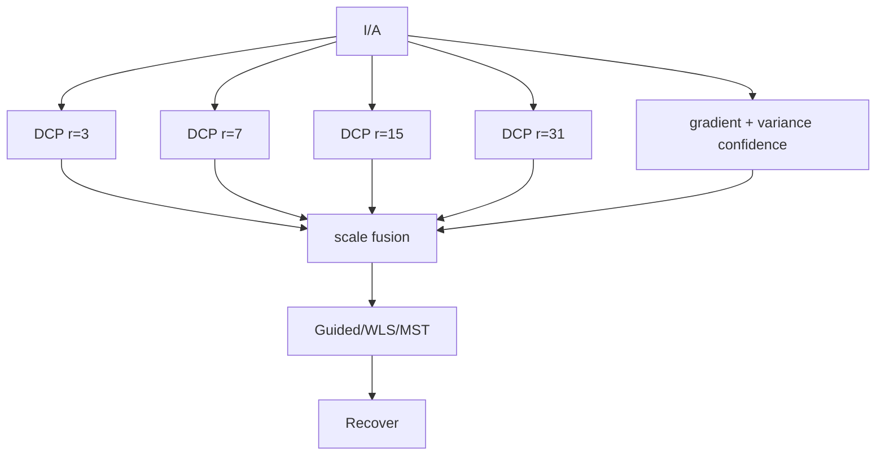

# Multi-Scale DCP Fusion - несколько карт трансмиссии вместо одного patch

В DCP размер окна `patch` задаёт компромисс:

- маленькое окно держит тонкие детали, но шумит;
- большое окно стабильнее, но даёт halo на границах глубины;
- один `patch` не подходит одновременно для неба, листвы, зданий и проводов.

Multi-Scale DCP Fusion считает несколько карт $\tilde t_r$ с разными радиусами и смешивает
их по локальному доверию. Это похоже на Laplacian Pyramid Fusion, но остаётся внутри
физической DCP-модели.

> Статус: **реализовано** - `DCP - Multi-Scale Fusion`
> ([`MultiScaleDcpMethod.cs`](../../Methods/MultiScaleDcpMethod.cs)). В коде два радиуса
> (малый/большой) и смешивание по 'плоскостности' $\exp(-k\lVert\nabla Y\rVert)$; на тесте -
> один из лучших PSNR против эталона.

## Оценки на разных масштабах

Для радиусов $r\in\{3,7,15,31\}$:

$$D_r(x)=\min_{y\in\Omega_r(x)}\min_c \frac{I_c(y)}{A_c},$$

$$\tilde t_r(x)=1-\omega_r D_r(x).$$

Сила $\omega_r$ может быть меньше на больших окнах, чтобы не переусиливать дальний фон:

$$\omega_r=\omega_0\left(1-\rho\frac{r-r_{\min}}{r_{\max}-r_{\min}}\right).$$

## Доверие к масштабу

Малые окна лучше около краёв и тонких деталей:

$$w_{small}(x)=\sigma(a\lVert\nabla Y(x)\rVert+b\,\operatorname{var}_{\Omega}(Y)).$$

Большие окна лучше на гладких областях:

$$w_{large}(x)=1-w_{small}(x).$$

Для нескольких радиусов удобно использовать softmax:

$$w_r(x)=
\frac{\exp(s_r(x))}
{\sum_q\exp(s_q(x))}.
$$

Итог:

$$\tilde t(x)=\sum_r w_r(x)\tilde t_r(x).$$

## Конвейер



## Псевдокод

```python
def multiscale_dcp(I, A, radii=(3, 7, 15, 31), omega=0.5):
    IA = I / A
    Y = gray(I)
    edge = abs_sobel(Y)
    tex = local_variance(Y, radius=5)

    score_small = 4.0 * edge + 8.0 * tex
    alpha = sigmoid(score_small)

    maps = []
    weights = []
    for r in radii:
        D = dark_channel(IA, radius=r)
        wr = omega * (1.0 - 0.25 * normalize(r, min(radii), max(radii)))
        maps.append(1.0 - wr * D)

        # маленьким r больше вес на краях, большим r больше вес на гладких областях
        scale_pos = normalize(r, min(radii), max(radii))
        weights.append((1.0 - scale_pos) * alpha + scale_pos * (1.0 - alpha))

    weights = normalize_sum(weights)
    t = sum(w*m for w, m in zip(weights, maps))
    t = edge_aware_refine(clip(t, 0.05, 1.0), I)
    return recover(I, t, A)
```

## Плюсы / минусы

| Плюсы | Минусы |
|---|---|
| Убирает зависимость от одного `patch` | Несколько dark-channel проходов |
| Меньше halo, чем у большого окна | Нужно настроить confidence по масштабу |
| Легко GPU-параллелится | Может сглаживать эффект плотного тумана |

## Быстрая реализация

На GPU все `D_r` можно считать независимо. На CPU можно сначала сделать два радиуса
(`r=3` и `r=15`) - уже будет понятен эффект.

Если использовать обычную морфологическую эрозию, сложность примерно:

$$O(k\,N),$$

где $k$ - число радиусов. При separable/van Herk min-filter стоимость почти не зависит от
радиуса и остаётся практичной для видео.

## Связь с проектом

Это замена [`DehazeCore.RawTransmission`](../../Methods/DehazeCore.cs). Оценку $A$ и
восстановление можно оставить текущими. Финальное уточнение лучше начать с Guided Filter,
а затем проверить WLS/MST.
