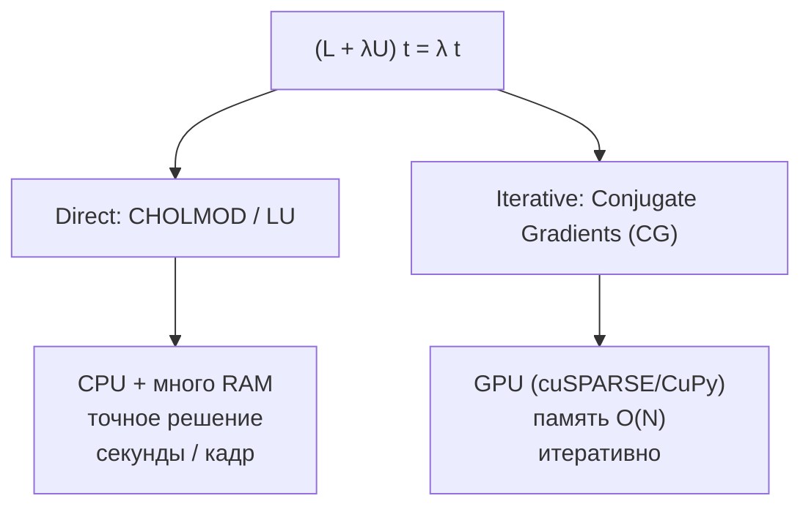

# Железо и решатели: RAM, VRAM, direct vs iterative

Практические заметки для 'тяжёлых' методов ([Matting Laplacian](laplacian-matting.md) и
близких), которые сводятся к решению разреженной системы $(L+\lambda U)\,t=\lambda\tilde t$.
Что считать на CPU, что на GPU, и где начинаются риски по памяти.

> Железо этой машины (из `nvidia-smi`): **RTX 3080, 10 ГБ** видеопамяти (~8.5 ГБ свободно
> при типичной загрузке рабочего стола). Системной RAM с запасом (десятки ГБ).

## 1. Хватит ли RAM?

Для кадра $1000\times1000$ полный Matting Laplacian обычно требует уже не 'размер кадра',
а сотни МБ/ГБ: сама sparse-матрица плюс буферы решателя. Десятки ГБ RAM дают запас для
фото, но точная граница зависит от окна, формата чисел, числа ненулевых элементов и
выбранного решателя. Текущая реализация проекта поэтому использует matrix-free WLS, а не
полную матрицу $L$.

## 2. Поможет ли RTX 3080?

И да, и нет - зависит от решателя. Матрица $L$ **разрежённая**. Ampere феноменален на
**плотных** вычислениях (тензорные ядра), но с гигантскими разреженными структурами всё
тоньше:

- **VRAM**: сама $L$ для 1 Мп может занимать сотни МБ и больше; при **прямой** факторизации
  промежуточные данные (fill-in) легко съедают доступную VRAM.
- **Деградация при OOM**: CUDA уйдёт в системную RAM через PCIe (Unified Memory), и скорость
  падает в десятки раз. Поэтому на GPU - только методы без факторизации.

## 3. Два сценария решателя

### Сценарий A - Direct Solver (CHOLMOD / LU), на CPU
- Точное решение; ест очень много памяти (тут и нужны десятки ГБ RAM).
- Библиотеки: SuiteSparse/CHOLMOD, MKL (C++/Python). На GPU матрица не помещается.
- Скорость: обычно секунды на мегапиксельный кадр. Для видео не годится, для пакетной
  обработки фото может быть приемлемо.

### Сценарий B - Iterative (Conjugate Gradients), на GPU
- Не факторизует $L$, а последовательно приближается; доп. память почти не нужна.
- Библиотеки: CuPy (`cupyx.scipy.sparse.linalg.cg`) или cuSPARSE (C++). Влезает в 8.5 ГБ.
- Скорость зависит от обусловленности системы и предобуславливателя; при хорошем
  предобуславливании может быть существенно быстрее direct, но гарантий 'фиксированных
  миллисекунд' нет.

## 4. Память: Matting Laplacian vs Pyramid Fusion (1 Мп)

| Критерий | Matting Laplacian (матрицы) | [Pyramid Fusion](laplacian-pyramid-fusion.md) (слои) |
|---|---|---|
| Базовые данные | 24 МБ | 24 МБ |
| Пиковая RAM | сотни МБ -> ГБ | десятки/сотни МБ |
| Сложность по памяти | $O(N)$-$O(N^{1.5})$ (с fill-in) | $O(N)$ |
| OOM на $2000\times2000$ | возможен, зависит от solver/fill-in | обычно нет, но зависит от реализации |

Откуда берётся память в Matting:
- $L$ в Sparse CSR/CSC: десятки соседей на пиксель -> сотни МБ для $N=10^6$ при
  `float64` + индексах.
- Решатель: при факторизации fill-in + десятки служебных векторов длины $N$ (float64) -> ГБ.

## 5. Рекомендации по размеру кадра

| Разрешение | Где считать | Метод |
|---|---|---|
| до $1500\times1500$ | **GPU (RTX 3080)** | CG/CuPy/cuSPARSE, если есть хорошее предобуславливание |
| 4K и выше | **CPU + RAM** | direct/iterative solver вне интерактивного пути |
| любое, нужна скорость | GPU | уйти от матриц: [MST](mst-graph-filter.md) / [Fractional](fractional-laplacian.md) / [Pyramid Fusion](laplacian-pyramid-fusion.md) / [Color Cube](color-cube-projection.md) |

## 6. Практические грабли

- **Индексы sparse-матрицы.** `int32` обычно хватает для обычных фото и 4K, но если
  число ненулевых записей может приблизиться к $2^{31}-1$, нужна сборка с `int64`-индексами.
- **Не гонять direct на GPU.** Факторизация = fill-in = OOM = откат в Unified Memory.
- **CG нужен предобуславливатель** (Jacobi/IC) для быстрой сходимости на больших кадрах.
- В рамках этого проекта (Emgu.CV/.NET) тяжёлый matting удобнее считать **вне** основного
  пути - отдельным CPU/GPU-решателем; лёгкие методы из [README.md](README.md) ложатся прямо
  в `RefineTransmission`.

## Источники

- SuiteSparse / CHOLMOD (T. Davis); Intel MKL PARDISO.
- CuPy / cuSPARSE - итерационные решатели на CUDA.
