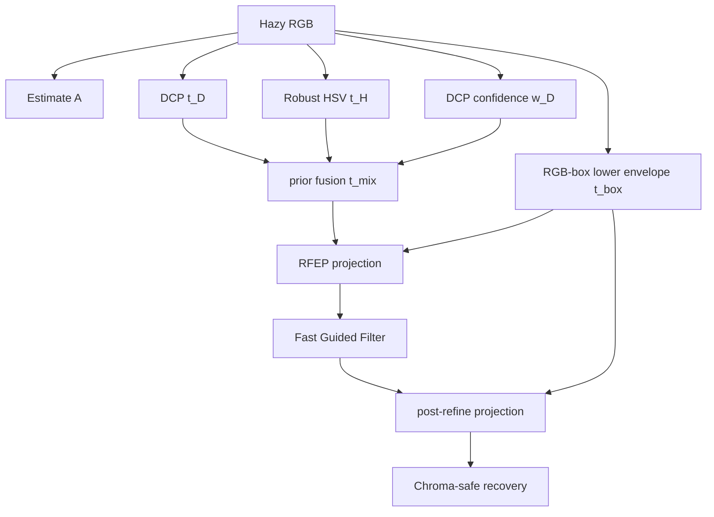

# Boundary-Constrained Prior Fusion (быв. RFEP-DCP)

> Статус: **реализовано** - `Boundary-Constrained Prior Fusion (быв. RFEP)`
> ([`RfepDcpMethod.cs`](../../Methods/RfepDcpMethod.cs)).
>
> **Правка после аудита.** Нижняя граница `t_box` из условия `0 <= J <= 1` - это **известный
> boundary constraint** (Meng et al., *Efficient Image Dehazing with Boundary Constraint and
> Contextual Regularization*, ICCV 2013, при `C0=0, C1=1`), а не находка проекта. Заявлять её
> новой нельзя. Кандидат в вклад - **другая** граница, выведенная для фактически используемой
> chroma-safe формулы восстановления: [`DehazeCore.ChromaSafeLowerBound`](../../Methods/DehazeCore.cs),
> где допустимое множество оказывается отрезком, а не лучом. Актуальные формулировки -
> [`NOVELTY.md`](../../../NOVELTY.md).

Метод объединяет:

- DCP-карту `t_D`;
- robust HSV bright-region prior `t_H` по квантилям `V-S`;
- sky/bright confidence `w_D`;
- нижнюю границу допустимости (по умолчанию - согласованную с chroma-safe восстановлением,
  параметр `csbound`; при `csbound=0` - классический boundary constraint);
- fast guided refinement и chroma-safe recovery.

Гарантия допустимости выполняется **только при `strict=1`** (граница без ослабления `bscale`/`bmax`,
жёсткая проекция `t = max(t, bound)`). Дефолт `strict=0` намеренно ослабляет границу ради силы
дехейзинга; доля нарушений измеряется командой `--mathtest`.

## Radiance-Feasible Bound

Классическое восстановление:

$$
J_c=\frac{I_c-A_c}{t}+A_c.
$$

Требуем, чтобы результат до клиппинга оставался в физически допустимом RGB-кубе:

$$
0\le J_c\le 1.
$$

Для каждого канала получаем нижнюю границу для `t`:

$$
t \ge
\begin{cases}
\dfrac{I_c-A_c}{1-A_c+\varepsilon}, & I_c>A_c, \\
\dfrac{A_c-I_c}{A_c+\varepsilon}, & I_c<A_c, \\
0, & I_c=A_c.
\end{cases}
$$

И берём максимум по каналам:

$$
t_{box}(x)=\max_c t_{box,c}(x).
$$

В коде граница дополнительно масштабируется (`bscale`) и ограничивается сверху (`bmax`), чтобы
не превращать метод в слишком мягкий restoration при шумной оценке `A`.

## Prior Fusion

DCP-оценка:

$$
t_D(x)=1-\omega\,\operatorname{dark}(I/A).
$$

Robust HSV prior:

$$
q(x)=V(x)-S(x), \qquad
z(x)=\frac{q(x)-\operatorname{median}(q)}
{\operatorname{IQR}(q)/1.349+\varepsilon},
$$

$$
t_H(x)=\exp(-\alpha\,\operatorname{clip}(z(x),0,3.5)).
$$

Доверие к DCP:

$$
w_D(x)=
(1-\operatorname{Sky}(x))
\cdot\exp(-3\alpha(V(x)-\tau_v)_+)
\cdot\exp(-3\alpha(\tau_s-S(x))_+).
$$

Смешивание:

$$
t_{mix}=t_H+w_D(t_D-t_H).
$$

## Projection Layer

RFEP-проекция:

$$
t_{proj}=t_{mix}+\rho\,\max(t_{box}-t_{mix},0).
$$

При `rho=1` это жёсткая проекция на feasible envelope; при `rho<1` - мягкая проекция,
которая сохраняет часть агрессивности DCP, но снижает клиппинг и цветные ореолы.

После fast guided filter применяется повторная мягкая проекция, потому что edge-aware
сглаживание может снова опустить `t` ниже физической границы.

## Конвейер

## Параметры по умолчанию

| Параметр | Значение | Смысл |
|---|---:|---|
| `omega` | `0.95` | сила DCP |
| `patch` | `5` | радиус dark channel |
| `alpha` | `1.0` | сила robust HSV prior |
| `tauV` | `0.62` | bright threshold |
| `tauS` | `0.22` | low-saturation threshold |
| `rho` | `0.80` | сила projection layer |
| `bscale` | `0.85` | масштаб RGB-box lower bound |
| `bmax` | `0.92` | потолок lower bound |
| `tsky` | `0.68` | мягкость bright/sky-зон |
| `chroma` | `0.35` | chroma-safe recovery floor |
| `fast` | `4` | downsample factor fast guided filter |

## Что здесь реализовано и что ещё является гипотезой

RFEP не утверждает, что boundary constraints сами по себе неизвестны: boundary-constraint
dehazing уже существует. Отличие этого метода в другом:

- RGB-box constraint используется как **быстрый projection layer** после fusion нескольких priors,
  а не как отдельная тяжёлая оптимизационная задача;
- projection применяется **до и после** fast guided refinement;
- bright-region handling идёт через robust HSV quantile prior без обученных коэффициентов;
- recovery остаётся chroma-safe, поэтому projection работает вместе с защитой цвета.

Для Хабра это хорошая инженерная история: “мы не просто добавили ещё один prior, а вставили
физическую проверку допустимости перед делением на `t`”.

До внешнего поиска литературы и полной абляции безопасная формулировка только инженерная:

> We implement a boundary-constrained projection layer between prior fusion and edge-aware
> refinement. The standard RGB-box bound follows Meng et al. (ICCV 2013); the separately tested
> chroma-safe admissible interval is a candidate contribution pending literature review and
> external ablation.
