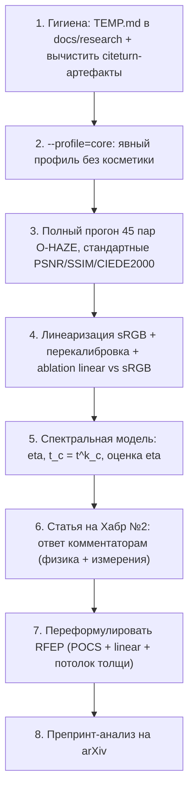

# Аудит: новизна методов, методология измерений, готовность к публикации

> **Статус на 28.07.2026: кодовые пункты P0 закрыты; инфраструктура P1 реализована,
> диагностические (не публикационные) прогоны получены.** Сделано: канонический DCP как
> отдельный baseline и переименование legacy-ветки; линейный радианс (`ColorSpace`); вывод и
> реализация допустимого множества для chroma-safe восстановления (`DehazeCore.ChromaSafeLowerBound`)
> с проверкой в `--mathtest`; снятие claim'а о новизне границы; первичные метрики без подгонки и
> переименование прокси-метрик; режимы `--profile=core|full` / `--linear` / `--evalfull`; метаданные прогона;
> manifest/dataset tooling, внешний evaluator, отдельные автоматические тесты, полные metadata,
> `NOVELTY.md`, `REPRODUCIBILITY.md`, `CITATION.cff`, `AUTHORS`. Выполнены единые прогоны
> на test-split O/I/Dense/NH-HAZE: 800 px и native, по два внутренних baseline,
> в каждом протоколе 182/182 успешных строки ([сводка native](diagnostic-results-2026-07-28.md)).
> Не сделано: публикуемый повторный timing на чистом commit с замороженными параметрами, импорт внешних baseline,
> чистый commit и tagged release. Актуальные формулировки
> новизны - [`NOVELTY.md`](../../../NOVELTY.md).

Дата: 2026-07-25. Основание: чтение `Methods/*.cs`, `docs/**`, `TEMP.md`,
`docs/research/rfep-dcp-preprint.md`, `docs/articles/habr-rfep-dcp.md`, `Metrics.cs`,
`Program.cs`.

Итог одной строкой: **инженерная часть сильная, экспериментальная — нет; главный
заявленный вклад (RFEP) совпадает с известной работой 2013 года; и есть три
методологические проблемы, из-за которых текущие числа нельзя публиковать.**

---

## 1. Новизна по методам

Оценка «новизна» — насколько формулировку можно защищать как вклад в статье
(не «интересно ли это», а «выдержит ли рецензента»).

| Метод | Что реально делает | Прототип в литературе | Новизна | Что с этим делать |
|---|---|---|---|---|
| **RFEP-DCP** | нижняя огибающая $t$ из $0\le J\le1$, мягкая проекция до и после guided filter | **BCCR** (Meng et al., ICCV 2013) — boundary constraint на $t$ выводится ровно из $C_0\le J\le C_1$ | **низкая** для самой границы; средняя для «проекции как слоя» | переформулировать (см. §2) |
| **BRACE-DCP** | смесь $t_{DCP}$ и robust-HSV по карте доверия | DCP + CAP + confidence fusion — очень плотно занятая ниша (в т.ч. `EnergyBasedDcpMethod` в этом же репо) | низкая | оставить как baseline/ablation, не как вклад |
| **PF-SFGF** | пирамида патчей + fast GF + ограниченный спектральный gain | PF-DCP (multi-scale fusion) + fast guided filter | низкая | оставить как «скоростной вариант» |
| **LAF-TV/WLS** | low-res поле $A(x)$ + регуляризация + guided upsample | линия «spatially varying airlight» широко занята | средняя | **эмпирически это лучший метод в вашей же таблице** — усилить и мерить |
| **GDR-SP** | screened-Poisson recovery при фиксированных $A,t$ | gradient-domain dehazing | низкая как метод, **высокая как ablation-конструкция** («тот же $t$, разный recovery») | подавать именно как ablation |
| **LocalHazeCore** (4 пресета) | поле $A(x)$ по карте доверия + локально-адаптивная $\omega(x)$ + FGS + денойз по $(1-t)^2$ + локальный ББ по цвету вуали | отдельные куски известны, **комбинация — нет** | средняя-высокая как **система** | лучший кандидат в прикладную статью/Хабр |
| **SpectralAdaptiveMethod** | поканальный DCP, вес канала по локальному контрасту | эвристика, не физика | низкая | заменить физической спектральной моделью (§3) |
| **FractalHsv / TransScale / Silhouette / VisibilityBoost** | контурно-визуальные пресеты | enhancement | нулевая как научный вклад | это продукт, не статья |

### Главная находка: RFEP = boundary constraint BCCR

Код `RfepDcpMethod.RadianceFeasibleLowerBound` считает

$$t_{\text{box}} = \max_c \max\Bigl(\frac{I_c-A_c}{1-A_c},\ \frac{A_c-I_c}{A_c}\Bigr),$$

что есть в точности граница Meng et al. при $C_0=0,\ C_1=1$ (в BCCR $C_0,C_1$ —
настраиваемые константы вида $20/255$ и $300/255$). Это **не «похожая идея», а та же
формула**: она однозначно следует из $0\le J\le 1$, поэтому любая работа, выводящая
границы из допустимого радианса, получает её же.

Следствие: формулировку «Contribution 1: we derive a closed-form lower bound on
transmission from the condition $0\le J\le1$» в
[`rfep-dcp-preprint.md`](rfep-dcp-preprint.md) **нужно убрать** — в текущем виде это
переоткрытие ICCV-2013 и почти гарантированный отрицательный отзыв.
Файл [`novelty-rfep.md`](novelty-rfep.md) это частично признаёт («RFEP не должен
заявляться как “мы первые придумали ограничения на transmission”»), но абстракт
и §2 препринта живут ещё по старой версии — они рассинхронизированы.

Ссылки: [Meng et al., ICCV 2013 (openaccess)](https://openaccess.thecvf.com/content_iccv_2013/html/Meng_Efficient_Image_Dehazing_2013_ICCV_paper.html),
[IEEE Xplore](https://ieeexplore.ieee.org/document/6751186/).

---

## 2. Что в RFEP можно сделать реально новым

Граница не новая — новыми могут быть три вещи, и все три дешёвы:

1. **Проекция как итерация POCS, а не «применить дважды».** Сейчас код делает
   projection → fast guided filter → projection. Это ровно две итерации проекций на
   пересечение двух множеств: $\mathcal{C}_1=\{t\ge t_{\text{box}}\}$ (выпукло, проекция
   тривиальна) и $\mathcal{C}_2$ = «edge-aware гладкие карты» (guided filter — линейный
   оператор, т.е. приближённая проекция). Прогнать до сходимости и **сформулировать как
   alternating projection / Dykstra** — это уже математический вклад с доказуемым
   поведением, а не эвристика с параметром $\rho$.
2. **Граница в линейном радиансе.** BCCR и все производные считают её в гамма-домене.
   В линейном пространстве огибающая другая и физически корректная (см.
   [physics-linear-spectral.md](physics-linear-spectral.md) §1).
3. **Спектральная граница = потолок оптической толщи.** С $t_c=\exp(-k_c D)$ ограничение
   превращается в $D(x)\le\min_c[-\ln t_{\text{box},c}]/k_c$ — «сколько толщи физически
   можно снять в этом пикселе». Этого в литературе по boundary constraint нет,
   потому что там $t$ один и ахроматичный.

Честная формулировка новизны после правки:

> We revisit the classical boundary constraint on transmission (Meng et al., 2013) and show
> that (i) it must be evaluated on linearized radiance, (ii) under a wavelength-dependent
> scattering coefficient it becomes a per-pixel ceiling on optical depth rather than a
> floor on transmission, and (iii) combining it with edge-aware refinement is naturally an
> alternating-projection scheme rather than a one-shot correction.

Это защитимо и не требует заявлять SOTA.

---

## 3. Три методологические проблемы (блокируют публикацию чисел)

### 3.1. Внутри «методов» сидит косметика — сравнение измеряет не то

`RfepDcpMethod.Process` заканчивается так:

```csharp
using var toned = DehazeCore.RestoreTone(recovered, tone);
return DehazeCore.LimitColorfulness(toned, input.Mat, color);
```

То есть RFEP-DCP = физика **+** авто-уровни по L в Lab **+** ограничитель цветности.
А `DcpCpuMethod` (baseline в той же таблице) этих стадий не имеет. Любой PSNR/SSIM в
такой таблице сравнивает не приоры, а наборы косметики. Для статьи теперь используется
`--profile=core`: метод должен иметь явную конфигурацию в `BenchmarkProfiles`, иначе он
пропускается. Отдельно строится таблица `--profile=full`.

### 3.2. «Совмещённые» PSNR/SSIM — нестандартная метрика

`Metrics.Evaluate` считает `AlignExposure(result, gt)` и публикует
`PsnrAligned/SsimAligned`. Это выравнивание экспозиции и баланса белого **под эталон**,
то есть частичное «подглядывание» в GT. Для внутренней регрессии — полезно; в статье
как основную метрику это не пройдёт. Нужно: основные — обычные PSNR/SSIM/CIEDE2000,
aligned — отдельная колонка с явным объяснением, зачем она.

Отдельно: `NaturalnessDev`/`ArtifactDev` — собственные эвристики. В коде и в препринте это
помечено явно; в таблицах статьи их нельзя называть NIQE/BRISQUE. Либо реализовать
настоящие (нужны опубликованные параметры модели), либо переименовать в свои названия и
не сравнивать с чужими числами.

### 3.3. Текущие числа противоречат заявленной истории

Из [`rfep-dcp-preprint.md`](rfep-dcp-preprint.md) §6 (smoke на одном кадре):

| Метод | PSNR aligned | SSIM aligned | score |
|---|---:|---:|---:|
| DCP CPU | 16.97 | **0.752** | **72.3** |
| BRACE-DCP | 16.60 | 0.602 | 60.4 |
| **RFEP-DCP** | 16.62 | 0.611 | 58.2 |
| LAF-TV/WLS | **17.59** | **0.838** | 59.2 |

Главный заявленный вклад проигрывает базовому DCP по SSIM на 0.14 и по score на 14
пунктов, а выигрывает совсем другой метод (LAF-TV). Публиковать RFEP как основной вклад
с такими числами нельзя — либо (а) причина в проблеме 3.1 и её надо устранить,
либо (б) историю статьи надо переписать вокруг LAF-TV / LocalHazeCore.

Плюс: это один кадр. У вас в репозитории уже лежат **45 пар** (`dataset/NN_outdoor_hazy`
+ `hazefree/NN_outdoor_GT`) — это O-HAZE. Прогон полного набора — одна команда, и его
надо сделать до любых формулировок.

---

## 4. Код: замечания, влияющие на статью

| Место | Проблема | Почему важно для статьи |
|---|---|---|
| `RfepDcpMethod.RobustStats` | `Array.Sort` всех $N$ пикселей → $O(N\log N)$ | препринт заявляет $O(N)$; рядом в `DehazeCore.Atmospheric` уже есть гистограммный top-$k$ за $O(N)$ — надо сделать так же (у $q=V-S$ диапазон $[-1,1]$) |
| `DehazeCore.Normalize` | нет линеаризации sRGB | ломает физику, см. [physics-linear-spectral.md](physics-linear-spectral.md) |
| `Recover` / `RecoverLocal` | «ахроматическая часть» = `mean_c`, а не яркость с весами | Y-разложение точно только с линейными весами |
| `LabEnhance`, `ScaleChromaByMask`, `MultiScaleContourBoost`, `CoarseReveal` | несколько round-trip'ов float→8U→Lab→8U→float на кадр | квантование/бэндинг + время; для quality-статьи держать float |
| `SkyMask`, `RobustHsvTransmission`, `DcpConfidence` | ~10 захардкоженных порогов (0.6/0.3, 0.25/0.2, 3.5, 0.20, 0.10, 8.0…) | препринт гордится отсутствием «обученных коэффициентов CAP» — при таком числе ручных констант это утверждение уязвимо; либо вынести в параметры, либо признать в Limitations |
| `Atmospheric` | 4 массива `float[N]` на вызов, вызывается по нескольку раз за метод | ms/MP в таблицах (796 ms/MP у DCP CPU выглядит завышенно) |
| `TEMP.md` в корне репозитория | содержит артефакты вида `citeturn11view0` от исследовательского инструмента | публично видно; выглядит как машинно-сгенерированный текст — перенести в `docs/research/` и вычистить **до** любой публикации |

---

## 5. Годятся ли документы для arXiv и Хабра

### arXiv — пока нет

Что есть: аккуратная математика, честные Limitations, воспроизводимые команды,
реальная реализация. Что блокирует:

1. нет экспериментов — только smoke на одном кадре;
2. нет внешних baseline'ов: BCCR, PF-DCP, non-local haze-lines, RSVT перечислены как
   планы, но не прогнаны (нужны либо официальные реализации, либо честное «сравниваем
   только с тем, что реализовали сами»);
3. новизна главного вклада сформулирована неверно (§1);
4. метрики нестандартные (§3.2), пост-обработка внутри методов (§3.1);
5. нет описания железа/версий/повторяемости; нет доверительных интервалов;
6. язык — черновой английский, местами русские фрагменты; в `TEMP.md` смесь языков.

**Реалистичная цель вместо «SOTA среди non-ML»:** статья-анализ, а не статья-метод:

> «Physically consistent prior-based dehazing: how gamma encoding, colour-space choice and
> the achromatic-$\beta$ assumption silently bias classical dehazing — an analysis and an
> open testbed» (cs.CV / eess.IV).

Такая работа: (а) полностью строится на трёх замечаниях из комментариев,
(б) имеет измеримые результаты (ablation линейного vs гамма-пространства на O-HAZE),
(в) не требует побеждать SOTA, (г) не рискует переоткрытием — потому что вклад
именно в измерении и в корректной постановке, (д) даёт естественную ценность
репозитория как testbed'а на 40+ методов.

### Хабр — да, но не текущий черновик

[`docs/articles/habr-rfep-dcp.md`](../articles/habr-rfep-dcp.md) технически готов по форме
(тезис, формулы, mermaid, воспроизводимость, честные ограничения), но:

* нельзя подавать RFEP как «новую идею проверять допустимость» — комментаторы Хабра
  находят BCCR за пять минут, и это ударит по репутации сильнее, чем принесёт пользы;
* таблица со smoke-числами показывает, что новый метод хуже базового;
* лучше **не** делать вторую статью «ещё один DCP-вариант». Прямое продолжение первой
  статьи, которое напрашивается: **ответ на комментарии** — см. §6.

---

## 6. Что делать: план

Порядок важен — каждый следующий шаг опирается на предыдущий.



Шаги 1–4 — примерно неделя работы и уже дают самостоятельную статью на Хабр.
Шаги 5–8 — вторая волна, из них получается препринт.

Черновик статьи №2 — [`../articles/habr-2-physics.md`](../articles/habr-2-physics.md).

---

## 7. Идеи, которые стоит проверить (кандидаты на настоящую новизну)

Все — только математика, все считаются на CPU/GPU, ни одна не требует обучения.

1. **SC-1D: одно поле оптической толщи + спектральный показатель.** Вместо трёх $t_c$ —
   одно $D(x)$ и один $\eta$; система переопределена ⇒ появляется проверка
   согласованности и уменьшается число степеней свободы.
   [Детали](physics-linear-spectral.md#2-спектральная-модель-betalambda-вместо-одного-beta).
2. **Оценка $\eta$ по декоррелации остаточного каста с глубиной** — одномерный поиск,
   детерминированный, попутно даёт тест «применима ли спектральная модель к кадру».
3. **Регуляризация в координате $D=-\ln t$, а не $t$** — TV/WLS-приор на глубину
   физически оправдан; готовый ablation `TV(t)` vs `TV(D)`.
4. **$t_{\text{floor}}$ из измеренного шума** вместо магических $t_{min}$/`chromaFloor` —
   «метод без ручных порогов, с бюджетом шума».
5. **Alternating projection (POCS) для boundary constraint + edge-aware сглаживания** —
   превращает эвристику «проекция дважды» в схему со понятным поведением.
6. **Синтетический falsifiability-стенд**: генерировать дымку **в линейном пространстве**
   с известными $D$, $A$, $\eta$ и мерить ошибку оценки **$t$ и $A$ напрямую**, а не
   только PSNR финального $J$. Это самая дешёвая вещь, которая радикально повышает
   доверие к работе: ни один хобби-проект в этой области так не делает.

Пункт 6 стоит сделать первым из этого списка — он превращает все остальные пункты из
«выглядит лучше» в «ошибка оценки $t$ снизилась на X%».
